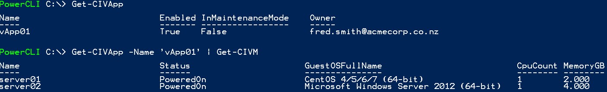
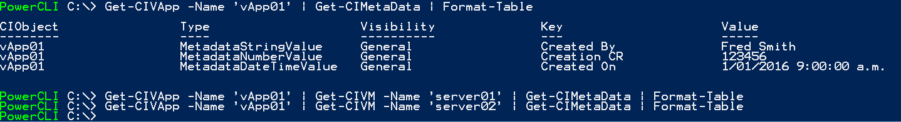
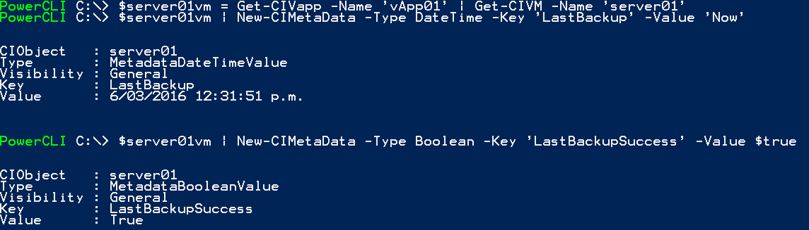
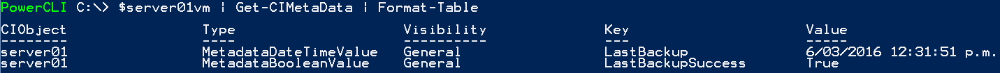
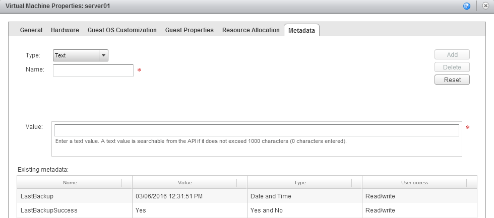
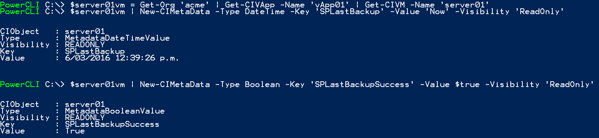
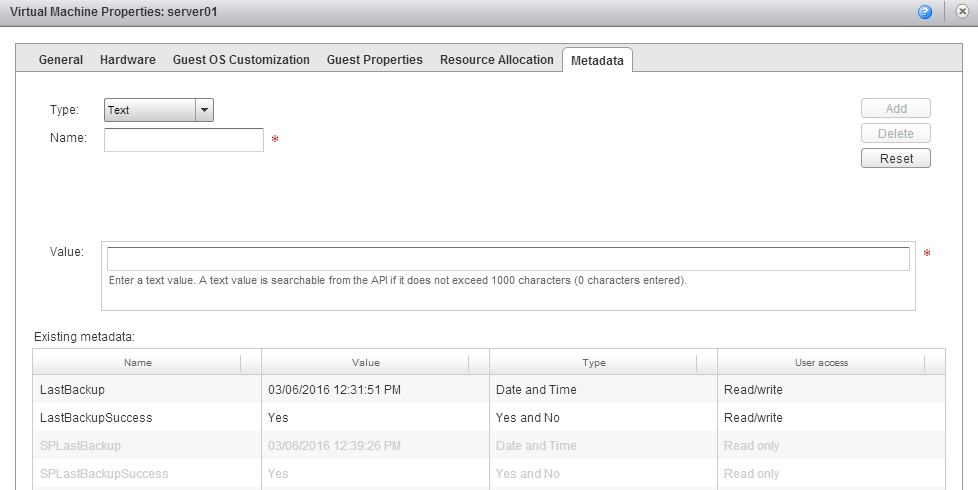
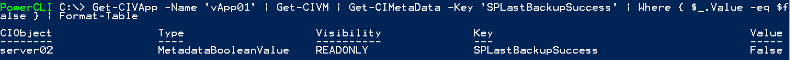

In [part 1][1] of this series I posted some code for a PowerShell module to manipulate (view/add/delete) metadata tags on vCloud Director objects.

As promised, in this followup post I've given some examples of syntax and possible use-cases for the module.

The PowerShell Import-Module cmdlet can be used to add my module to your PowerCLI environment:

```powershell
Import-Module "C:\PowerShell\CIMetadata.psm1"
```

(assuming you've saved the code from part 1 as C:\PowerShell\CIMetadata.psm1). This can also be added to your PowerShell profile so that the cmdlets are always available when you start a new PowerShell session.

First we need to connect to a vCloud environment using Connect-CIServer:

```powershell
Connect-CIServer -Server '<URI to my cloud provider>' -Org '<My organisation>'
```

Once connected we can get a list of the vApps in our environment:



So in this example organisation we have a single vApp with two VMs (server01 and server02) in it. Now lets see what existing metadata exists for them:



So we have some useful-ish metadata on the vApp itself, but nothing for the individual server VMs. Let's say we have a script that runs (or we can call) after our VM backups run that we want to use to provide feedback on when our individual VMs were last backed up. We could do this by adding a 'LastBackup' key to the VM with a Date/Time value of 'Now' at the time the backup runs and a boolean value of 'True' to a key 'LastBackupSuccess' to indicate this was successful. Note that we're using the special value 'Now' for a Date/Time value to indicate the current date/time.



If we now check the VM metadata we can see that these keys/values have been added, both from PowerShell:



and from the vCloud Director web UI:



It's much more likely in a service provider context that these fields would actually be updated by our service provider using a 'system' context user account and using the '-Visibility' option to make these key/values read-only to a tenant user. This could be accomplished using the following (connected as a system user to the vCloud environment):



The vCD UI now shows (from a tenant perspective) the values we've entered as read-only/non-editable:



The fields returned by Get-CIMetaData can also be used in PowerShell scripts to filter results. For example, if our service provider uses the key 'SPLastBackupSuccess' to indicate backup success/failure and has set 'server02' in our vApp as having failed it's backup we can (as a tenant) use the following to see any VMs in our vApp which have failed their backup:



These are just a couple of examples of how manipulating vCloud Director metadata from PowerShell could be useful, I'm sure there are many other use-cases out there too - e.g. indicating replication status to a remote cloud/data center or maintaining a reference link between another system and vCloud VMs. Don't forget that you can also attach metadata to most vCloud Director objects in addition to vApps and VMs.

Let me know in the comments if you've found this useful and if there's any other use-cases or scenarios you'd like to see.

Jon.

 [1]: /2016/02/working-with-vcloud-metadata-in-powercli-part-1/