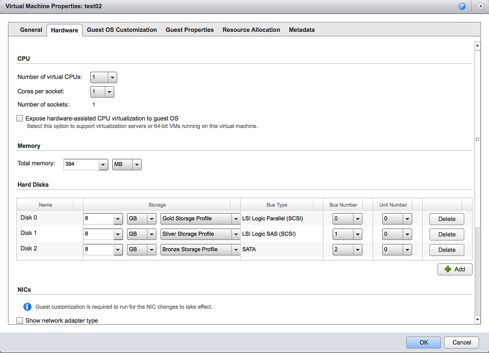
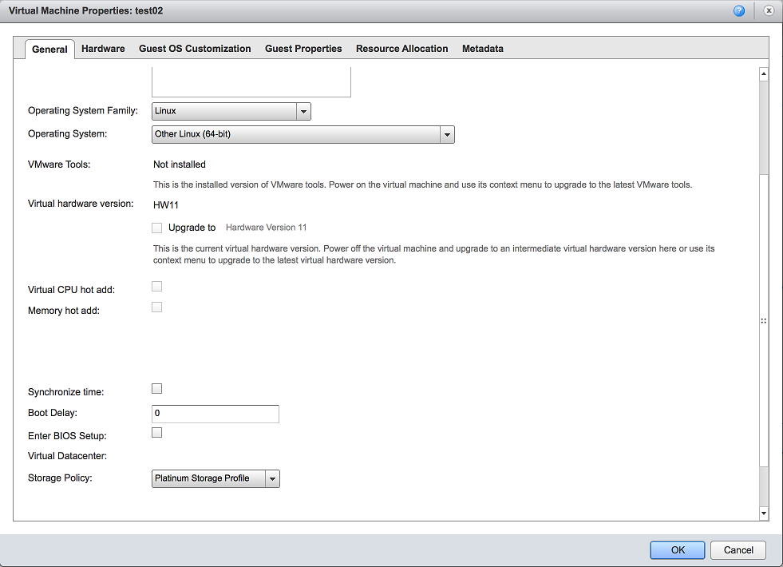

I recently had a request from one of our customers who wanted an easy / scriptable method to determine the storage allocations on their hosted VMs in our vCloud platform, preferably from PowerShell. That should be easy I thought and set about my usual Google-based research. I initially found [this post][1] from Alan Renouf which I forwarded back to the client.

Unfortunately, while this achieved part of the answer, this particular customer had a number of VMs which had hard disks attached using multiple/different storage profiles and they wanted to get the details of these too. So I set about writing some code to see if I could get full storage information about the VM and all of its disks. I ended up having to access the vCloud REST API directly for this information but it wasn’t too bad.

First, I created a ‘worst-case’ test VM where the 3 attached hard disks which were created one each on our ‘Gold’, ‘Silver’ and ‘Bronze’ storage policies:



(Just to make sure everything would work I also created the 3 disks on 3 different storage Bus Types). I also set the VM storage policy to something different:



My first step was a function to access the vCloud REST API, I found [this post][2] from Matt Vogt’s blog which had some code for this which I shamelessly borrowed (hey, why reinvent the wheel unless you need to):

```powershell
function Get-vCloudREST($href) {
  $request = [System.Net.HttpWebRequest]::Create($href)
  $request.Accept = "application/*+xml;version=20.0" # For vCloud Director 8.xx or later API
  $request.Headers.add("x-vcloud-authorization",$global:session.sessionID)
  $response = $request.GetResponse()
  $streamReader = new-object System.IO.StreamReader($response.getResponseStream())
  $xmldata = $streamReader.ReadToEnd()
  $streamReader.Close()
  $response.Close()
  return $xmldata
}
```

The return from the **Get-CIVM** cmdlet includes a reference to the VM object within the vCloud API:

```
PowerCLI C:\> $test02 = Get-CIVM -Name 'test02'
PowerCLI C:\> $test02 | fl
ExtensionData   : VMware.VimAutomation.Cloud.Views.Vm
Status          : PoweredOff
Deleted         : False
GuestOsFullName : Other Linux (64-bit)
CpuCount        : 1
MemoryMB        : 384
MemoryGB        : 0.375
VMVersion       : v11
Org             : MyOrg
OrgVdc          : MyOrgVDC
VApp            : test02
Description     : 
Href            : https://<cloud.com>/api/vApp/vm-ef4a4594-c631-421a-98f0-4d15670c98ad
Id              : urn:vcloud:vm:ef4a4594-c631-421a-98f0-4d15670c98ad
Name            : test02
Client          : /CIServer=<user>:<org>@<cloud.com>:443/
Uid             : /CIServer=<user>:<org>@<cloud.com>:443/CIVM=urn:vcloud:vm:ef4a4594-c631-421a-98f0-4d15670c98ad/
```

Using this we can obtain our disk information:

```powershell
PowerCLI C:\> $queryHref = $test02.Href + "/virtualHardwareSection/disks"
PowerCLI C:\> $xml = Get-vCloudREST($queryHref)
PowerCLI C:\> $xml
xml                            RasdItemsList
---                            -------------
version="1.0" encoding="UTF-8" RasdItemsList
```

Filtering the returned RasdItemsList for a ResourceType of 17 (Hard Disk), we can get a list of attached hard disks:

```
PowerCLI C:\> $xml.RasdItemsList.Item | Where { $_.ResourceType -eq 17 }

AddressOnParent      : 0
Description          : Hard disk
ElementName          : Hard disk 1
HostResource         : HostResource
InstanceID           : 2000
Parent               : 2
ResourceType         : 17
VirtualQuantity      : 8589934592
VirtualQuantityUnits : byte

AddressOnParent      : 0
Description          : Hard disk
ElementName          : Hard disk 2
HostResource         : HostResource
InstanceID           : 2016
Parent               : 3
ResourceType         : 17
VirtualQuantity      : 8589934592
VirtualQuantityUnits : byte

AddressOnParent      : 0
Description          : Hard disk
ElementName          : Hard disk 3
HostResource         : HostResource
InstanceID           : 16060
Parent               : 4
ResourceType         : 17
VirtualQuantity      : 8589934592
VirtualQuantityUnits : byte
```

So this gets us to a point where we have all of the hard disk information, but how do we find the storage policy for each disk? It turns out that each disk has an attribute ‘HostResource’ which provides the URI to the storage policy from which the disk has been allocated:

```
PowerCLI C:\> $disks = $xml.RasdItemsList.Item | Where { $_.ResourceType -eq 17 }

PowerCLI C:\> $disks.Count
3

PowerCLI C:\> $disks[0].HostResource

vcloud                          : http://www.vmware.com/vcloud/v1.5
storageProfileHref              : https://<my cloud URI>/api/vdcStorageProfile/f89df73a-2fa5-40e4-9332-fdd6e29d36ac
busType                         : 6
busSubType                      : lsilogic
capacity                        : 8192
iops                            : 0
storageProfileOverrideVmDefault : true

PowerCLI C:\> $disks[1].HostResource

vcloud                          : http://www.vmware.com/vcloud/v1.5
storageProfileHref              : https:// <my cloud URI>/api/vdcStorageProfile/d14c6c2e-2cfb-4ffe-9f31-599c3de42150
busType                         : 6
busSubType                      : lsilogicsas
capacity                        : 8192
iops                            : 0
storageProfileOverrideVmDefault : true

PowerCLI C:\> $disks[2].HostResource

vcloud                          : http://www.vmware.com/vcloud/v1.5
storageProfileHref              : https:// <my cloud URI>/api/vdcStorageProfile/dc382284-bc65-4e61-b85f-ea7facba63e4
busType                         : 20
busSubType                      : vmware.sata.ahci
capacity                        : 8192
iops                            : 0
storageProfileOverrideVmDefault : true
```

So how can we convert the storageProfileHref values into meaningful (human readable) storage profile names? We can use another API call to establish the name of each vdcStorageProfile:

```
PowerCLI C:\> $sp = Get-vCloudREST($disks[0].HostResource.storageProfileHref)
PowerCLI C:\> $sp.VdcStorageProfile.name
Gold Storage Profile

PowerCLI C:\> $sp = Get-vCloudREST($disks[1].HostResource.storageProfileHref)
PowerCLI C:\> $sp.VdcStorageProfile.name
Silver Storage Profile

PowerCLI C:\> $sp = Get-vCloudREST($disks[2].HostResource.storageProfileHref)
PowerCLI C:\> $sp.VdcStorageProfile.name
Bronze Storage Profile
```

Querying the API for every vdcStorageProfile for every disk is going to generate a lot of calls for any significant number of VMs, so in the code below I’ve added a hash stored in a global variable which caches these results so that any storageProfileHref which has been seen before doesn’t need to generate an additional API call.

**Putting it all together**

So we now have a way of determining all of the information we need, using PowerShell custom objects allows us to write a function which returns all of our VM and storage details in a easily consumable form for further processing.

The script included at the bottom of this article produces the following output for my test environment containing 2 VMs of which the ‘pxetest01’ VM has no disks attached:

```
PowerCLI C:\> $vmobjs

VMName    : pxetest01
Id        : urn:vcloud:vm:45a86f24-1109-4ead-881d-f865c1f0692f
Status    : PoweredOff
vRAM      : 1
vCPU      : 1
HWVersion : v11
vAppName  : PXE Demo
GuestOS   : CentOS 4/5/6/7 (64-bit)
Disks     :

VMName    : test02
Id        : urn:vcloud:vm:ef4a4594-c631-421a-98f0-4d15670c98ad
Status    : PoweredOff
vRAM      : 0.375
vCPU      : 1
HWVersion : v11
vAppName  : test02
GuestOS   : Other Linux (64-bit)
Disks     : {@{Name=Hard disk 1; StorageProfile=Gold Storage Profile; Quantity=8589934592; QuantityUnits=byte}, @{Name=Hard disk 2; StorageProfile=Silver Storage Profile; Quantity=8589934592; QuantityUnits=byte}, @{Name=Hard disk 3; StorageProfile=BronzeStorage Profile; Quantity=8589934592; QuantityUnits=byte}}
```

It can also return just the disk information as another custom object:

```
PowerCLI C:\> $test02vm = $vmobjs | Where {$_.VMName -eq 'test02'}
PowerCLI C:\> $test02vm.Disks

Name StorageProfile Quantity QuantityUnits
---- -------------- -------- -------------
Hard disk 1 Gold Storage Profile 8589934592 byte
Hard disk 2 Silver Storage Profile 8589934592 byte
Hard disk 3 Bronze Storage Profile 8589934592 byte
```

And we can check the number of disks attached to any VM:

```
PowerCLI C:\> ($test02vm.Disks | Measure).Count
3
```

Finally because the output is a PowerShell object, we can easily turn this custom object into JSON for use in further processing:

```
PowerCLI C:\> $test02vm | ConvertTo-Json

{
	"VMName": "test02",
	"Id": "urn:vcloud:vm:ef4a4594-c631-421a-98f0-4d15670c98ad",
	"Status": "PoweredOff",
	"vRAM": 0.375,
	"vCPU": 1,
	"HWVersion": "v11",
	"vAppName": "test02",
	"GuestOS": "Other Linux (64-bit)",
	"Disks": {
		"value": [
			{
				"Name": "Hard disk 1",
				"StorageProfile": "Gold Storage Profile",
				"Quantity": 8589934592,
				"QuantityUnits": "byte"
			},
			{
				"Name": "Hard disk 2",
				"StorageProfile": "Silver Storage Profile",
				"Quantity": 8589934592,
				"QuantityUnits": "byte"
			},
			{
				"Name": "Hard disk 3",
				"StorageProfile": "Bronze Storage Profile",
				"Quantity": 8589934592,
				"QuantityUnits": "byte"
			}
		],
		"Count": 3
	}
}
```

Hopefully you’ve found this post useful, let me know in the comments if you have any issues or would like to see more examples like this.

Jon.

Full script to find storage policy information for vCloud VMs using the vCloud REST API:

```powershell
$global:spolrefs = @{}
# Change to be appropriate for your scenario:
$cloudURL = "<cloud FQDN or IP Address>"
$cloudOrg = "<cloud Organization name>"

# Check if we are already logged-in (interactive session) and if not, prompt for login:
if (!$session.IsConnected) {
 $creds = Get-Credential -Message "Authenticate to $cloudOrg Cloud Service"
 $session = Connect-CIServer -Server $cloudURL -Org $cloudOrg -Credential $creds
}

# PS Function to query the vCloud Director REST API
# ('Borrowed' from Matt Vogt's blog at: http://blog.mattvogt.net/)
function Get-vCloudREST($href)
{
 $request = [System.Net.HttpWebRequest]::Create($href)
 $request.Accept = "application/*+xml;version=20.0" # For vCloud Director 8.xx or later API
 $request.Headers.add("x-vcloud-authorization",$global:session.sessionID)
 $response = $request.GetResponse()
 $streamReader = new-object System.IO.StreamReader($response.getResponseStream())
 $xmldata = $streamReader.ReadToEnd()
 $streamReader.Close()
 $response.Close()
 return $xmldata
}

# Function to get Storage Profile name from its Href (if not already known/cached in a global hash)
# if already known we don't need to call the API again and can just return the value from the hash
function Get-SPName($storage_href)
{
 if ($global:spolrefs.ContainsKey($storage_href)) {
 return $global:spolrefs.Get_Item($storage_href)
 } else {
 $sp = Get-vCloudREST($storage_href)
 $global:spolrefs.Add($storage_href, $sp.VdcStorageProfile.name)
 return $sp.VdcStorageProfile.name
 }
}

# Function to retrieve the disk information for a VM:
function Get-VMDisks($VM)
{
 $VMDisks = @() # Start with an empty array
 $queryHref = $VM.Href + "/virtualHardwareSection/disks" # API path for VM disk information
 $xml = Get-vCloudRESt($queryHref)
 $disks = $xml.RasdItemsList.Item | Where-Object {$_.ResourceType -eq 17} # Resource Type 17 = Hard disk drive
 foreach ($disk in $disks)
 {
 $sp = Get-SPName($disk.HostResource.storageProfileHref)
 $diskobj = New-Object -TypeName PSObject
 $diskobj | Add-Member -Type NoteProperty -Name "Name" -Value ([String]$disk.ElementName)
 $diskobj | Add-Member -Type NoteProperty -Name "StorageProfile" -Value ([String]$sp)
 $diskobj | Add-Member -Type NoteProperty -Name "Quantity" -Value ([Int64]$disk.VirtualQuantity)
 $diskobj | Add-Member -Type NoteProperty -Name "QuantityUnits" -Value ([String]$disk.VirtualQuantityUnits)
 $VMDisks += $diskobj
 }
 return $VMDisks
}

function Get-VMInfo($VM)
{
 $vmobj = New-Object -TypeName PSObject
 $vmobj | Add-Member -Type NoteProperty -Name "VMName" -Value ([String]$VM.Name)
 $vmobj | Add-Member -Type NoteProperty -Name "Id" -Value ([String]$VM.ExtensionData.Id)
 $vmobj | Add-Member -Type NoteProperty -Name "Status" -Value ([String]$VM.Status)
 $vmobj | Add-Member -Type NoteProperty -Name "vRAM" -Value ([Decimal]$VM.MemoryGB)
 $vmobj | Add-Member -Type NoteProperty -Name "vCPU" -Value ([Int]$VM.CpuCount)
 $vmobj | Add-Member -Type NoteProperty -Name "HWVersion" -Value ([String]$VM.VMVersion)
 $vmobj | Add-Member -Type NoteProperty -Name "vAppName" -Value ([String]$VM.VApp.Name)
 $vmobj | Add-Member -Type NoteProperty -Name "GuestOS" -Value ([String]$VM.GuestOsFullName)
 [PSCustomObject]$disks = Get-VMDisks($VM)
 $vmobj | Add-Member -Type NoteProperty -Name "Disks" -Value $disks
 return $vmobj
}

# Get all VMs in our Cloud Organization:
$vms = Get-CIVM

# Initialise an array for returned objects:
$vmobjs = @()

# For each VM, build our object:
foreach ($vm in $vms) {
 $vmobjs += Get-VMinfo($vm)
}

# Output our object to console:
$vmobjs
```

 [1]: https://blogs.vmware.com/PowerCLI/2013/03/retrieving-vcloud-director-vm-hard-disk-size.html
 [2]: http://blog.mattvogt.net/2013/06/04/change-vcloud-vappvm-storage-profile-with-powercli/