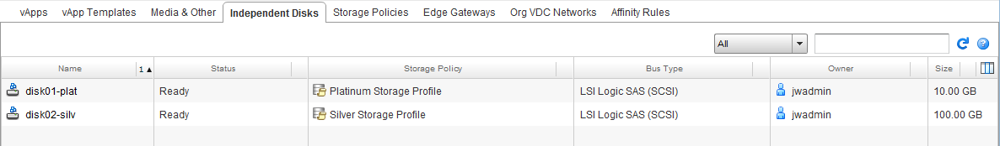
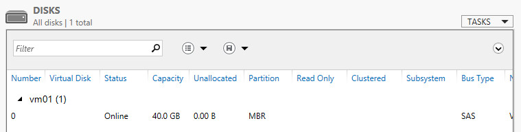
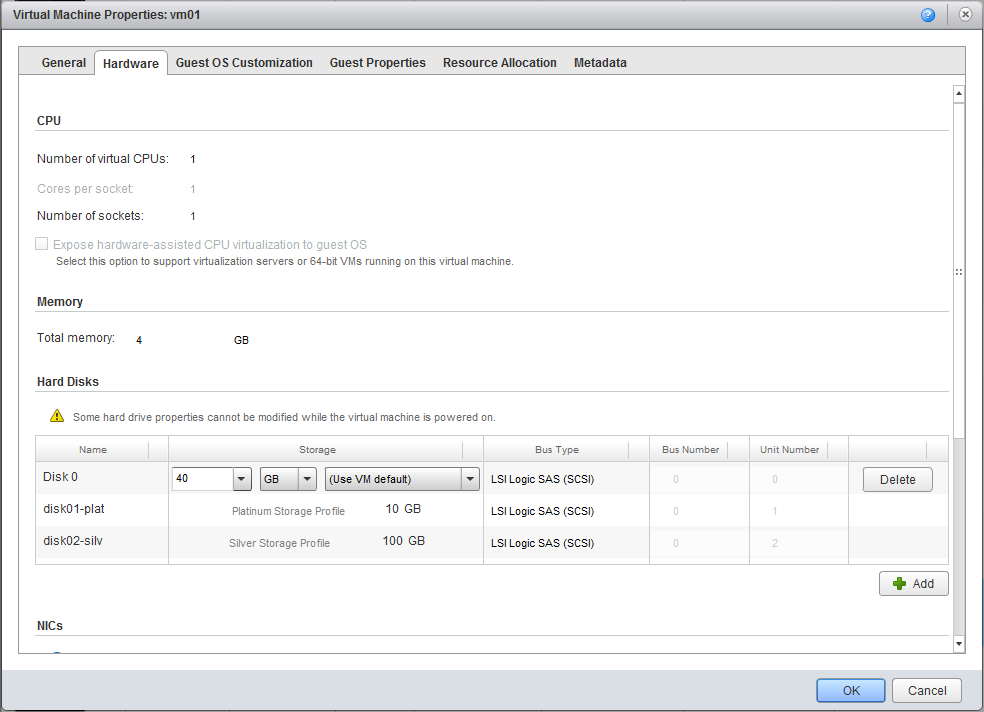
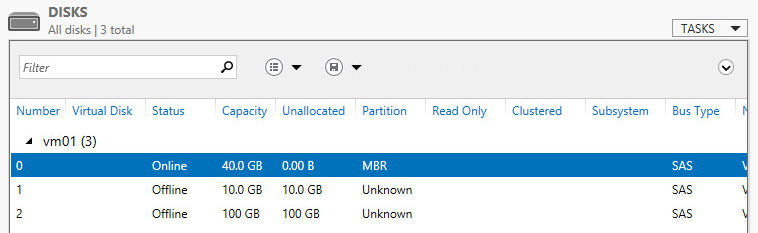
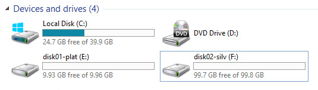
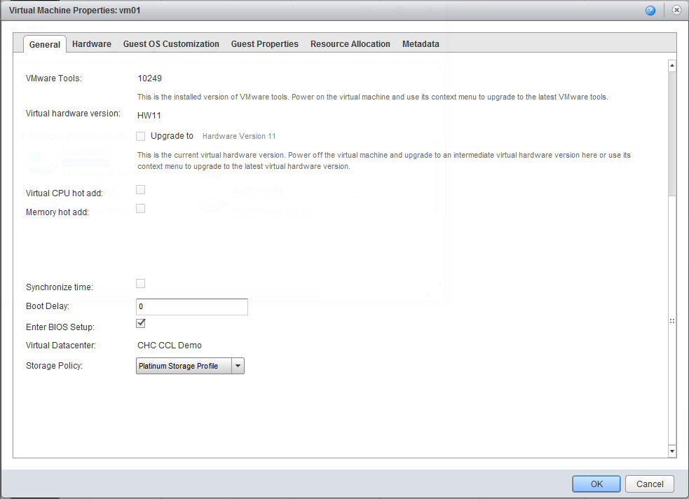
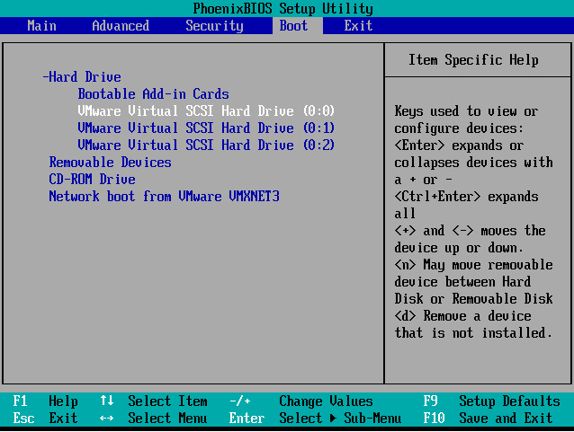
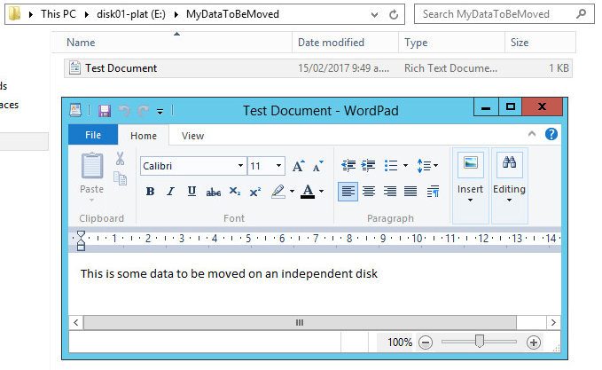
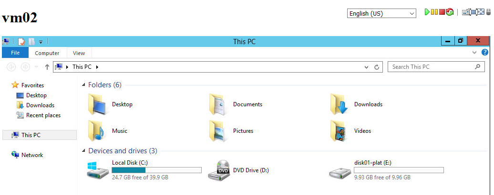
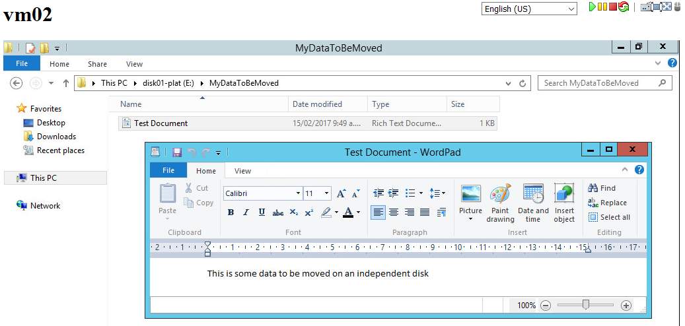

[Yesterday][1] I wrote about the PowerShell module I've written ([CIDisk.psm1][2]) to allow manipulation of independent disks in a vCloud environment. This post shows some usage options and details some of the caveats to be aware of when using disks in this manner.

My test environment has two VMs (named imaginatively 'vm01' and 'vm02'), and the VDC they are in has access to four different storage profiles ('Platinum', 'Gold', 'Silver' and 'Bronze' storage). The default storage policy for the VDC is 'Bronze', but what if we want to create independent disks on other profiles? The -StorageProfileHref parameter to New-CIDisk lets us do this. Once connected to our cloud (Connect-CIServer) we can find the Hrefs of the available storage profiles we can use:

```
C:\> $vdc = Get-OrgVdc -Name '<My VDC Name>'

C:\> $vdc.ExtensionData.VdcStorageProfiles.VdcStorageProfile | Select Name, Href

Name                     Href                                                                                       
----                     ----                                                                                       
Platinum Storage Profile https://my.cloud.com/api/vdcStorageProfile/4777f1a3-1f71-4e47-831e-fc7ed80376c3
Silver Storage Profile   https://my.cloud.com/api/vdcStorageProfile/d14c6c2e-2cfb-4ffe-9f31-599c3de42150
Bronze Storage Profile   https://my.cloud.com/api/vdcStorageProfile/dc382284-bc65-4e61-b85f-ea7facba63e4
Gold Storage Profile     https://my.cloud.com/api/vdcStorageProfile/f89df73a-2fa5-40e4-9332-fdd6e29d36ac
```

Let's create 2 independent disks, a 10G disk on 'Platinum' storage and a 100G disk on 'Silver' storage:

```
C:\> New-CIDisk -DiskName 'disk01-plat' -DiskSize 10G -StorageProfileHref https://my.cloud.com/api/vdcStorageProfile/4777f1a3-1f71-4e47-831e-fc7ed80376c3 -DiskDescription 'Platinum test disk'
Request submitted, waiting for task to complete...
Task completed successfully.

Name        : disk01-plat
Href        : https://my.cloud.com/api/disk/a1b00fa4-3d84-4c75-bc76-7604b96cdcab
Description : Platinum test disk
Size        : 10 GB
BusType     : lsilogicsas
Storage     : Platinum Storage Profile
AttachedTo  : Not Attached

C:\> New-CIDisk -DiskName 'disk02-silv' -DiskSize 100G -StorageProfileHref https://my.cloud.com/api/vdcStorageProfile/d14c6c2e-2cfb-4ffe-9f31-599c3de42150 -DiskDescription 'Silver test disk'
Request submitted, waiting for task to complete...
Task completed successfully.

Name        : disk02-silv
Href        : https://my.cloud.com/api/disk/b02b50fd-1305-454d-923c-26ef9874a3fd
Description : Silver test disk
Size        : 100 GB
BusType     : lsilogicsas
Storage     : Silver Storage Profile
AttachedTo  : Not Attached
```

We can see in the vCloud interface that these disks now exist in our VDC (Note: you may have to completely refresh your vCloud session using your browser's refresh before the 'Independent Disks' tab appears):



There are no context actions for these disks though and we can't attach/detach them to VMs in the vCloud interface.

Our VM01 virtual machine currently has a 40GB base disk attached and no other storage:



We can mount both our new independent disks to this VM using the following:

```
C:\> $vm01 = Get-CIVM -Name 'vm01'

C:\> $disk01 = Get-CIDisk -DiskName 'disk01-plat'

C:\> $disk02 = Get-CIDisk -DiskName 'disk02-silv'

C:\> Mount-CIDisk -VMHref $vm01.Href -DiskHref $disk01.Href
Request submitted, waiting for task to complete...
Task completed successfully.

C:\> Mount-CIDisk -VMHref $vm01.Href -DiskHref $disk02.Href
Request submitted, waiting for task to complete...
Task completed successfully.
```

Looking at the VM01 Hardware tab following this shows both disks mounted:



Note again that no manipulation options are available in the vCloud UI, but at least it's obvious that independent disks have been attached to VM01.

After rescanning storage in the guest, we can see the new storage devices on VM01:



And once these are brought online, initialized, storage volumes created and drive letters assigned, we can use the disks inside the guest (the volume names don't get automatically mapped - I've just named the volumes the same as the independent disk objects for consistency):



At this point everything appears to be working fine, but there can be a catch here - if you restart the virtual machine you may find that the server attempts to boot from one of the newly mounted independent disks. Luckily vCloud Director 8.10 allows us to get into the VM BIOS and change the boot order settings:



Once restarted into BIOS we can select the correct boot order:



With the server restarted, we can create some test content in 'disk01-plat' to prove that the data moves when we reattach this disk to VM02:



And to dismount 'disk01-plat' from VM01 and mount it to VM02 we can:

```
C:\> Dismount-CIDisk -VMHref $vm01.Href -DiskHref $disk01.Href
Request submitted, waiting for task to complete...
Task completed successfully.

C:\> $vm02 = Get-CIVM -Name 'vm02'

C:\> Mount-CIDisk -VMHref $vm02.Href -DiskHref $disk01.Href
Request submitted, waiting for task to complete...
Task completed successfully.
```

Looking at the available storage in VM02 after a disk rescan shows our disk has transfered across:



Finally, checking the contents of the 'E:\' drive shows our test folder & file have made it across:



And Get-CIDisk can be used to verify the disk attachments after moving disk01 to VM02:

```
C:\> Get-CIDisk | ft -AutoSize

Name        Href                                                               Description        Size   BusType     Storage                  AttachedTo
----        ----                                                               -----------        ----   -------     -------                  ----------
disk01-plat https://my.cloud.com/api/disk/a1b00fa4-3d84-4c75-bc76-7604b96cdcab Platinum test disk 10 GB  lsilogicsas Platinum Storage Profile vm02      
disk02-silv https://my.cloud.com/api/disk/b02b50fd-1305-454d-923c-26ef9874a3fd Silver test disk   100 GB lsilogicsas Silver Storage Profile   vm01
```

Hopefully this gives a better idea of how CIDisk can be used to manage independent disks in a vCloud environment, it would be nice if VMware included the management functions in the UI, but for now at least you can use PowerShell to easily achieve the same results without having to write against the API directly.

As always, any comments / feedback greatly appreciated.

Jon

 [1]: /2017/02/independent-disks-in-vcloud-via-powercli/
 [2]: https://github.com/jondwaite/cidisk