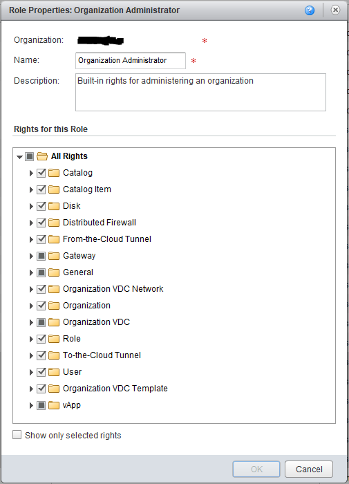
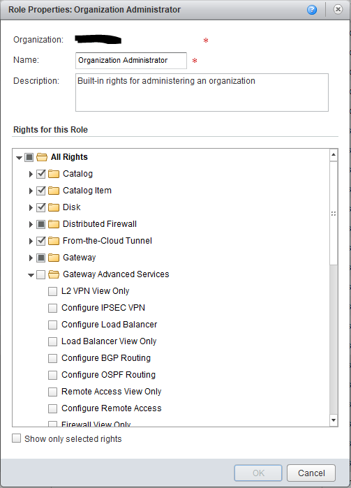

One of the key changes in vCloud Director 8.20 and 8.20.1 from 8.10 is the Advanced Networking for Edge Gateways, this allows customer control of several advanced networking features of the Edge Gateways which previously could not be made available to tenant administrators. vCloud Director 8.20 and later also change the Roles to be per-tenant organisation (rather than globally shared between all tenants). However, in order for tenant administrators to be able to take advantage of the new features, the new Edge Gateway roles need to be added to their organisation. The only way currently to achieve this is by the vCloud REST API and must be performed separately for each organisation in the vCloud infrastructure.

Here is what the available rights looks like prior to the change being made - note there is no 'Gateway Advanced Services' section at all:



Since manually modifying the OrgRights XML is time-consuming and a bit prone to error, I set about writing a PowerCLI script to make the change automatically for a given organisation. Note that this change does not alter the defined roles for an organisation, it simply adds the new Edge Gateway permissions as available entities which can then be selectively added to roles.

Once the script has been run for an organisation, editing the properties of a role allows the new Gateway Advanced Services entities to be selected for that role:



The script is included below, as always I welcome any thoughts/comments/feedback.

Jon

```powershell
# Script to add new OrgRights options for administering advanced Edge Gateway to a vCloud Director organisation.
# Note that Organisation roles (e.g. Organizational Administrator) still need to be edited to add these rights once
# this script has been run against their org.
# NOTE: You must be connected to the vCloud API (Connect-CIServer) with a System administrative user prior to running the script for this to work.

$OrgToUpdate = 'Organisation'
$APIendpoint = 'API Endpoint - api.my.cloud.com'

Function vCloud-REST(
[Parameter(Mandatory=$true)][string]$URI,
[string]$ContentType,
[string]$Method = 'Get',
[string]$ApiVersion = '27.0',
[string]$Body,
[int]$Timeout = 40
)
{
$mysessionid = ($global:DefaultCIServers | Where { $_.Name -eq $APIendpoint }).SessionId
$Headers = @{"x-vcloud-authorization" = $mysessionid; "Accept" = 'application/*+xml;version=' + $ApiVersion}
if (!$ContentType) { Remove-Variable ContentType }
if (!$Body) { Remove-Variable Body }
Try
{
$response = Invoke-RestMethod -Method $Method -Uri $URI -Headers $headers -Body $Body -ContentType $ContentType -TimeoutSec $Timeout
}
Catch
{
Write-Host "Exception: " $_.Exception.Message
if ( $_.Exception.ItemName ) { Write-Host "Failed Item: " $_.Exception.ItemName }
Write-Host "Exiting."
Return
}
return $response
} # Function vCloud-REST End

# The new vCloud Director API v27.0 OrgRights for Advanced Networking:
$newrights = @{}
$newrights.Add("Organization vDC Distributed Firewall: Enable/Disable", "a100f6a0-2c81-3b61-90c3-c4dbd721b3a8")
$newrights.Add("Organization vDC Gateway: Configure BGP Routing", "2c4eb5ac-15f5-33f0-8b4a-680b3a1d3707")
$newrights.Add("Organization vDC Gateway: Configure DHCP", "be1abe9a-7ddc-38f6-bdf3-94affb01e46b")
$newrights.Add("Organization vDC Gateway: Configure Firewall", "b755b050-772e-3c9c-9197-111c286f563d")
$newrights.Add("Organization vDC Gateway: Configure IPSec VPN", "209cde55-55db-33f1-8357-b27bba6898ed")
$newrights.Add("Organization vDC Gateway: Configure L2 VPN", "eeb2b2a0-33a1-36d4-a121-6547ad992d59")
$newrights.Add("Organization vDC Gateway: Configure Load Balancer", "27be9828-4ce4-353e-8f68-5cd69260d94c")
$newrights.Add("Organization vDC Gateway: Configure NAT", "c9e19573-3d54-3d4a-98f2-f56e446a8ef9")
$newrights.Add("Organization vDC Gateway: Configure OSPF Routing", "3b337aef-42a8-3ed1-8616-341152bc5790")
$newrights.Add("Organization vDC Gateway: Configure Remote Access", "72c5e652-c8d7-3f19-ab83-283d30cb679f")
$newrights.Add("Organization vDC Gateway: Configure SSL VPN", "92b7d500-6bb6-3176-b9eb-d1fda4ce444d")
$newrights.Add("Organization vDC Gateway: Configure Static Routing", "f72af304-97b0-379e-9d6d-68eb89bdc6cf")
$newrights.Add("Organization vDC Gateway: View BGP Routing", "d9dabcab-579e-33c5-807b-dc9232bf7eff")
$newrights.Add("Organization vDC Gateway: View DHCP", "8e16d30d-1ae3-3fff-8d4b-64c342b186a9")
$newrights.Add("Organization vDC Gateway: View Firewall", "7fee6646-ec0c-34c9-9585-aff6f4d92473")
$newrights.Add("Organization vDC Gateway: View IPSec VPN", "82beb471-ab7f-3e2b-a615-136ba6645525")
$newrights.Add("Organization vDC Gateway: View L2 VPN", "105191de-9e29-3495-a917-05fcb5ec1ad0")
$newrights.Add("Organization vDC Gateway: View Load Balancer", "2a097e48-f4c4-3714-8b24-552b2d573754")
$newrights.Add("Organization vDC Gateway: View NAT", "fb860afe-2e15-3ca9-96d8-4435d1447732")
$newrights.Add("Organization vDC Gateway: View OSPF Routing", "eb525145-08e5-3934-91ef-ec80837c9177")
$newrights.Add("Organization vDC Gateway: View Remote Access", "65439584-6aad-3c2c-916f-794099ee85bf")
$newrights.Add("Organization vDC Gateway: View SSL VPN", "cdb0edb0-9623-30a8-89de-b133db7cfeab")
$newrights.Add("Organization vDC Gateway: View Static Routing", "9740be24-4dd7-373c-9237-91896338c11e")

$myendpoint = $global:DefaultCIServers | Where { $_.Name -eq $APIendpoint }

if (!$myendpoint.IsConnected) {
Write-Host "Not connected to this vCloud endpoint, use 'Connect-CIServer' before running this script."
Exit
}

$org = Get-Org -Name $OrgToUpdate -Server $APIendpoint

if (!$org) {
Write-Host "Couldn't match organization with name $OrgToUpdate, exiting."
Exit
}

$rightsuri = 'https://' + $APIendpoint + "/api/admin/org/" + $org.Id.Substring($org.Id.LastIndexOf(':')+1) + "/rights"

$rights = vCloud-REST -URI $rightsuri -ContentType 'application/vnd.vmware.admin.org.rights+xml' -Method 'Get' -ApiVersion '27.0'

# Add the new API v27 'RightsReference' elements to the XML returned:
foreach($newrule in $newrights.Keys) {
$newright = $rights.CreateElement("RightReference", "http://www.vmware.com/vcloud/v1.5")
$newright.SetAttribute("href","https://$APIEndpoint/api/admin/right/$($newrights.Item($newrule))")
$newright.SetAttribute("name",$newrule)
$newright.SetAttribute("type","application/vnd.vmware.admin.right+xml")
$rights.OrgRights.AppendChild($newright)
}

# Update the Organization with the ammended rights:
vCloud-REST -URI $rightsuri -ContentType 'application/vnd.vmware.admin.org.rights+xml' -Body $rights.InnerXml -Method 'Put' -ApiVersion '27.0'
```