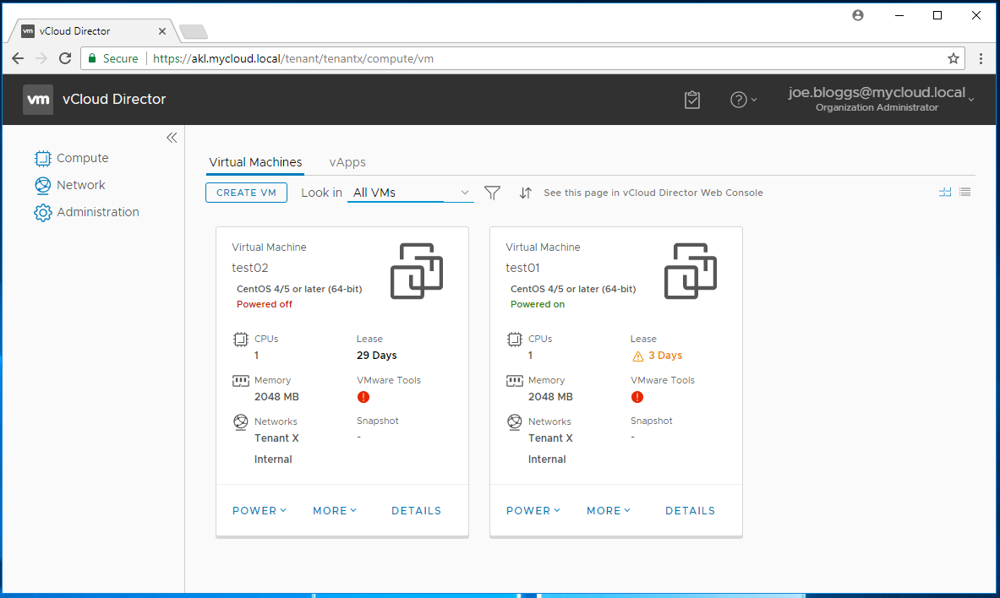
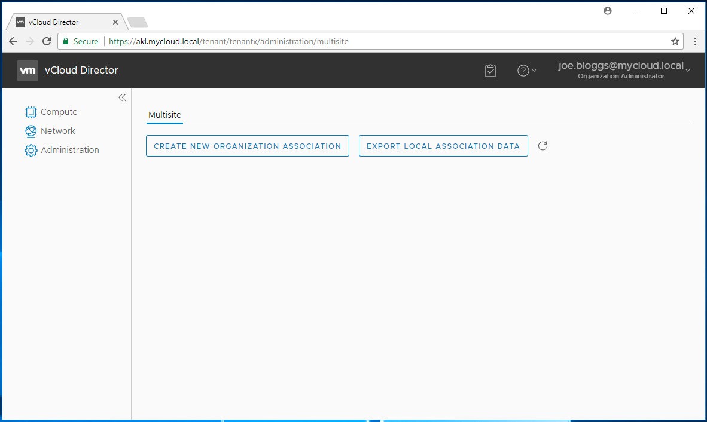
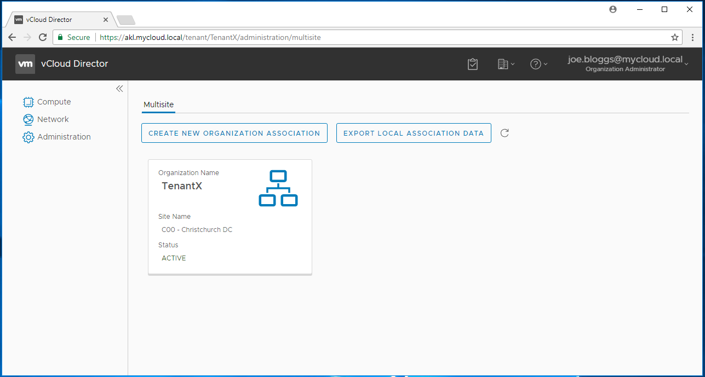
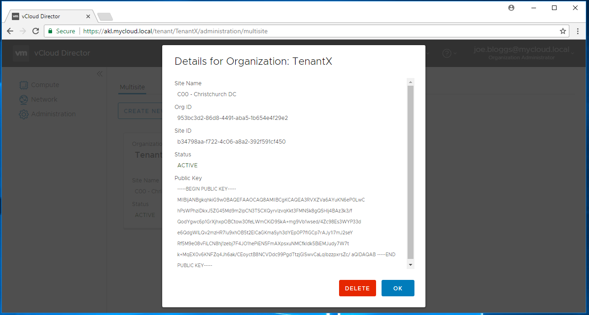
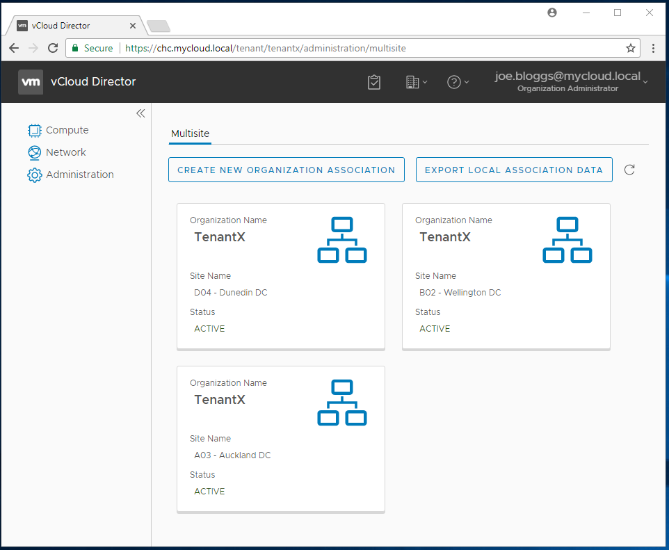
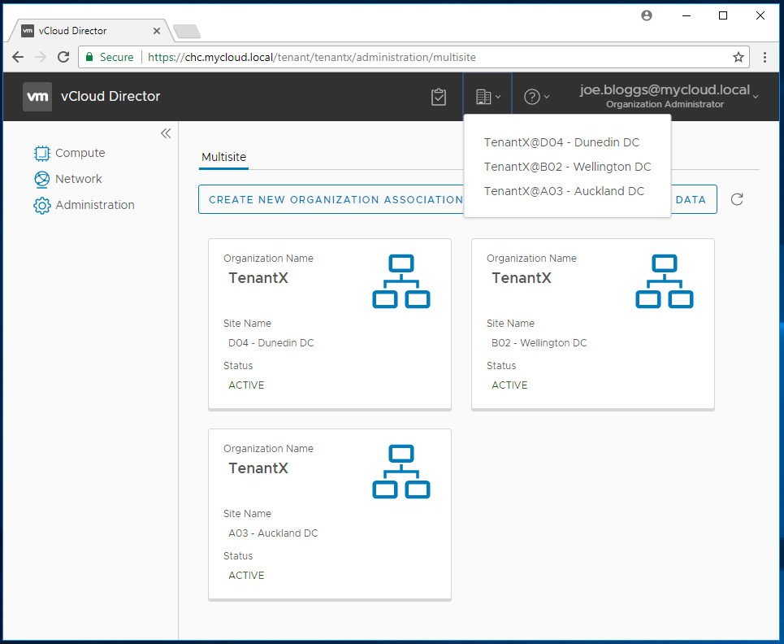
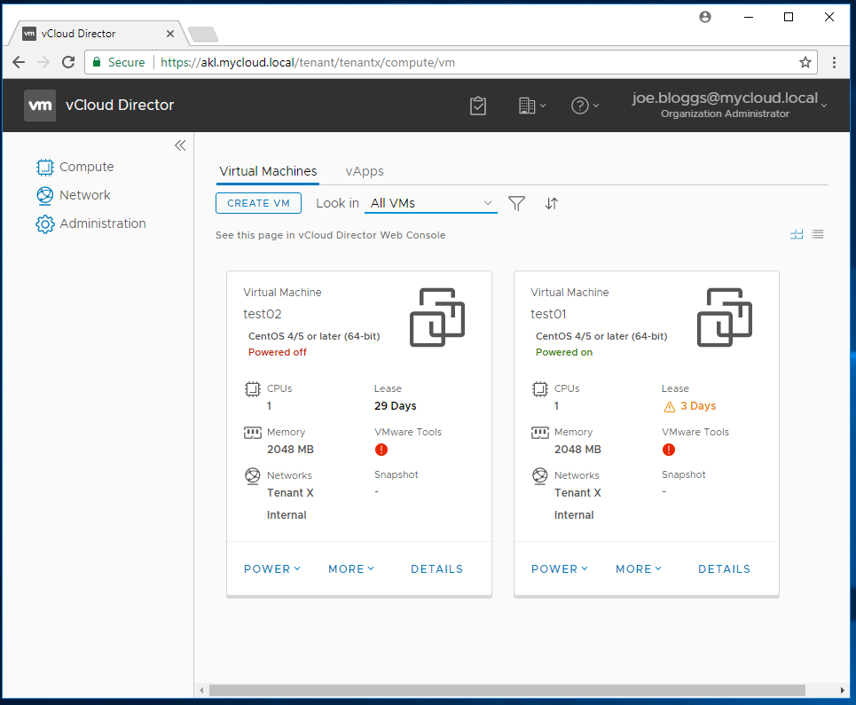

Since vCloud Director v9 was released last week (and previously as part of the closed beta), one of the new features I'm most excited about is support for multi-site deployments. This allows vCloud Director environments for the first time to properly span federated sites (e.g. a tenant who has resources in multiple datacenter locations for resiliency/redundancy can now manage these in the same place).

Configuring multi-site support in vCloud Director v9 is a 2-part process:

1) The service provider has to configure federation between their vCloud Director instances.  
2) The tenant has to associate each of their Organizations in each vCloud Director instance.

This post will attempt to explain and show both processes, and there's even a bonus of a PowerShell script I've written to help other service providers configure their site pairings. To help demonstrate the processes involved, I've built a test lab environment consisting of 4 separate vCloud Director instances ('Auckland', 'Wellington', 'Christchurch' and 'Dunedin' sites). Each of these has it's own vCloud Director, vCenter, NSX and ESXi hosts. I've also created a tenant organization ('Tenant X') in all 4 instances and created and assigned a VDC to Tenant X in each location. Finally, I've federated Tenant X's vCloud users with a directory service (Microsoft AD FS in this case) so that the same identity provider is available to all 4 vCloud instances.

If you're not a service provider and just need to configure Organization pairing you're probably safe to skip this section and proceed straight to the 2nd part of this post.

## Part 1 - Service Provider Site Pairing

The basic process for a service provider to pair sites is:

- Check (and configure if necessary) the vCloud site name in each location. Note by default in the initial vCloud Director 9 release this is simply a GUID string so you'll probably want to change it to something more meaningful.  
- Download from each site the site association document (from /api/site/associations/localAssociationData)  
- Upload this site association document to each other site that you want to pair with (to /api/site/associations)

In a scenario with only 2 sites you need to perform this process twice (once in each direction), but for our example with 4 sites we need to do this a total of 12 times to pair every site with every other site.

Being a bit of a pain to do manually against the REST API interface I ran true to form and wrote a PowerShell module to simplify the process of both administering the site names and also pairing sites together. The module is available on my github repository at <a href="https://github.com/jondwaite/vCDSitePair" target="_blank" rel="noopener">https://github.com/jondwaite/vCDSitePair</a>. The script uses my <a href="http://152.67.105.113/2017/09/invoke-vcloud-powershell-module/" target="_blank" rel="noopener">Invoke-vCloud</a> module, so you'll need that installed for it to run.

Once you've downloaded the vCDSitePair.psm1 file from github you can add it to your PowerShell session using 'Import-Module '

There are a total of 4 functions provided by the module, and they are documented on the github repository but basically:

|Commandlet|Description|
|---|---|
|Get-vCloudSiteName|Allows a service provider to check/confirm the 'Site Name' assigned to a vCloud Director instance.|
|Set-vCloudSiteName|Allows a service provider to set/update the 'Site Name' assigned to a vCloud Director instance.|
|Get-vCloudSiteAssociations|Shows the existing associations (if any) from a vCloud Director instance.|
|Invoke-vCDPairSites|Performs the 2-way exchange of localAssociationData documents to pair two vCloud Director instances.|

So to confirm/set the names of our 'Auckland' (akl.mycloud.local) and 'Christchurch' (chc.mycloud.local) sites we can use `Get-vCloudSiteName` and `Set-vCloudSiteName`:

```
PS C:\> Get-vCloudSiteName -siteDomain akl.mycloud.local
847f4785-f8a5-4e59-b0d7-5608723247dd

PS C:\> Set-vCloudSiteName -siteDomain akl.mycloud.local -siteName 'A03 - Auckland DC'
Task submitted successfully, waiting for result
q=queued, P=pre-running, .=Task Running:
q
Task completed successfully
True

PS C:\> Get-vCloudSiteName -siteDomain akl.mycloud.local
A03 - Auckland DC

Christchurch Site Name:

PS C:\> Get-vCloudSiteName -siteDomain chc.mycloud.local
b34798aa-f722-4c06-a8a2-392f591cf450

PS C:\> Set-vCloudSiteName -siteDomain chc.mycloud.local -siteName 'C00 - Christchurch DC'
Task submitted successfully, waiting for result
q=queued, P=pre-running, .=Task Running:
q 
Task completed successfully
True

PS C:\> Get-vCloudSiteName -siteDomain chc.mycloud.local
C00 - Christchurch DC
```

Now we have set the site names, we can check if they are already associated:

```
PS C:\> Get-vCloudSiteAssociations -siteDomain akl.mycloud.local
Displaying site associations for site Id: urn:vcloud:site:847f4785-f8a5-4e59-b0d7-5608723247dd with site Name: A03 - Auckland DC
No site associations found

PS C:\> Get-vCloudSiteAssociations -siteDomain chc.mycloud.local
Displaying site associations for site Id: urn:vcloud:site:b34798aa-f722-4c06-a8a2-392f591cf450 with site Name: C00 - Christchurch DC
No site associations found
```

Ok, so they're not already associated, so we can run Invoke-vCDPairSites without the 'WhatIf $false' to see what would happen:

```
PS C:\> Invoke-vCDPairSites -siteAuri akl.mycloud.local -siteBuri chc.mycloud.local
Running in information mode only - no API changes will be made unless you run with -WhatIf $false
Site A returned site ID as: urn:vcloud:site:847f4785-f8a5-4e59-b0d7-5608723247dd
Site A returned site name as: A03 - Auckland DC
Site B returned site ID as: urn:vcloud:site:b34798aa-f722-4c06-a8a2-392f591cf450
Site B returned site name as: C00 - Christchurch DC
Not performing site association as running in information mode
```

That all looks good so now we can attempt the actual pairing operation:

```
PS C:\> Invoke-vCDPairSites -siteAuri akl.mycloud.local -siteBuri chc.mycloud.local -WhatIf $false
Running in implementation mode, API changes will be committed
Site A returned site ID as: urn:vcloud:site:847f4785-f8a5-4e59-b0d7-5608723247dd
Site A returned site name as: A03 - Auckland DC
Site B returned site ID as: urn:vcloud:site:b34798aa-f722-4c06-a8a2-392f591cf450
Site B returned site name as: C00 - Christchurch DC
Associating A03 - Auckland DC (Site A) with C00 - Christchurch DC (Site B)
Task submitted successfully, waiting for result
q=queued, P=pre-running, .=Task Running:
q 
Task completed successfully
Returned Result = True
Associating C00 - Christchurch DC (Site B) with A03 - Auckland DC (Site A)
Task submitted successfully, waiting for result
q=queued, P=pre-running, .=Task Running:
q 
Task completed successfully
Returned Result = True
```

And confirm the associations using Get-vCloudSiteAssociation again:

```
PS C:\> Get-vCloudSiteAssociations -siteDomain akl.mycloud.local
Displaying site associations for site Id: urn:vcloud:site:847f4785-f8a5-4e59-b0d7-5608723247dd with site Name: A03 - Auckland DC
Associated sites:
https://chc.mycloud.local/api


href                    : https://akl.mycloud.local/api/site/associations/b34798aa-f722-4c06-a8a2-392f591cf450
type                    : application/vnd.vmware.admin.siteAssociation+xml
Link                    : {Link, Link, Link}
RestEndpoint            : https://chc.mycloud.local/api
TenantUiEndpoint        : https://chc.mycloud.local/tenant
RestEndpointCertificate : -----BEGIN CERTIFICATE-----
                          MII...
                          -----END CERTIFICATE-----
SiteId                  : urn:vcloud:site:b34798aa-f722-4c06-a8a2-392f591cf450
SiteName                : C00 - Christchurch DC
PublicKey               : -----BEGIN PUBLIC KEY-----
                          MII...
                          -----END PUBLIC KEY-----
```

(I've cut out the certificate dumps for brevity).

So now that our Auckland and Christchurch sites are paired we can move on with associating the Organization ('Tenant X') between these sites. I've also been through and associated all of the other sites to each other, so by this stage 'Auckland' is associated to 'Wellington','Christchurch' and 'Dunedin' etc.

## Part 2 - Organization Site Pairing

Originally I was intending to write PowerShell functions for this too, and while this is certainly possible, VMware have been nice to us and created the capability in the new vCloud Director tenant UI. Logging in as a user with 'Organizational Administrator' access shows an 'Administration' tab:



Selecting the 'Administration' tab reveals the site pairing options:



When we select 'Export Local Association Data' a file is downloaded (named 'Download' weirdly enough) and this file can be uploaded to the 'partner' site using the other 'Create New Organization Association' button. Once completed, the association is shown in the panel - here is the Auckland site for 'Tenant X' once the Christchurch Local Association Data has been uploaded to it:



You can click on this panel to see the association details and even remove a site association if no longer required:



Here's the view of the 'Christchurch' environment once I've paired the 'other' 3 sites to it for this Organization:



Once we've added all our associations (and logged out and back in) we can see the new multi-site drop-down menu item which allows us to select from any of our datacenter locations:



And selecting one ('Auckland' in this case) takes us to the Auckland resource view:



All in all, a little bit of a convoluted process, but at least it should only need to be done once and can then be left alone. Very excited to see what VMware do with this functionality in future - can definitely see a time when all of an Organization's VMs are displayed / summarised in a single view regardless of which vCloud instance supports them.

I have several more thoughts generally on vCloud Director v9 which I'll put into a separate post when I have time, but wanted to get this published for anyone else playing around with the new multi-site features.

As always, comments and feedback appreciated.

Jon.