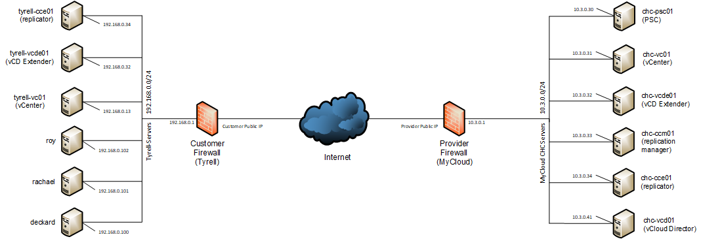

Last week VMware released version 1.0 of the new vCloud Director Extender (CX) ([link to documentation set][1]). This provides some extremely flexible options for customers to migrate servers to/from a vCloud service provider cloud platform, including the use of L2VPN to transparently stretch their on-premise networks to the cloud provider. Together with a 'warm' cutover feature, this enables any customer with an appropriately configured vCloud tenancy and resources to safely and easily move their virtual servers to the most suitable hosting location with minimal application downtime.

As always, there are a few pre-requisites:

- The customer site must be running vSphere 6 Update 3 or later (6.5.0 and 6.5 Update 1 are also both supported).  
- If the customer wishes to use L2VPN network extension and is already running VMware NSX, this must be v6.2.8 or v6.3.2.  
- The cloud provider must be running vCloud Director v8.20 or v9.0.

Deployment of the replication environment is different for the Cloud Provider and tenant (as you would expect) and firewall rules and address translation need to be appropriately configured to permit the required traffic flows at both the provider and customer end.

This series of articles will detail the installation and configuration of vCloud Director Extender and is intended to be useful for both Cloud Providers needing to configure their own environments to support CX and for customers wishing to configure their environments to allow migration to/from a CX-enabled provider.

The environment that I will be describing and building through this series is shown in the graphic below, Tyrell Corporation is the client organisation and MyCloud is the Cloud Provider which Tyrell wish to use to host 3 of their production VMs ('Deckard', 'Rachael' and 'Roy'). In this example Tyrell and MyCloud happen to use different internal IP network ranges, but that is not a requirement to use CX since NAT firewalls are in place at both organisations.

Since I built this environment using 'real' public Internet addresses and VMware NSX edge gateways as the firewalls for both Tyrell and MyCloud, I have stripped the public IP addresses from the configurations shown in these articles, but it should be easy to see where these are substituted.

I'm expecting this series to consist of 6 parts eventually including this introduction:

Part 1 - This overview  
[Part 2 - Cloud Provider / Service Provider installation and configuration (MyCloud)][2]  
[Part 3 - Customer / Tenant installation and configuration (Tyrell)][3]  
[Part 4 - Customer / Tenant connecting to a Cloud Provider and Virtual Machine migration (Tyrell)][4]  
[Part 5 - Stretched networking (L2VPN) configurations][5]  

I'm still working on the later parts of this series so check back if I haven't published all of them yet.

[Link to Part 2][2]

As always, corrections, comments and feedback are always appreciated.

Jon.

 [1]: https://docs.vmware.com/en/vCloud-Director-Extender/index.html
 [2]: /2017/10/vcloud-director-extender-part-2-cloud-provider-setup/
 [3]: /2017/10/vcloud-director-extender-part-3-tenant-setup/
 [4]: /2017/10/vcloud-director-extender-part-4-connect-to-provider-vm-migration/
 [5]: /2017/11/vcloud-director-extender-part-5-stretch-networking-l2vpn/