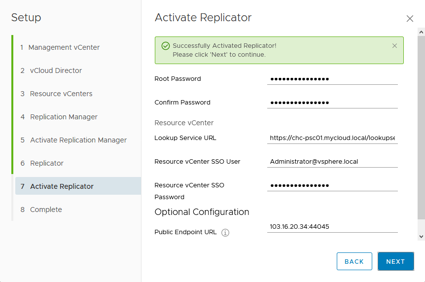

In the [first part][1] of this series of articles I described the new vCloud Director Extender (CX) software released by VMware. In this article I will show the steps required to install and configure the software from a Cloud Provider perspective. Included in this will be the necessary network and firewall configuration required.

vCloud Director Extender is supplied as a single .ova appliance from the VMware download site (login required). The download is located in the 'Drivers & Tools' section of the vCloud Director for Service Providers v9.0 page:

The ova file will generate the 3 different server components required to create a functional deployment:

|Item|Description|
|---|---|
|CX Cloud Service|The main vCloud Director Extender appliance, this is used to provide the UI for setup/configuration. This is the appliance initially deployed from the vCloud Director Extender appliance download package.|
|Cloud Continuity Manager (CCM)|This component (also known as the 'Replicator Manager') is the operational manager of the deployment. CCM only runs in provider deployments and manages the replicator (CCE) appliances. CCM appliances are deployed and managed by the CX appliance (no additional download is required).|
|Cloud Continuity Engine (CCE)|This component (also known as the 'Replicator') is the transfer engine that deals with data transfers between the customer and provider environments. CCE runs in both the provider and client environments. CCE appliances are deployed and managed by the CX appliance (no additional download is required).|

The downloaded CX appliance is deployed from vCenter, the first selection allows you to specify the VM name and datacenter/folder location to deploy. In most service providers this would likely be the management cluster for their environment (as opposed to resource vcenters used for customer workloads)

Next you select which cluster/resource pool to deploy the CX appliance into:

A Review screen is presented which allows you to confirm the ova details:

And of course we have to read/accept the license agreement:

Next we select the datastore location for deployment:

And the internal network which the appliance will be connected to:

Make sure in the 'Customize template' screen (below) you change the 'Deployment Type' to 'cx-cloud-service' and don't leave the default selection (cx-connector) selected as this will install the customer/tenant environment instead of the service provider configuration! The rest of the configuration options on this page are straightforward:

A summary screen is displayed showing a summary of the customization options selected, check these carefully as if they are wrong you'll probably have to re-deploy from scratch:

Once the appliance is deployed, you will need to manually power it on from the vSphere client (or I did anyway - not sure if this is by design or not). Once it has booted and configured itself it will show the browser link to access to begin the environment configuration:

Note that if you open a page to just the hostname/IP address you'll get an error, you must include the '/ui/mgmt' suffix to the URL. You can now login with the 'initial root login' password you configured during the ova deployment. As you can see from the screen grab below I pre-configured DNS entries for the 3 provider components and used these wherever possible to avoid IP address confusion:

The main screen opens to the Setup Wizard, the tabs at the top of the screen allow you to easily navigate between sections, but these won't show much until you complete the wizard:

Clicking on the 'Setup Wizard' opens a series of dialogs to provide the initial system configuration, first we have to specify the management vCenter authentication details. Note that the 'Lookup Service URL' as well as being optional also requires the path to the Platform Services Controller (PSC) if you are using external PSCs. The full path is truncated in this grab but should be `https://<psc or vcenter with embedded psc address>/lookupservice/sdk`:

The wizard includes very useful feedback at each step to show you if the previous actions have been successful or not, just click 'Next' through if everything is ok, or go back and fix the issue if not:

Now we need to provide a 'system' (administrator) level login to vCloud Director, you don't need to specify the @system part of the user name here:

Again we get confirmation that we've successfully linked to vCloud Director and can continue with 'Next':

Next we can add the resource vCenters (where customer workloads actually run). In my lab environment this is the same vCenter that supports the management environment so the details are the same, but in production environments this will almost certainly be different. The setup wizard is intelligent enough to retrieve the names of any vCenter servers being used in Provider VDCs (pVDCs) in vCloud Director so for these you only need to 'Update'.

When you click update you'll be asked to provide administrator credentials to the resource vCenter environment. Be careful here as the default 'Lookup Service URL' will be set to the vCenter name, even if the vCenter is using an external Platform Services Controller (PSC) as mine was and will need to be manually edited to point to the PSC. This caught me out initially and I couldn't work out why authentication to the resource vCenter was failing.

Once the resource vCenter(s) are authenticated they'll show as 'Registered' in the wizard:

Next we need to configure the 2nd appliance configuration - this will be the 'Replication Manager' (also called the Cloud Continuity Manager / CCM in the documentation). We need to specify the parameters shown (the dialog scrolls down and also asks for default gateway address, DNS server address and netmask).

The wizard will now deploy and start up the replication manager appliance on the vCenter specified. If the networking information is incorrect the process will stall at this point as the wizard relies on establishing network connectivity with the replication manager before continuing. A status update is given at the top of the dialog as the appliance is deployed and started up. Once the replication manager appliance is running and seen on the network you'll see the success message:

Next the replication manager appliance must be 'activated' by setting the password for the root user and the 'Public Endpoint URL'. Make sure you set this to the correct external (public) IP address that your customers will be using to connect to your CX environment. I haven't found any way yet to alter this setting after deployment if specified incorrectly without deleting the entire CX environment and starting over (the xx's in this grab are simply to hide the real internet addressing I was using - I'm also pretty sure I eventually used the default port of 8044 for this public URL):

If everything has gone ok, you'll get the screen below showing that the replication manager deployment has succeeded and you can move on to the replicator configuration:

The deployment details for the Replicator are specified next - the wizard helpfully copies across some of the settings from the Replication Manager deployment, but you still need to specify the (unique) IP and Netmask details:

The Replicator appliance will now be deployed in vCenter in exactly the same way as the Replication Manager was previously. Once it becomes available on the network the wizard will detect this and show the screen below:

Next we have to 'Activate' the Replicator appliance by completing the settings shown below to authenticate to the resource vCenter which this Replicator will be responsible for.

If everything worked ok you'll get a 'Successfully Activated' message:

Clicking 'Next' takes you to the 'Complete' screen and shows that if you have additional Resource vCenters you'll need to deploy additional Replicator appliances for these (1 per vCenter):

Clicking through the tabs in the management UI should now show that all the required CX components are now deployed and registered. The 'Cloud Resoures' tab shows linked vCloud Director instances and resource vCenters:

The 'Replication Manager' tab shows the deployed Replication Manager appliance:

The 'Replicators' tab shows the deployed Replicator appliance(s) - 1 per resource vCenter if you have multiples of these.

That completes the appliance installation and initial configuration, next you will need to configure appropriate NAT/firewall rules so that customers on the internet can connect to your new CX service!

Assuming that you wish to use a single external (public) Internet IP address for the entire CX service, the configuration is a little tricky since traffic will need to be directed to either the CX, Replication Manager or Replicator appliance depending on what port it is attempting to aceess. The NAT/Firewall rules that I worked out from the documentation and found that worked are:

|Source Address|Destination|Destination Port/Protocol|Translated Port/Protocol|Translated Internal Address|
|---|---|---|---|---|
|External (Internet)|CX Service Public IP Address|443/tcp|443/tcp|CX (vCD Extender) appliance internal address|
|External (Internet)|CX Service Public IP Address|8044/tcp|8044/tcp|Replication Manager appliance internal address|
|External (Internet)|CX Service Public IP Address|44045/tcp|44045/tcp|Replicator appliance internal address|

Also note that if you restrict outbound internet traffic from your CX network you will also need to permit the following traffic in an Outbound direction:

|Source|Destination|Source Port/Protocol|Destination Port/Protocol|Description|
|---|---|---|---|---|
|CX Server Network|External (Internet)|Any|443/tcp|Required for CX to be able to communicate with customer Replicator management interface|
|CX Server Network|External (Internet)|Any|44045/tcp|Required for CX to be able to communicate with customer Replicator data interface|

In the next part of this series of articles I'll continue with the installation and configuration of the CX components required on the customer / tenant site.

[Link back to Part 1][1] || [Link to Part 3][2]

As always, corrections, comments and feedback are always appreciated.

Jon.

 [1]: /2017/10/vcloud-director-extender-part-1-overview/
 [2]: /2017/10/vcloud-director-extender-part-3-tenant-setup/