In the first 3 parts of this series I covered an overview of vCloud Director Extender (CX), the installation and configuration of CX at the Cloud Provider site and the installation and configuration of CX at the customer/tenant site. In this 4th part I will be covering the configuration of the tenant environment to connect to the provider cloud and then migrate VM workloads to the provider.

This part follows on from the configuration completed in part 3 of this series and assumes that Tyrell (the customer site) have an existing virtual datacenter (VDC) environment available from MyCloud (the provider) and an appropriate Organization Administrator login to this environment. I've also created local DNS entries in the Tyrell network for the 'chc.mycloud.local' and 'vcde.mycloud.local' DNS names which resolve to the public IP addresses for the MyCloud vCloud Director instance and the provider CX endpoint respectively. Obviously in the real world these would be registered Internet DNS names.

In the Tyrell vCenter server when we select the 'vCloud Director Extender' icon we are shown an initial view of the CX plugin interface:  

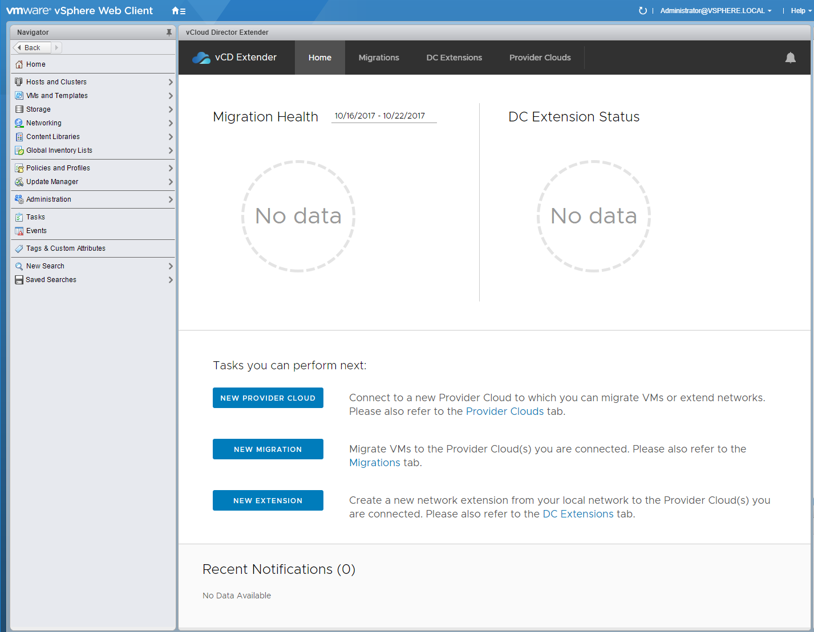

Selecting the 'New Provider Cloud' button opens a wizard to configure the connection to the Cloud Provider endpoints:  

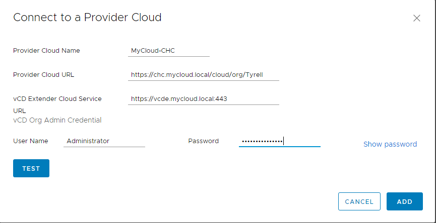

The 'Provider Cloud URL' needs to be set to include the appropriate path for the vCloud Director Organisation which is being connected to (the /cloud/org/Tyrell part in this example). The user details hold the Organization Administrator role within this cloud organisation.

When clicking 'Add' you will be presented with a certificate warning if the cloud provider is not using trusted/signed certificates, you can optionally select to trust these certificates if this is the case (very handy for a lab environment).

You can use the 'Test' button to confirm the settings are valid - you will see a status update at the bottom of the dialog showing the status of this test:

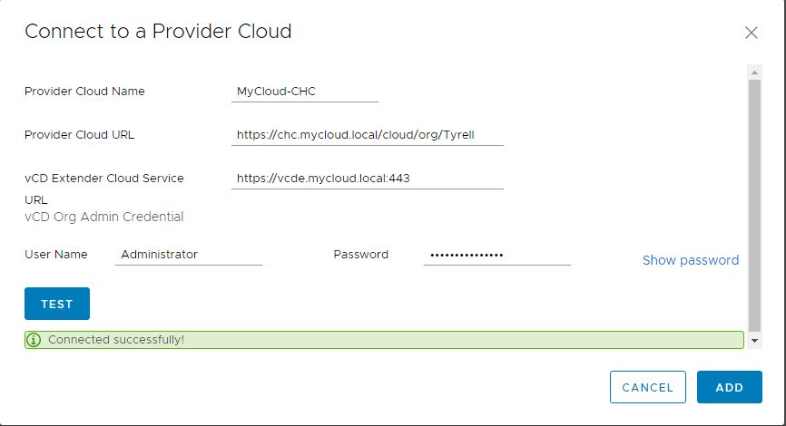

Note that even if the 'Test' succeeds, there are still some circumstances to do with network connectivity that can result in the enablement process failing - this is shown in the following capture from the 'Provider Clouds' tab where you can see the 'Status' shows 'Enable Failed':

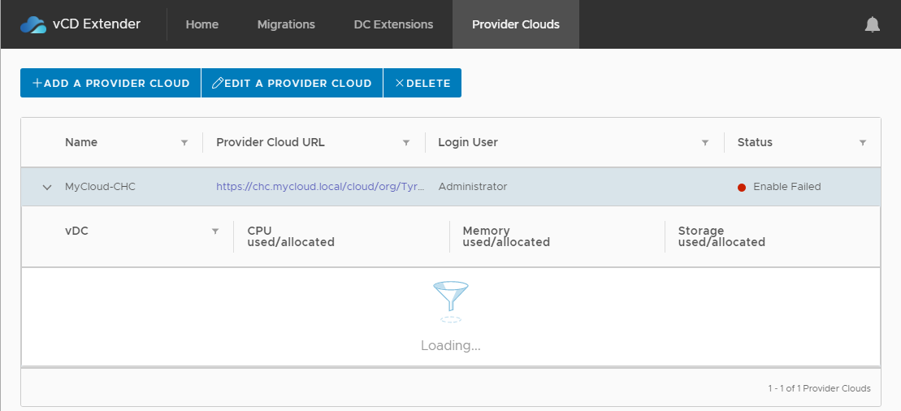

This is usually caused by incorrect firewall rules, NAT rules or Public Endpoint URL's set incorrectly when the CX appliances are deployed, I'm intending to cover this in a future 'Troubleshooting' part to this series of posts.

Once the networking and URLs are configured correctly you will see the new provider cloud registered under the 'Provider Clouds' tab with a status of 'Running', you will also see any accessible virtual datacenters (vDC) to which you have access:

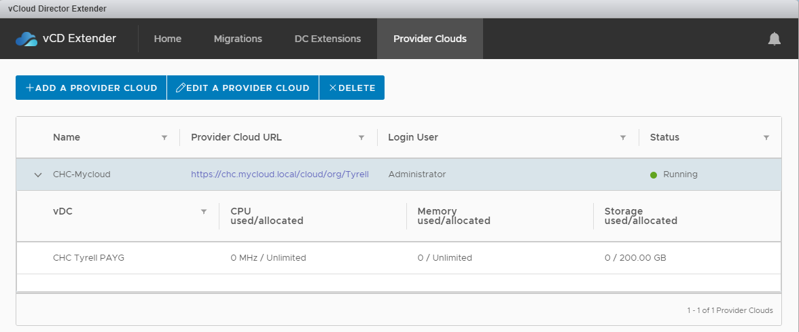

Now that our provider cloud is properly registered, we can submit a migration request using the 'Migrations' tab in the CX interface, first we will be asked if we wish to perform a 'Cold' or 'Warm' migration - the differences between these are well explained in the dialog. Note that 'Warm' migration is not a vMotion, but does involve a period of network disconnection as the VM is cutover to the Cloud Provider. For this example we'll select a 'Warm' migration:

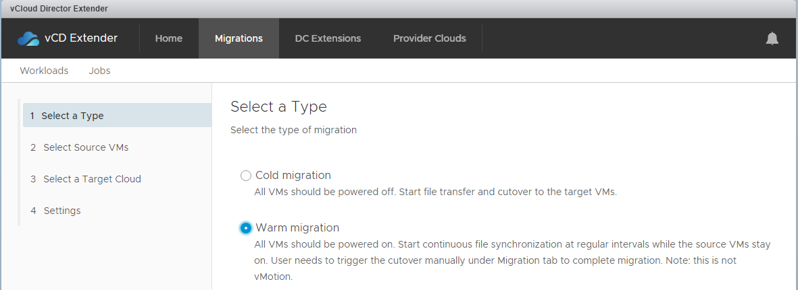

Clicking 'Next' takes us to an inventory view where we can select the source VM(s) to be migrated. The grey panel below the 'Inventory Browser' dynamically expands to show candidate VMs from the vCenter environment. When a VM is selected the status and disk sizes are update in the right-side panel. For this example we've selected the 'deckard' VM:

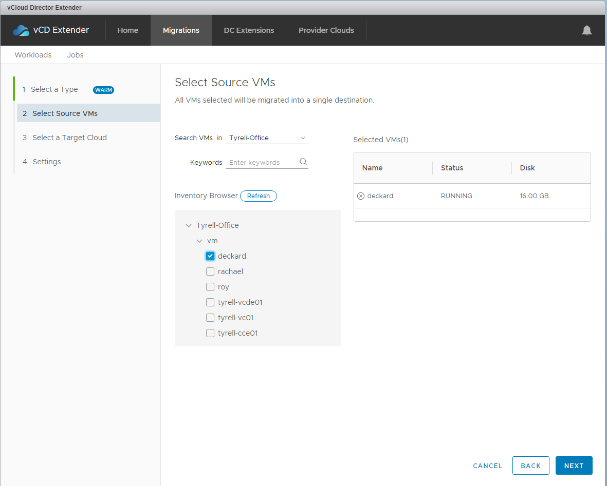

Clicking 'Next' takes us on to the Target selection - here we can select the Cloud Provider, vDC, VM storage profile for the remote copy and the network to be connected to the VM in the Cloud Provider. Note that we are not L2-extending our on-premises network in this example and relying on our Cloud Provider (MyCloud) having already defined an Org vDC network for us (in this case called 'Tyrell Servers'). All of the values are populated automatically from the vCloud Director environment and drop-downs allow easy select of other options. Finally we have the option when migrating multiple VMs together to group these into a single vApp rather than creating a new vApp for each VM:

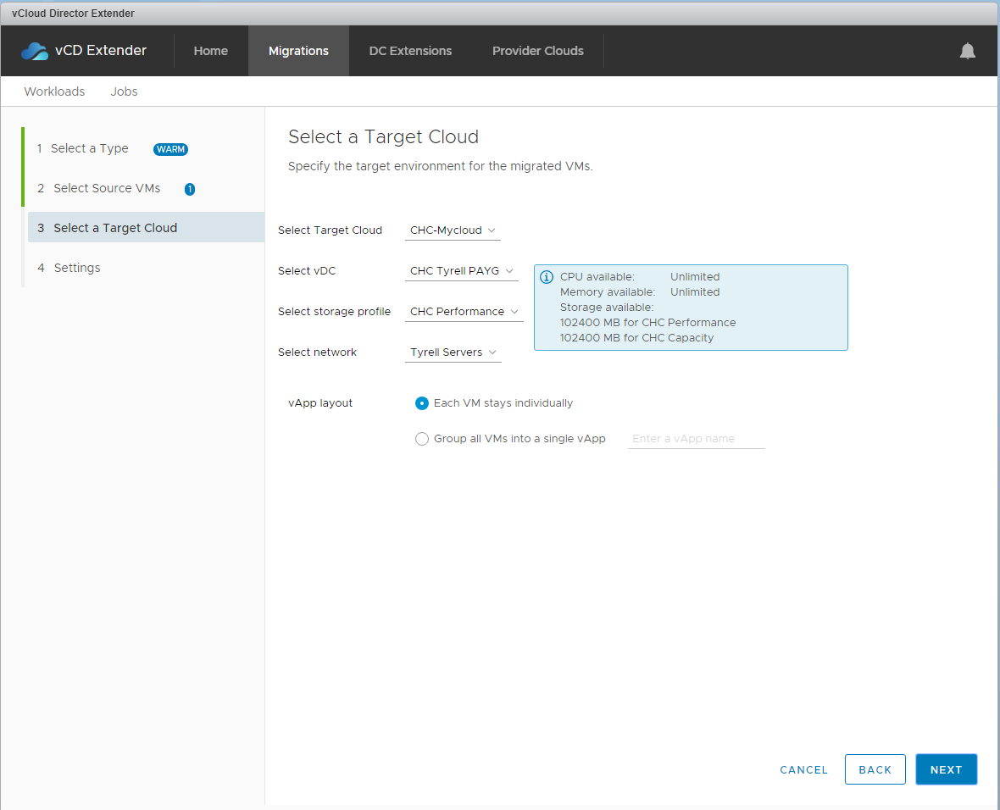

In the final migration configuration step we can specify when the VM synchronisation should start, what our target Recovery Point Objective (RPO) is in minutes and whether to provision the destination disks as 'Thin' provisioned or 'Thick' provisioned. Finally we can add an optional tag to reference against this job later:

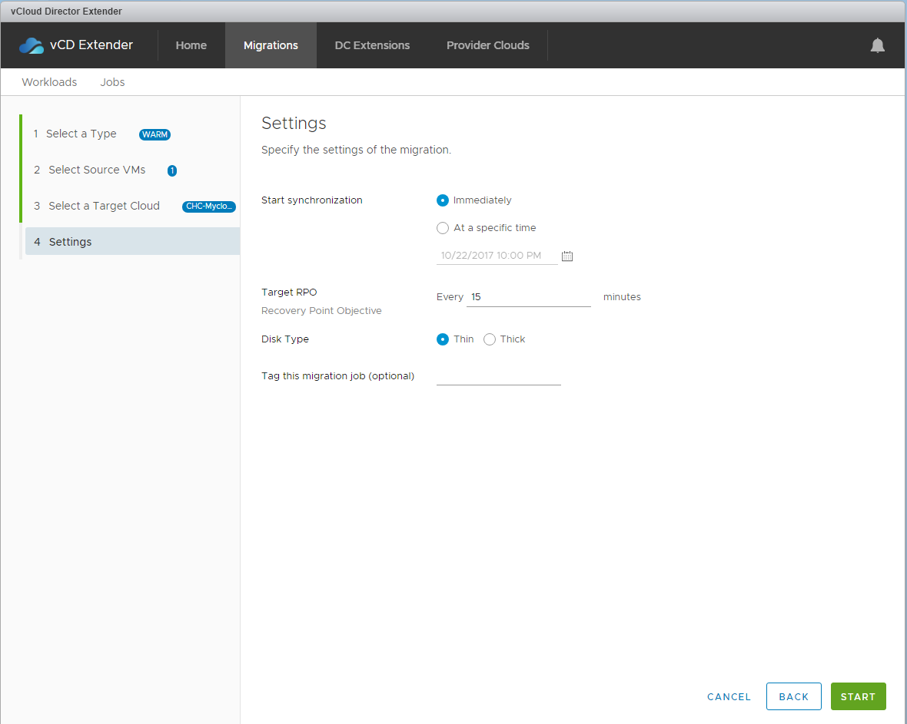

If everything has worked, you'll now see a progress indicator against the VM in the Migrations tab. Initially the status will be 'Created':

Once data synchronisation begins this status will be updated to show the synchronised percentage for the migration. If you get an 'Error' prior to the sync percentage moving from 0% this is almost certainly a network configuration issue (and one which I encountered frequently when first building my lab environment). I'll cover the common causes and remedies for this more in my vCloud Extender Troubleshooting post.

Once the initial synchronisation process has completed you will see the VM listed as 'Cutover ready' which means it's staged and ready to be migrated:

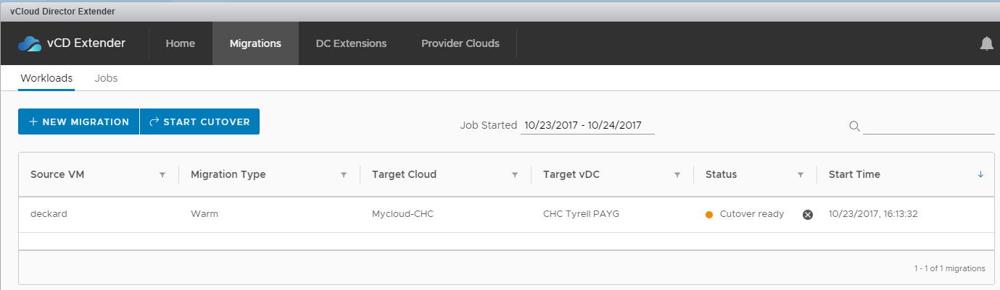

Logging in to the Tyrell vCloud Director portal at this point shows that nothing actually has been provisioned into the Tyrell VDC:

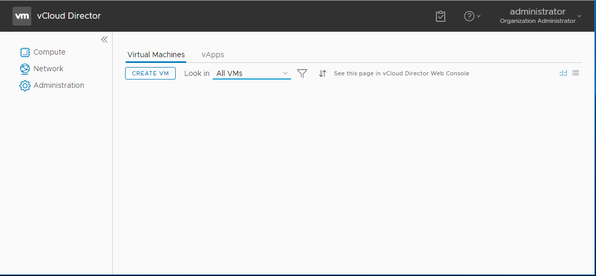

Looking at the 'Home' page for the CX environment in vCenter shows our VM as in a 'Transition' state:

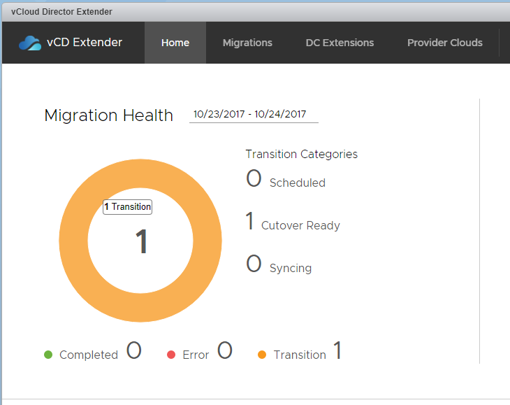

In the Migrations tab we can now select the 'Start Cutover' button to actually cutover the VM to the Cloud Provider environment which opens the Cutover dialog:

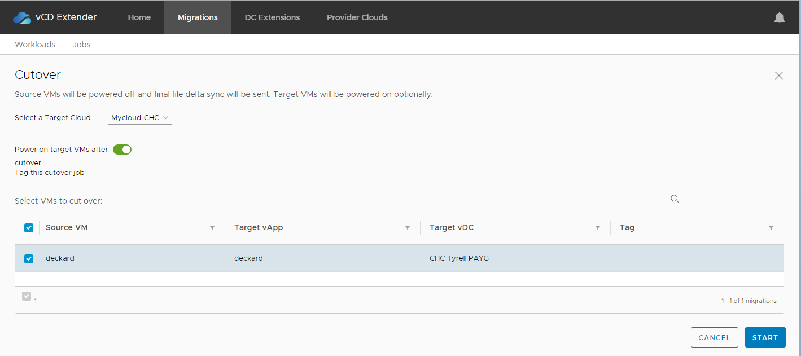

Clicking 'Start' asks for confirmation and then performs the actual cutover to running the VM in the Cloud Provider datacenter, progress is updated during the cutover procedure:

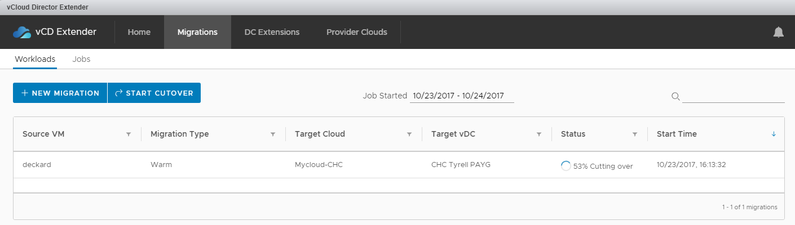

When the cutover process is complete you will see the Status update:

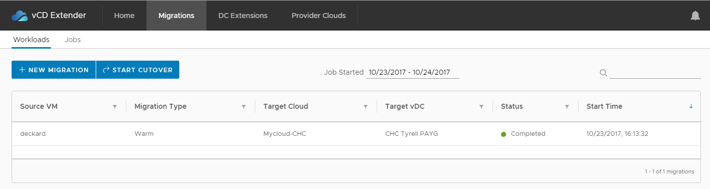

Looking in vCenter at this point shows the original VM still in place, but now powered off, you should probably take steps to ensure that this VM cannot be accidentally started at this point or risk having two running instances of the same VM (potentially on the same network if your network is extended to the Cloud Provider):

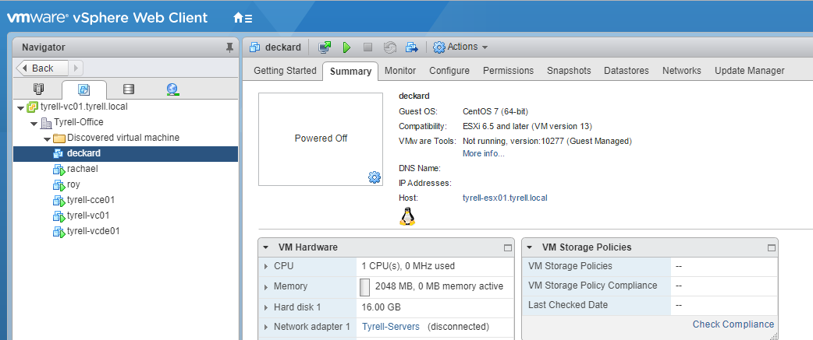

Refreshing the Tyrell vCloud Director portal shows the migrated VM now running in the Tyrell Cloud Provider VDC:

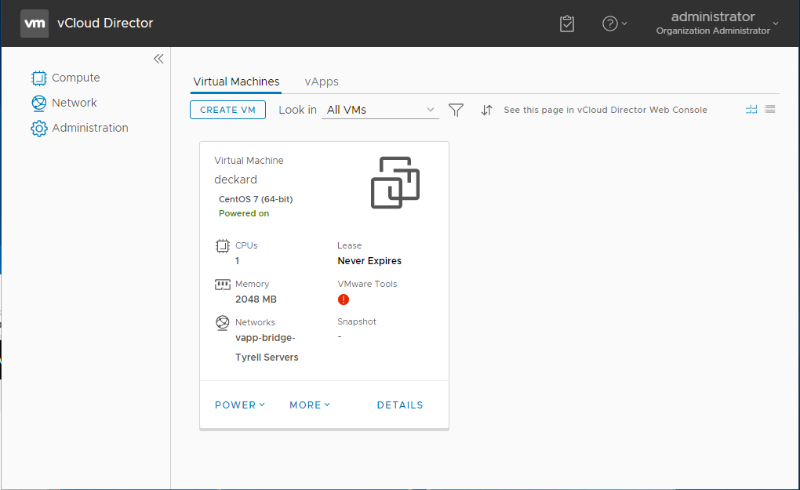

The status in the vCloud Extender vCenter plugin also now shows the completed migration total:

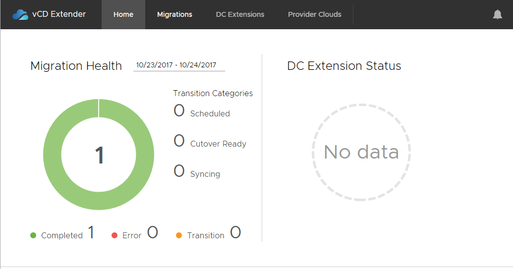

In the next part of this series of articles I look at the options to extend L2 networking directly from a customer site into vCloud Director using CX and the changes this introduces into the migration workflow.

[Link back to Part 3][1] || [Link to Part 5][2]

As always, corrections, comments and feedback are always appreciated.

Jon.

 [1]: /2017/10/vcloud-director-extender-part-3-tenant-setup/
 [2]: /2017/11/vcloud-director-extender-part-5-stretch-networking-l2vpn/