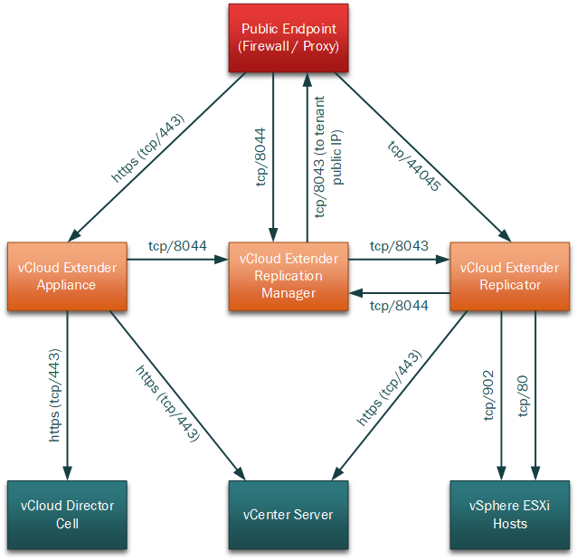

One of the things which appears to be missing from the [published documentation][1] on vCloud Director Extender (CX) is any mention of the communications internally between the deployed appliances and other VMware infrastructure components (vCenter, vCloud Director etc.) In a service provider context it is unlikely that the appliances will be deployed into the same network/security zone as these components so it is important to know what these communication requirements are.

Using the Flow Monitoring functionality in VMware NSX I was able to capture all traffic flows during vCloud Extender migrations and produce the drawing below detailing these traffic flows.

### Network Traffic Flows for vCloud Extender (Provider Side)

Note that the http (tcp/80) access from the replicator appliance to the ESXi hosts appears anomolous - I would have expected this to be on https (tcp/443) at the very least and this probably needs further investigation.

The 8044/tcp port to the replication manager can be NAT'd from a different external (public) port if necessary - this can be configured using the 'Public Endpoint URL' field when activating the replication manager appliance during vCloud Extender deployment (see my post: [here](/2017/10/vcloud-director-extender-part-2-cloud-provider-setup)).

The 44045/tcp port to the replicator appliance can also be NAT'd from a different external (public) port if necessary - this can be configured using the 'Public Endpoint URL' field when activating the replicator appliance during vCloud Extender deployment  (see my post: [here](/2017/10/vcloud-director-extender-part-2-cloud-provider-setup)).

Be careful when activating the "Replication Manager" and "Replicator" appliances - the configuration screens look very similar and it is reasonably easy to get them mixed up and enter incorrect parameters.

Also note that this diagram only depicts traffic flows for migration activity and doesn't capture additional flows involved in L2 network extensions (which typically will be from a hosted NSX edge to either the tenant NSX edge or standalone NSX appliance in the tenant site).

At least the information presented should allow other service providers to configure appropriate network security to protect their internal vCloud and vSphere environments when deploying vCloud Extender components into a DMZ network (for example).

As always, comments and feedback appreciated.

Jon

 [1]: https://docs.vmware.com/en/vCloud-Director-Extender/index.html
 