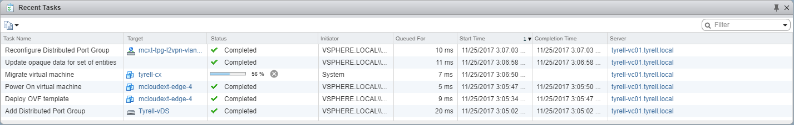

In this 5th part of my look into vCloud Director Extender (CX), I deal with the extension of a customer vCenter network into a cloud provider network using the L2VPN network extension functionality. Apologies that this post has been a bit delayed, turned out that I needed a VMware support request and a code update to vCloud Director 9.0.0.1 before I could get this functionality working. (I also had an issue with my lab environment which runs as a nested platform inside a vCloud Director environment and it turned out that the networking environment I had wasn't quite flexible enough to get this working).

**Update:** an earlier version of this article didn't include the steps to configure the L2 appliance settings in the vCloud Director Extender web interface - I've now added these to provide a more complete guide.

Links to the other parts of this series:  
[Part 1 - Overview][1]  
[Part 2 - Cloud Provider / Service Provider installation and configuration (MyCloud)][2]  
[Part 3 - Customer / Tenant installation and configuration (Tyrell)][3]  
[Part 4 - Customer / Tenant connecting to a Cloud Provider and Virtual Machine migration (Tyrell)][4]

I won't deal with the use-case here that the customer already has NSX networking installed and configured, since in most cases you can simply create L2VPN networks directly between the customer and provider NSX Edge appliances and don't really need to use the CX L2VPN functionality.

In order to be able to use the standalone L2VPN connectivity, the following pre-requisites are required:

  * A tenant vSphere environment with the vCloud Director Extender appliance deployed (it does not appear to be necessary to deploy the replication appliance if you only wish to use the L2VPN functionality, but obviously if you are intending to migrate VMs too you will need this deployed and configured as described in [Part 3][3] of this series. In either case you will still need to register the cloud provider in the CX interface.
  * A configured vCloud Director VDC for the tenant to connect to. This environment must also have an Advanced Edge Gateway deployed with at least one uplink having a publicly accessible (internet) IP address. Note that you do not need to configure the L2VPN service on this gateway - the CX wizard completes this for you.
  * At least one OrgVDC network created as a subinterface on this edge gateway. The steps to create a suitable new OrgVDC network are detailed below.
  * Outbound internet connectivity to allow the standalone edge deployed in the tenant vCenter to communicate with the cloud-hosted edge gateway - only port 443/tcp is required for this.
  * Administrative credentials to connect to both the tenant vCenter and the cloud tenancy/VDC (Organization Administrator role is required).

Opening the tenant vCenter environment and selecting the 'Home' page shows the following:

Selecting the vCloud Director Extender icon opens the CX interface:

If you have not yet configured the L2 appliance settings, selecting the 'DC Extensions' tab will show the following error:  

To fix this, open the vCloud Director Extender web interface in a browser by opening https://<ip address of deployed cx appliance>/ and log in, select the 'DC Extensions' tab:

Select the 'Add Appliance Configuration' option and complete the form to provide the deployment parameters where the standalone NSX edge appliance will be deployed:

The 'Uplink Network Pool IP' setting is a bit strange - it appears to be asking for a network pool or IP range, but the 'help text' in the field is asking for a single IP address. I found that the validation on this field is a bit odd - it will basically accept any input at all (even random strings) without complaining, but obviously deployment won't work. What you need to do is add individual IPv4 addresses and click the 'Add' button for each. You will need 1 address for each stretched network you will be extending to your cloud platform. In this example I am only extending a single network so have added a single IPv4 address (192.168.0.201).

Once you click the 'Create' button you will be returned to the 'DC Extensions' tab and shown a summary of the L2 appliance configuration:

Note that there doesn't appear to be any way to edit an existing L2 Appliance configuration, so if you need to change settings (e.g. to add additional uplink IP pool addresses) you will likely need to delete and recreate the entire entry.

Next we need to add a new 'subinterface' network to our hosted Edge gateway appliance, logging in to our cloud provider portal we can select the 'Administration' tab and the 'Org VDC Networks' sub-option, clicking the 'Add' button shows the dialog to create a new Org VDC Network. We need to select 'Create a routed network by connecting to an existing edge gateway' and then check the 'Create as subinterface' check box:

Next we configure the standard network information (Gateway, Network mask, DNS etc.) Since this network will be bridged to our on-premises network we can use the same details. Optionally a new Static IP pool can also be created so that new VMs provisioned in the cloud service can use this pool for their IP addresses. This won't be an issue for VMs being migrated as they will carry across whatever IP addresses are already assigned to them. Note that the gateway address is set to be the same address as the existing (on-premises) gateway - this means that re-configuring the default gateway setting in the guest OS isn't required either:

Now we supply a name for the new Org VDC network and optionally a description. The check box can also be used if the customer has multiple VDCs and wishes to share the new network across them:

Finally the summary screen allows us to check the information provided and go back and make any changes required if not correct. The most important setting is to make sure the network is attached to the edge gateway as a subinterface:

Once finished creating, the Org VDC network will be shown in the list with a type of 'Routed' and an interface type of 'Subinterface':

Next we access the vCloud Extender interface from within the customer vCenter plugin, selecting the 'DC Extensions' tab takes us to the following dialog:

Selecting 'New Extension' shows the dialog to create a new L2 extension, the fields are mostly populated for you. The 'Enable egress' allows you to select which gateway(s) will be allowed to forward traffic outside of the extended network. In this example I've only configured egress on the Source (on-premises) side through the existing gateway:

When you click 'Start', the status will go to 'Connecting' and a number of activities will take place in the customer vCenter:

Reading from the bottom (oldest) upwards, a new port group is created, an NSX Edge Standalone appliance is deployed and powered-on and the new port group is reconfigured once this has completed (ignore the VM migration task, that just happened to occur during the same time window in my lab). In this case the new NSX standalone edge was named 'mcloudext-edge-4' and the port group 'mcxt-tpg-l2vpn-vlan-Tyrell-VDC15'.

Once deployment has completed (takes a few minutes) the vCloud Extender client interface shows the new DC extension network with a status of 'Connected':

In the tenant vCloud Director portal you can also see the status of the tunnel under 'Statistics' and 'L2 VPN' within the edge gateway interface:

You will now find that any VMs connected to the stretched network (OrgVDC network) in your cloud environment have L2 connectivity with the on-premises network and will continue to function as if they were still located in the customer's own datacenter.

As I mentioned at the start of this post, I hit a number of issues when configuring this environment and getting it working took several attempts and a couple of rebuilds of my lab. The main issue was that in the initial release of vCloud Director v9.0.0.0 there is an issue that prevents the details required for the standalone NSX edge being deployed from being returned by the API. This prevents the deployment of the customer edge at all and resulted in my VMware support call. The specific issue is referenced in the vCloud Director 9.0.0.1 [release notes][5] as 'Resolves an issue where the vCloud Director API does not return a tunnelID parameter in response to a GET /vdcnetworks request sent against a routed Organization VCD network that has a subinterface enabled.' As far as I can work out, it will be impossible to successfully use L2VPN in CX without upgrading the provider to vCloud Director 9.0.0.1 to resolve this issue.

The other issue I hit in my lab was that my hosted 'Tenant Edge' was NAT'd behind another NSX Edge gateway which was also performing NAT translation (Double-NAT). This was due to the way my lab is built in a nested environment inside vCloud Director. Unfortunately this meant the external interface of my hosted 'Tenant Edge' was actually an internal network address, so when the customer/on-premise edge tried to establish contact it was using an internal network address which obviously wasn't going to work. I solved this by connecting a 'real' external internet network to my hosted Tenant Edge.

As always, comments and feedback always appreciated.

Jon.

 [1]: /2017/10/vcloud-director-extender-part-1-overview/
 [2]: /2017/10/vcloud-director-extender-part-2-cloud-provider-setup/
 [3]: /2017/10/vcloud-director-extender-part-3-tenant-setup/
 [4]: /2017/10/vcloud-director-extender-part-4-connect-to-provider-vm-migration/
 [5]: https://docs.vmware.com/en/VMware-vCloud-Director-for-Service-Providers/9.0.0.1/rn/rel_notes_vcloud_director_9-0-0-1.html