[Yesterday][1] I wrote showing the currently available container hosting options from VMware. As we’ve recently deployed one of these options – CSE in our environment I thought it would be useful to show a sample workflow on how the service functions and how customers can use this to deploy and manage both CSE clusters, and also micro-service applications onto those clusters.

There are a few requirements on the tenant side which must be completed prior to any of this working:

  * An Organizational Administrator login to the vCloud platform where CSE is deployed.
  * Access to a virtual datacenter (VDC) with sufficient CPU, Memory and Storage resources for the cluster to be deployed into.
  * An Org VDC network which can be used by the cluster and has sufficient free IP addresses in a Static Pool to allocate to the cluster nodes (clusters take 1 IP address for the ‘master’ node and an additional address for each ‘worker’ node deployed).
  * A client prepared with Python v3 installed and the vcd-cli and container-service-extension packages installed on it.
  * The {$HOMEDIR}\.vcd-cli\profiles.yaml file edited to add the CSE extension to vcd-cli.
  * The kubectl utility installed to administer the Kubernetes cluster once deployed and working. kubectl can be obtained most easily from <a href="https://kubernetes.io/docs/tasks/tools/install-kubectl/" target="_blank" rel="noopener">here</a>.

Detailed instructions for the client setup can be found in the CSE documentation at [https://vmware.github.io/container-service-extension/#tenant-installation][2]. Note that on a Windows platform the .vcd-cli folder and profiles.yaml file will not be automatically created, but you can do this manually by

<pre>mkdir %HOMEPATH%\.vcd-cli</pre>

from a DOS prompt and then using vcd-cli to log in and out of your cloud provider. This will cause profiles.yaml to be generated in the .vcd-cli folder. The profiles.yaml file can then be edited in your favourite text editor to add the required CSE extension lines.

### Deploying a Cluster with CSE

When deploying a cluster, you will need to know the storage profile and network names which the cluster will use, the easiest way of obtaining these is either from the vCloud portal, or using the vcd vdc info command when logged in to your environment:

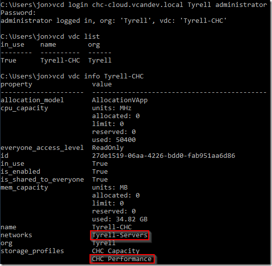

If you have multiple VDCs available to you, the ‘vcd vdc use <VDC Name>’ command to set which one to work with.

In this example we will be using the highlighted entries (the ‘Tyrell-Servers’ network and the ‘CHC Performance’ storage profile).

To retrieve a list of available cluster deployment templates that the Service Provider has made available to us we can use the vcd cse template list command:

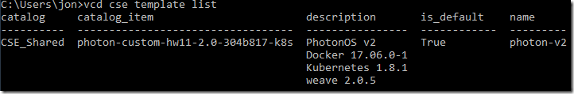

In this example only the Photon OS template is available and is also the default template. CSE actually comes with 2 profiles (Photon OS v2 and Ubuntu Linux 16-04, but I’ve only installed the Photon OS v2 template in my lab environment). The default template will be used if you do not specify the ‘-template’ switch when creating a cluster.

The cluster create command takes a number of parameters which are documented in the CSE page:


Be careful with the memory specification is it is in MB and not GB.

I chose to generate a public/private key to access the cluster nodes without needing a password, but this is optional. If you want to use key authentication you will need to generate a key pair and specify the public key filename in the cluster creation command using the -ssh-key switch.

To deploy a cluster with 3 worker nodes into our VDC where each node has 4GB of RAM and 2 CPUs using my public key and the network and storage profile identified above:

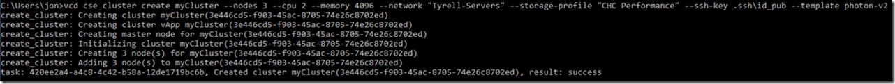

The deployment process will take several minutes to complete as the cluster VMs are deployed and started.

In to the vCloud Director portal, we can see the new vApp that has been deployed with our master and worker nodes inside it, we can also see that all 4 VMs are connected to the network we specified:

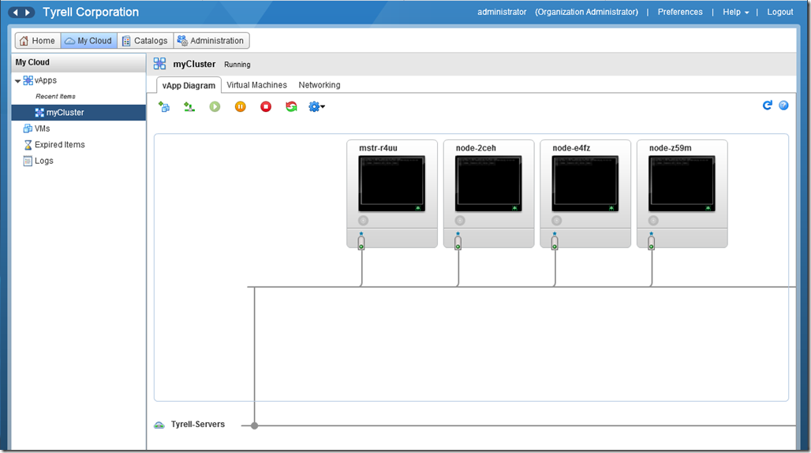

To see the details of the nodes deployed we can use ‘vcd cse node list <cluster name>’:

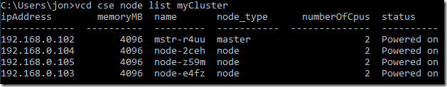

To manage the cluster with kubectl, we need a configuration file for Kubernetes containing our authentication certificates. kubectl by default looks for a file named ‘config’ in a folder called ‘.kube’ under the current user’s home directory. The config file itself can be downloaded using CSE. To create the folder and write the config file:

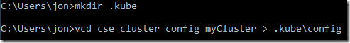

If you have multiple deployed clusters you can create separate config files for each one (with different file names) and use the -kubeconfig= switch to kubectl to select which one to use.

To test kubectl we can ask for a list of all containers (‘pods’ in Kubernetes) from the cluster, the ‘-all-namespaces’ switch shows system pods as well as any user created pods (which we don’t have yet). This must be run from a machine that has network connectivity with the deployed nodes (the ‘Tyrell-Servers’ network in this example):

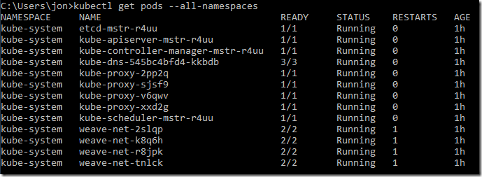

### Cluster Scaling

#### Adding Nodes to Clusters

If we need to add worker nodes to a cluster this is accomplished with the ‘vcd cse node create’ command. For example, we can add a 4th worker node to our ‘myCluster’ cluster as follows:

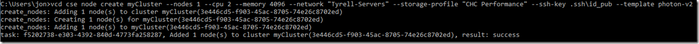

The node list now shows our cluster with 4 worker nodes including our new one:

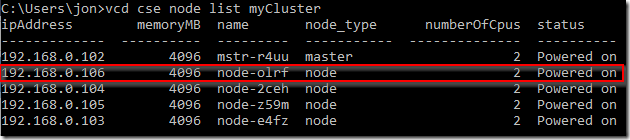

#### Removing Nodes from Clusters

To remove a cluster member is just as easy using the ‘vcd cse node delete’ command:

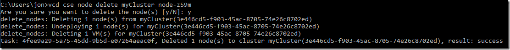

You will be prompted to confirm the node deletion, and if you have deployed container applications you should ensure that the node is properly drained and/or replica sets and deployments configured correctly so that the node deletion will not impact your applications.

### Cluster Host Affinity

One item that CSE does not deal with yet is creating vCloud Anti-Affinity rules to ensure that your worker nodes are spread across different physical hosts. This means that with appropriately configured applications a host failure will not impact on the availability of your deployed services. It is reasonably straightforward to add anti-affinity rules in the vCloud portal though.

Our test cluster is back to 3 nodes following the deletion example:

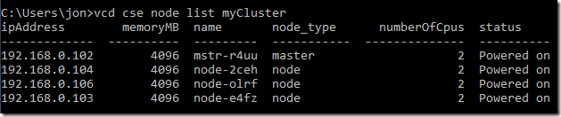

In the vCloud portal we can go to ‘Administration’ and select our virtual datacenter in the left pane, we will then see an ‘Affinity Rules’ tab:

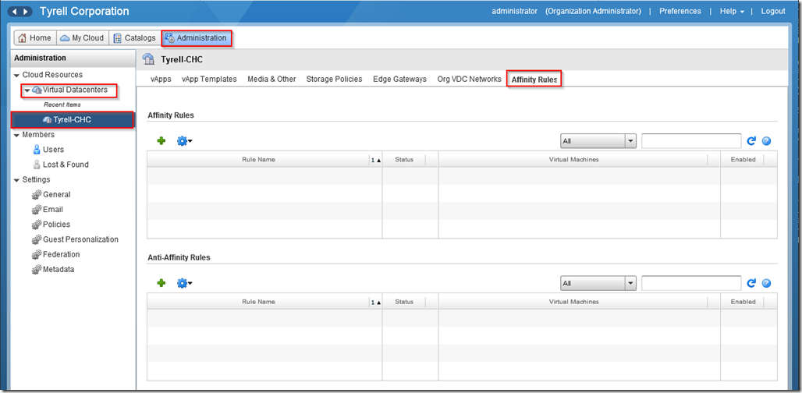

Clicking the ‘+’ icon under Anti-Affinity Rules allows us to create a new rule to keep our worker nodes on separate hosts:

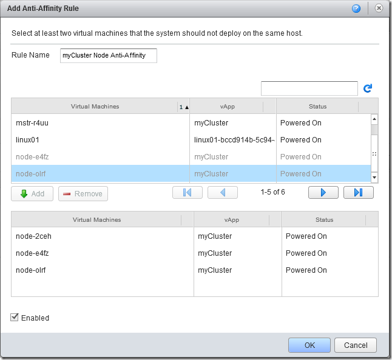

Provided the VDC has sufficient backing physical hosts, the screen will update to show the new rule and that it has successfully been applied and separated the worker nodes to different hosts:

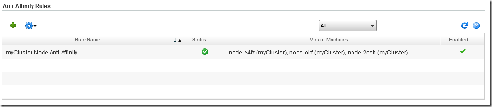

Of course if the host running the master node experiences a failure then this will be unavailable until the VMware platform restarts the VM on another host.

### Application Deployment using kubectl

Of course now that our cluster is up and running, it would be nice to actually deploy a workload to it. The ‘sock shop’ example mentioned in the CSE documentation is a good example application to try as it consists of several pods running in a separate namespace.

First we use kubectl to create the namespace:

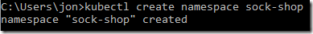

Now we can deploy the application into our name space from the microservices-demo project on github. You can read more about the sock-shop demo app at [https://github.com/microservices-demo/microservices-demo][19].

```
C:\Users\jon>kubectl apply -n sock-shop -f https://github.com/microservices-demo/microservices-demo/blob/master/deploy/kubernetes/complete-demo.yaml?raw=true
deployment "carts-db" created
service "carts-db" created
deployment "carts" created
service "carts" created
deployment "catalogue-db" created
service "catalogue-db" created
deployment "catalogue" created
service "catalogue" created
deployment "front-end" created
service "front-end" created
deployment "orders-db" created
service "orders-db" created
deployment "orders" created
service "orders" created
deployment "payment" created
service "payment" created
deployment "queue-master" created
service "queue-master" created
deployment "rabbitmq" created
service "rabbitmq" created
deployment "shipping" created
service "shipping" created
deployment "user-db" created
service "user-db" created
deployment "user" created
service "user" created`
```

We can see deployment status by getting the pod status in our namespace:

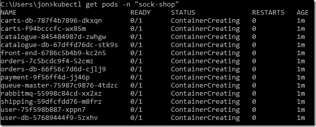

After a short while all the pods should have been created and show a status of ‘Running’:


The ‘sock-shop’ demo creates a service which listens on port 30001 on all nodes (including the master node) for http traffic, so we can get our master node IP address from ‘vcd cse node list myCluster’ and open this page in a browser:

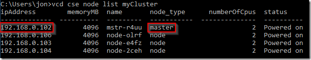

And here’s our deployed application running!

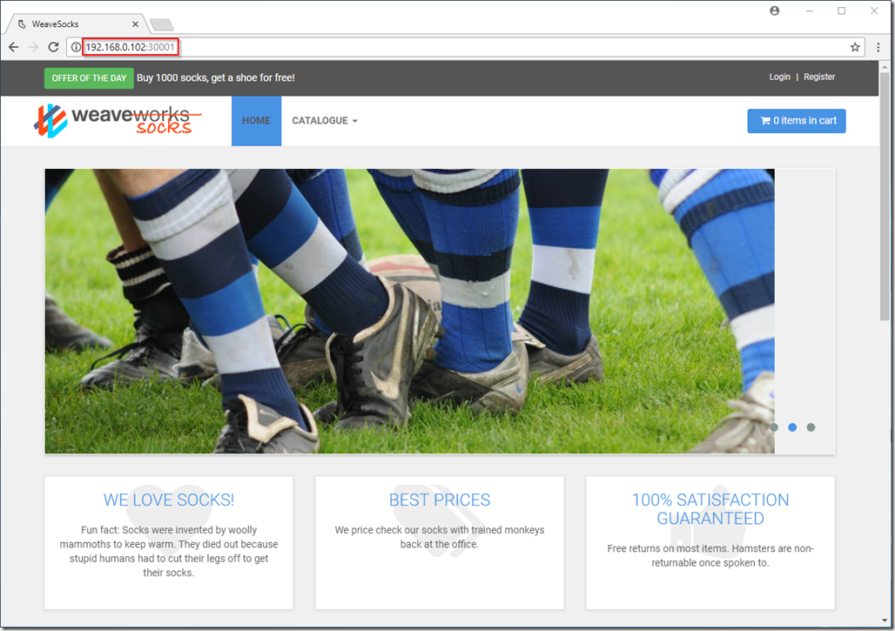

### Summary / Further Reading

Of course there’s much more that can be done with Docker and Kubernetes, but hopefully I’ve been able to demonstrate how easily a cluster can be deployed using CSE and how micro-services applications can be run in this platform.

For further reading on kubectl and all the available functionality I can recommend the Kubernetes kubectl documentation at [https://kubernetes.io/docs/reference/kubectl/overview/][24]. In fact the entire Kubernetes site is well worth a read for those considering deployment of these architectures.

As always, comments, feedback, suggestions and corrections always welcome.

Jon.

 [1]: /2018-02-24-vmware-container-solutions/
 [2]: https://vmware.github.io/container-service-extension/#tenant-installation "https://vmware.github.io/container-service-extension/#tenant-installation"
 [19]: https://github.com/microservices-demo/microservices-demo "https://github.com/microservices-demo/microservices-demo"
 [24]: https://kubernetes.io/docs/reference/kubectl/overview/ "https://kubernetes.io/docs/reference/kubectl/overview/"