One of the great new features in vCloud Director 9.1 is the ability to publish Orchestrator workflows to tenants which can be consumed from within their vCloud portal. Markus Kraus has written an excellent [post][1] showing the configuration process for linking Orchestrator and vCloud Director. This post shows the process for creating and deploying a workflow into this environment and shows the user experience when invoking the finished workflow. I can see a large range of possible use-cases for this capability – hopefully this post will give you an idea of what is possible.

Our demonstration workflow will be reasonably simple and cover a scenario where a tenant consuming an Allocated VDC needs more resources assigned to it. While this could be fully automated (directly make the changes to the vCloud Director VDC), it is probably more likely in these scenarios that the service provider would want to check and implement the change themselves. Therefore the following actions are required. The workflow tasks are therefore:

  * Extract the environment details (so we know which tenant user in which vCloud Organisation initiated the request.
  * Allow the tenant to enter the parameters for the extra resources they require.
  * Send an email to the service provider that contains the request details.
  * Send an email to the tenant user confirming the request details.

This example assumes that you have a functioning vRealize Orchestrator instance in the vCloud Director environment, and that you’ve registered the vCloud Director endpoint in Orchestrator. It also requires that you’ve configured the Orchestrator integration in the vCD provider portal and granted the new Service Library permissions to the tenant Organization Administrator role.

From the Orchestrator client, we first create a new workflow in Design view (I’ve created a folder to contain this called ‘vCD Workflows’ too), I’ve called my workflow ‘Request VDC Resources’:

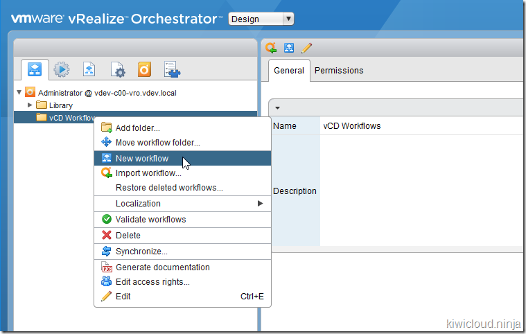

The new (empty) workflow is created and displayed in the vRO editor:

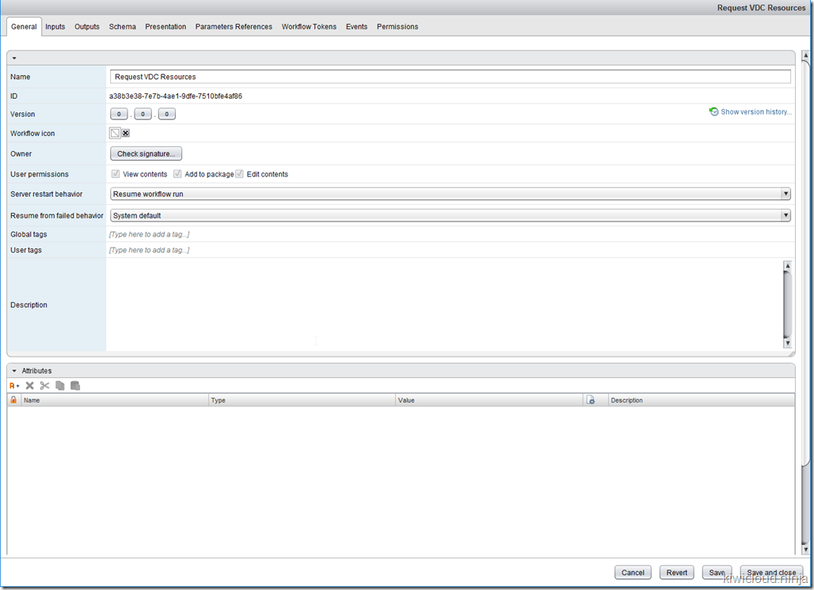

Our first task is to create some workflow inputs to capture required inputs, these can be created in the ‘Inputs’ tab using the ‘Add parameter’ button:

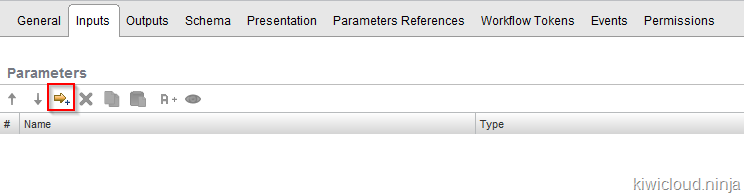

We need the following information from the user to be able to process this workflow, so I’ve created the parameters, given them the correct Type and set a description for each one. In my lab environment there are two classes of storage profiles (performance and capacity) so I’ll ask the user to provide values for both if requesting a storage increase. To change the parameter names, types and descriptions just click in the fields. The final ‘Inputs’ tab now looks like this:

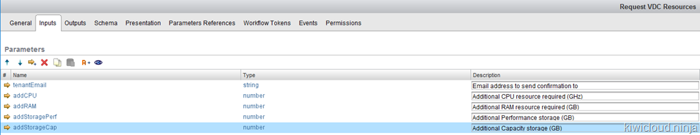

Now we can alter the Presentation tab to group the input fields appropriately. It can be a bit fiddly to add groups (Orchestrator adds steps each time which need to be removed), but with a bit of fiddling about you can get to something like this:

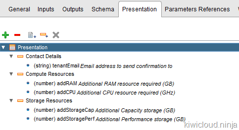

Next we need to add some attributes to our workflow to contain the subject and content of the email message together with some parameters to be passed to the send mail workflow, this can be done on the ‘General’ tab using the ‘add attribute’ button:

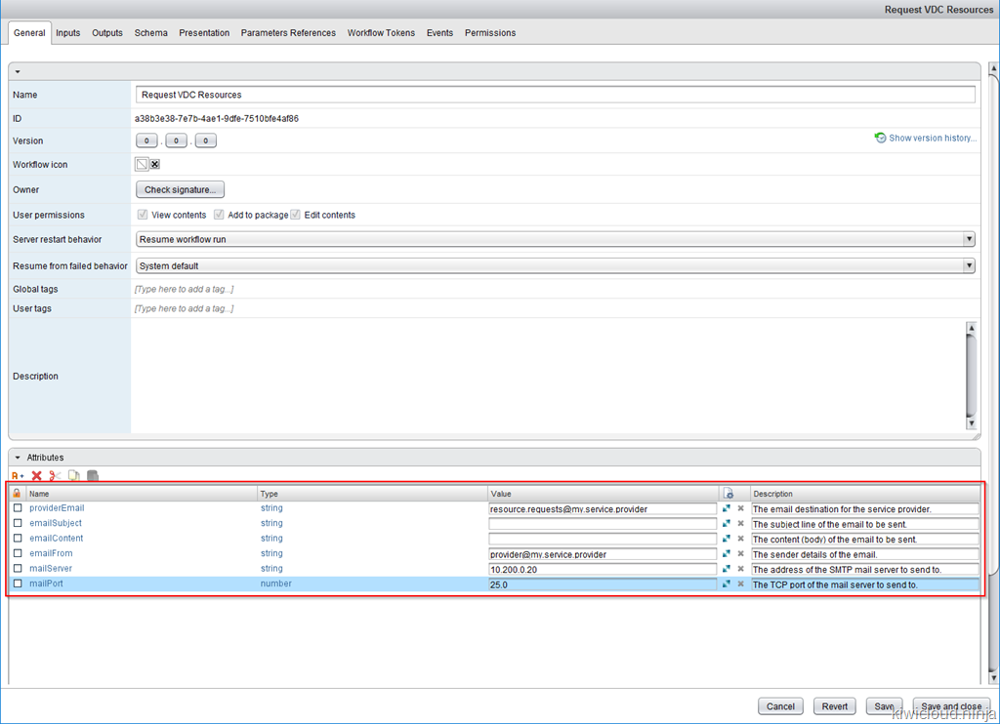

So that should be all of the information we require, next step is to go to the Schema tab and add a Scriptable Task by dragging the element between our start and end markers:

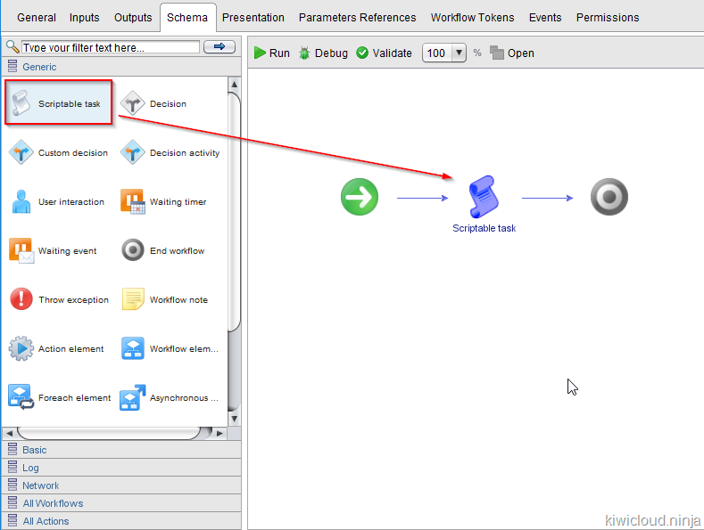

Double clicking on the title ‘Scriptable task’ allows us to set a friendly script name (‘Build Resource Email’ in this example). We can then select the ‘In’ tab for the script and select our input attributes and parameters:

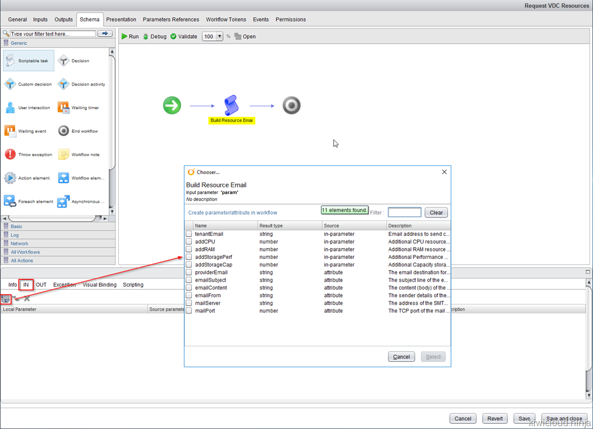

We select the in-parameters (‘tenantEmail’, ‘addCPU’, ‘addRAM’, ‘addStoragePerf’ and ‘addStorageCap’) from this dialog and get the following listed under our script’s ‘IN’ tab:

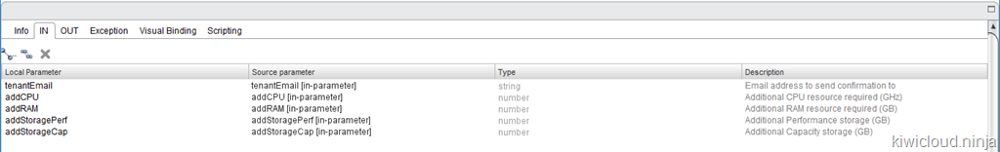
We do the same to bind the ‘emailSubject’ and ‘emailContent’ attributes to our script’s ‘OUT’ tab:

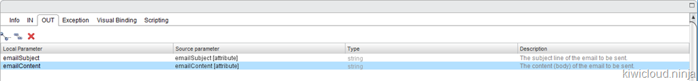

Switching to the ‘Visual Binding’ tab, (sliding the edit pane up a bit for clarity) should now show something like the following:

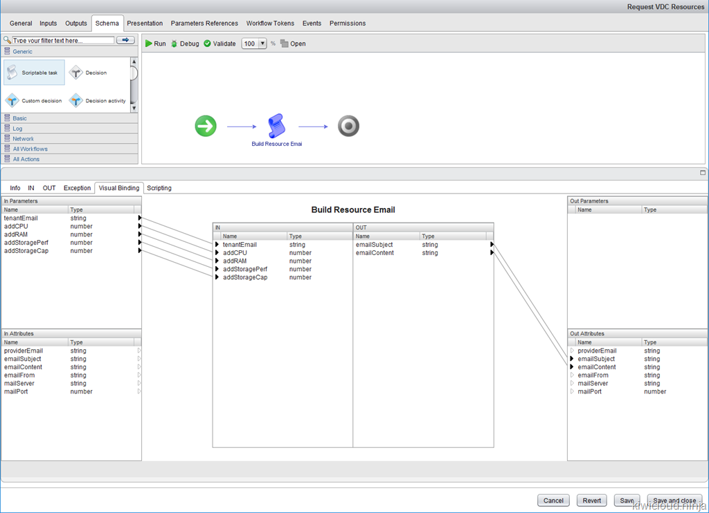

We can now switch to the Scripting tab to actually write the code that will generate our email subject and body:

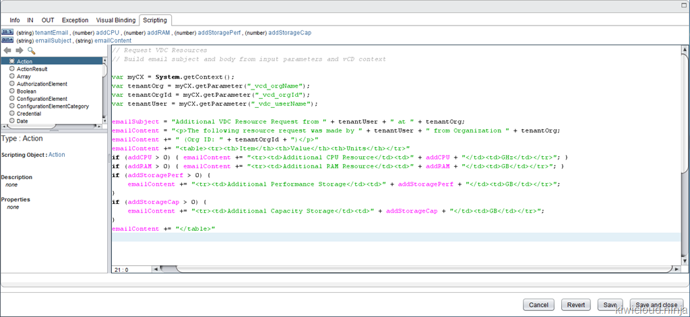

The code from this script is included below in case copy/paste is useful:

```
// Request VDC Resources
// Build email subject and body from input parameters and vCD context

var myCX = System.getContext();
var tenantOrg = myCX.getParameter("_vcd_orgName");
var tenantOrgId = myCX.getParameter("_vcd_orgId");
var tenantUser = myCX.getParameter("_vdc_userName");

emailSubject = "Additional VDC Resource Request from " + tenantUser + " at " + tenantOrg;
emailContent = "<p>The following resource request was made by " + tenantUser + " from Organization " + tenantOrg;
emailContent += " (Org ID: " + tenantOrgId + ")</p>"
emailContent += "<table><tr><th>Item</th><th>Value</th><th>Units</th></tr>"
if (addCPU > 0) { emailContent += "<tr><td>Additional CPU Resource</td><td>" + addCPU + "</td><td>GHz</td></tr>"; }
if (addRAM > 0) { emailContent += "<tr><td>Additional RAM Resource</td><td>" + addRAM + "</td><td>GB</td></tr>"; }
if (addStoragePerf > 0) {
     emailContent += "<tr><td>Additional Performance Storage</td><td>" + addStoragePerf + "</td><td>GB</td></tr>";
}
if (addStorageCap > 0) {
     emailContent += "<tr><td>Additional Capacity Storage</td><td>" + addStorageCap + "</td><td>GB</td></tr>";
}
emailContent += "</table>"
```

There’s nothing too complicated going on in the script, just building some HTML strings based on the input values we’ve received from the workflow. We query the \_vdc\_orgName, \_vdc\_orgId and \_vdc\_userName from our script environment to retrieve these values which are provided by the vCloud Director Service Library so we know which user in which tenant organisation has initiated the workflow.

Next we need to add the ‘send notification’ workflow to actually send an email, this can be dragged from the Mail folder under ‘All Workflows’ and placed after our script in the workflow Schema:

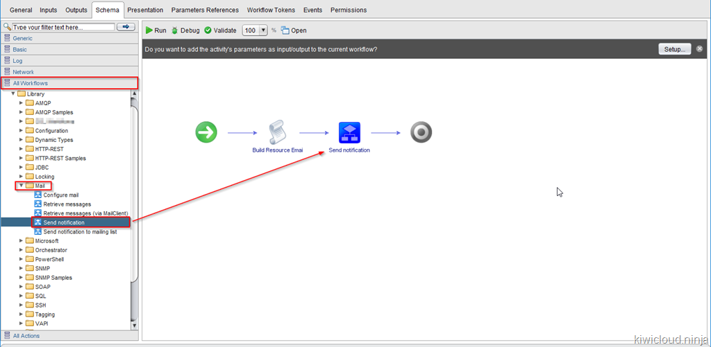

This first ‘Send notification’ will be the email sent to the service provider so I’ve renamed it as ‘Mail Provider’ and selected the ‘Source parameter’ items on the ‘IN’ tab as follows:

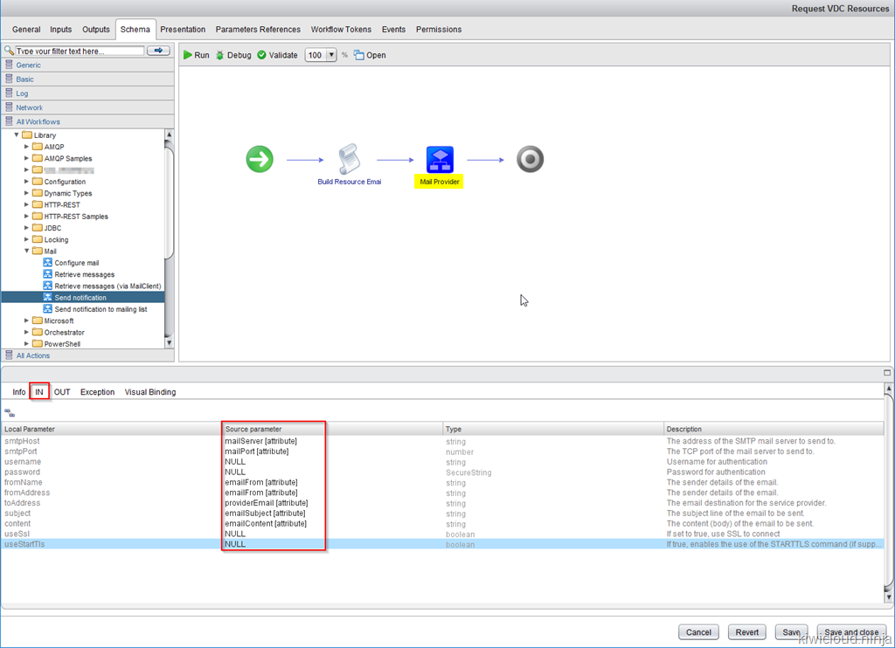

(To set each source parameter simply click on the ‘not set’ value and select the appropriate workflow attribute from the pop-up, ensure that unused parameters are set as NULL).

We can add a 2nd ‘Send Notification’ task to our workflow and configure it to send the same email content back to our tenant’s email address (the only change here is that the ‘toAddress’ parameter is set to the provided workflow tenant email address rather than the provider email address):

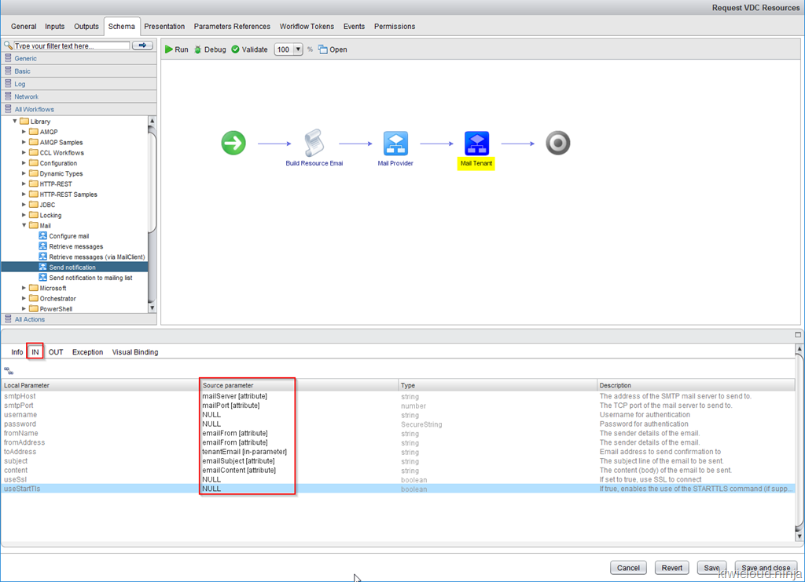

Our workflow is now complete and should be functional, we can ‘Validate’ and then Save and Close it in the Orchestrator client.

Our next step is to publish the workflow from the the provider interface of vCloud Director at https://<my vcloud IP>/provider

One logged in we see the following:

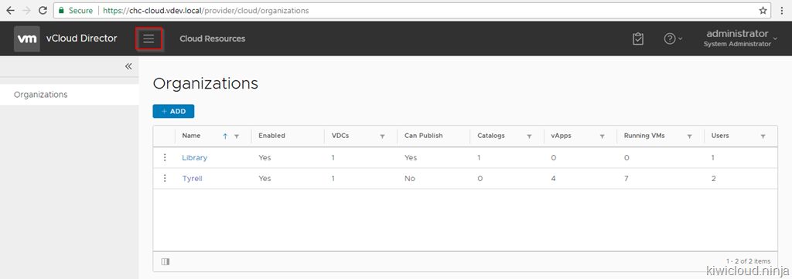

Selecting the 3-bars (highlighted) option and selecting ‘Content Libraries’ shows the Service Library:

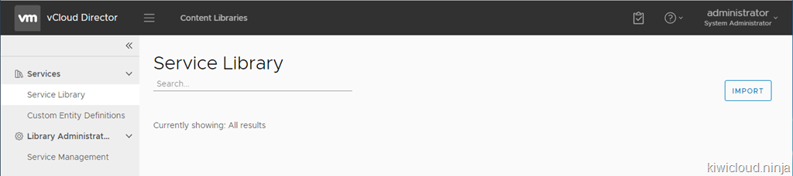

First we need to select ‘Service Mangement’ and then ‘Service Categories’ tab to create a new Service Category (group) into which our workflow will be imported:

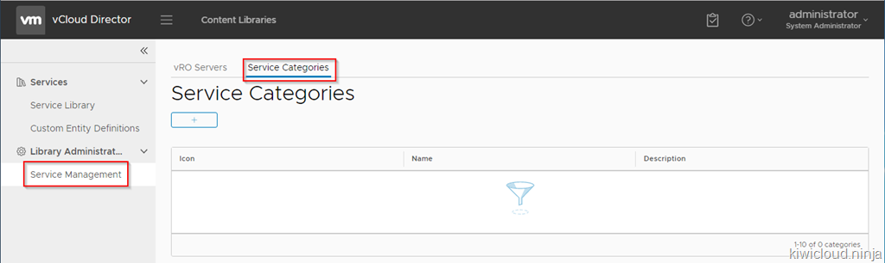

Clicking the ‘+’ sign allows us to define a new category and provide an icon for it:

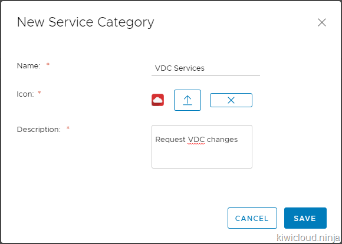

Once saved we can return to the ‘Service Library’:

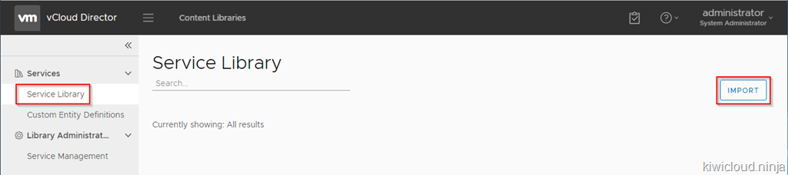

The ‘Import’ option allows us to add our workflow to the library, first we select the category we just created:

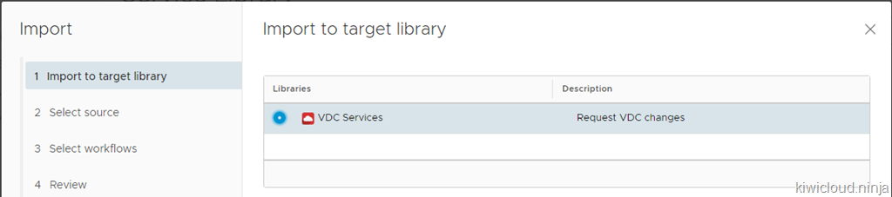

Next we select the source Orchestrator instance where our workflow lives:

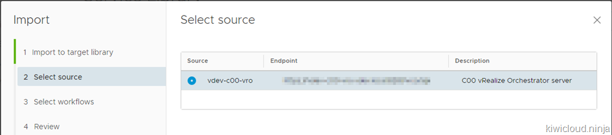

Now we can browse the workflow tree and select our new workflow:

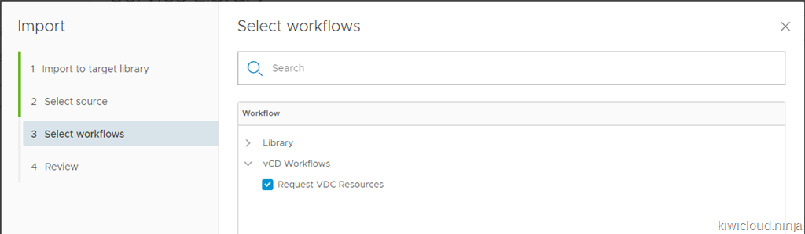

Finally we review and select ‘Done’ to create the library entry:

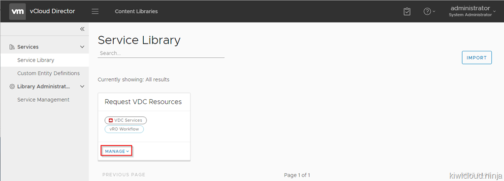

Using the ‘Manage’ button we can chose who the workflow should be published to:

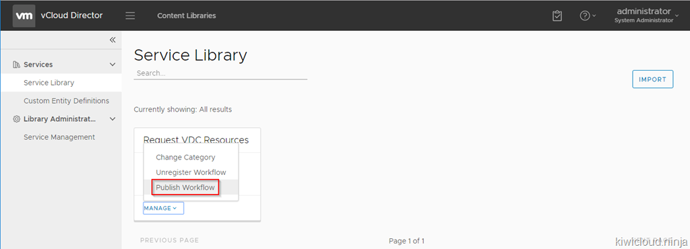

If we don’t select ‘Publish to All Tenants’ then we can chose individual tenancies with the check boxes:

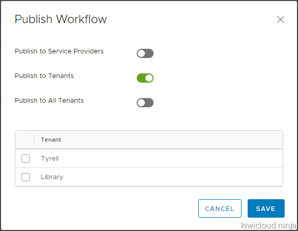

Clicking Save completes the process and publishes our workflow.

> **Note:** I’ve had several instances where changes to publishing are not saved correctly, I’d suggest going back into the settings and checking these after making any changes.

Now if we log in to vCD as a tenant we can see the published workflow in the ‘Libraries’ option:

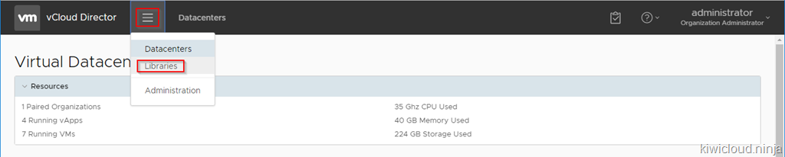

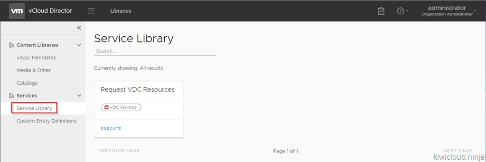

Clicking ‘Execute’ initialises our workflow and requests the input parameters we defined for the workflow:

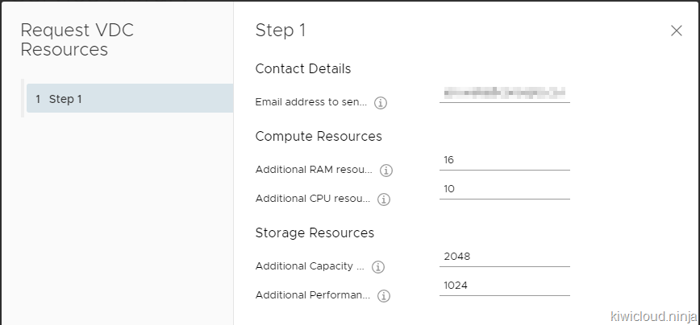

Here I’ve asked for 16GB more RAM, 10GHz more CPU, 2TB more Capacity storage and 1TB more Performance storage.

Clicking ‘Finish’ submits the request and we see in our email that they have arrived populated with the details from our workflow:

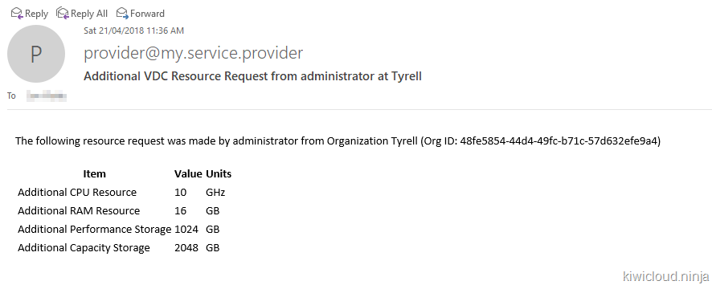

This is of course a fairly basic example, and not designed to be useful ‘as is’, but hopefully has given you a good idea of the power and flexibility that Service Libraries introduce in vCloud Director v9.1 and given you some ideas of how they can be used.

Generating emails is a trivial example, but much more complicated workflows could easily be built (for example, to directly submit API requests to other systems as well as directly provisioning resources in vCloud Director on request).

As always, comments and feedback appreciated.

Jon

 [1]: https://mycloudrevolution.com/en/2018/04/23/vcloud-director-and-vrealize-orchestrator-connection/
