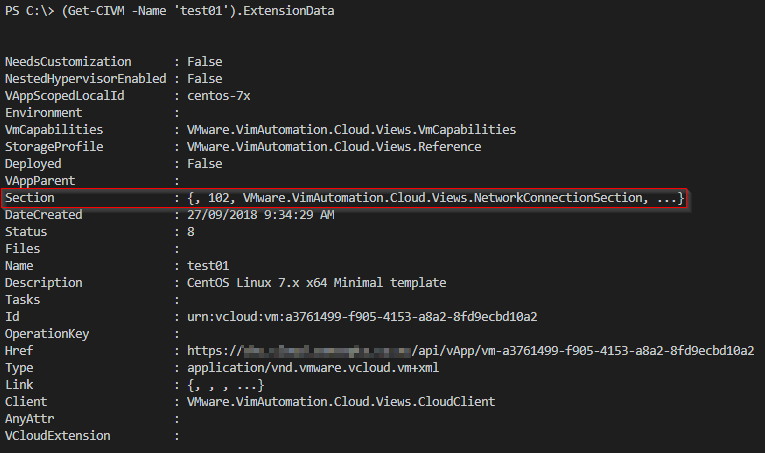
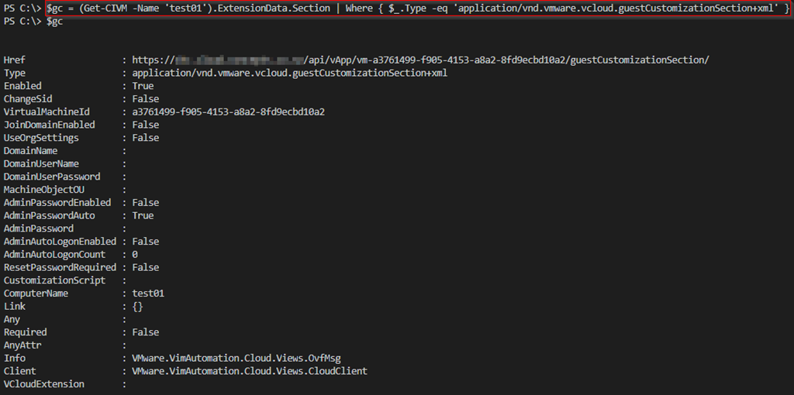
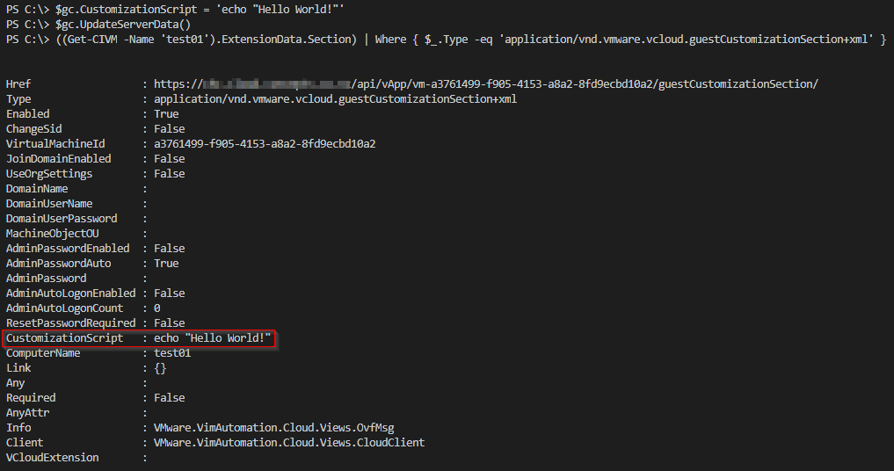

Bit of a quick post this, but hopefully useful to others.

I got asked recently if there was an easy way to set Guest Customization options for VMs hosted in vCloud Director via Powershell/PowerCLI. It turns out there is an extremely simple way, but the syntax is a bit awkward so figured it would make a good/quick blog post.

The Guest Customization settings are available as one of the ‘Section’ entries returned by accessing the ExtensionData properties on a CIVM object. Once connected (Connect-CIServer) you can see this from PowerCLI:

The ‘trick’ is that there are typically 5 sections (one each for OvfVSSD, OvfMsg, network connections, guest Customization and VMware tools). I’ve seen some approaches that rely on the ‘guest Customization’ setting always being found at the Section[3] index in the ExtensionData collection, but this could easily change in future and break any functionality relying on this. A much more reliable way of finding the guest Customization section values is:

But how about if you need to change/update a setting, luckily there is a method provided (UpdateServerData) which does exactly this. So if we want to (for example) change the ‘CustomizationScript’ setting to “echo “Hello World!” we can:

You can change other settings using the same method (e.g. ComputerName or Domain join settings).

Note that for many changes the VM must be powered off, and you may need to ‘Power On and Force Recustomization’ too.

As always, comments & feedback appreciated.

Jon.