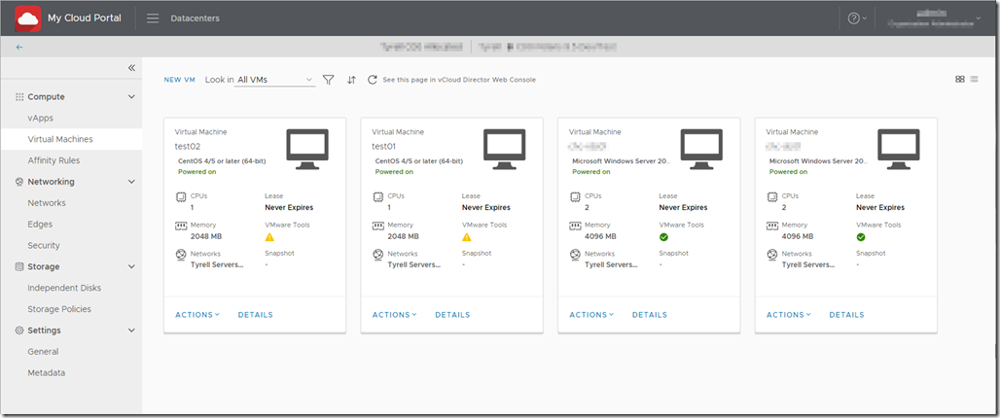

One of the great features in vCloud Director 9 which has been further enhanced in the latest v9.5 release is the new HTML5 portal:

Even better, VMware has released a toolkit to allow Service Providers to fully customise the look and feel of the portal using CSS themes in their <a href="https://github.com/vmware/clarity" target="_blank" rel="noopener">Clarity</a> framework..

The toolkit itself is part of the <a href="https://github.com/vmware/vcd-ext-sdk" target="_blank" rel="noopener">VMware vcd-ext-sdk</a> repository on github, available in the <a href="https://github.com/vmware/vcd-ext-sdk/tree/master/ui/theme-generator" target="_blank" rel="noopener">/ui/theme-generator</a> folder.

The repository has good instructions on how to modify and build a custom theme, but actually uploading and configuring the theme in vCloud Director is only accessible via the vCD API and involves a reasonable amount of manual work.

To help speed up development and allow changes to be easily tested, in my usual mode I’ve written a small PowerShell module that allows quicker/easier theme configuration. The module is available on github at [https://github.com/jondwaite/vcd-h5-themes][2]. Hopefully this will help those of you who need to develop and test updated themes for your vCloud Director portals.

I’ve included documentation in the repository on each cmdlet, its function and arguments <a href="https://github.com/jondwaite/vcd-h5-themes/blob/master/README.md" target="_blank" rel="noopener">here</a>.

To use the module you’ll need to be connected to a vCloud instance as a user with global ‘Administrator’ access in the ‘System’ organization since changes will affect all portal users. You’ll need to be connected to the vCD environment with PowerCLI (Connect-CIServer…) prior to using the cmdlets.

You can then download the vcd-ht-themes.psm1 file and add it to your session (‘Import-Module vcd-h5-themes.psm1’) to access the cmdlets.

As always, comments and feedback welcome – is there anything else you’d like to see added to this module?

Jon.

 [1]: https://kiwicloud.ninja/wp-content/uploads/2018/11/image.png
 [2]: https://github.com/jondwaite/vcd-h5-themes "https://github.com/jondwaite/vcd-h5-themes"