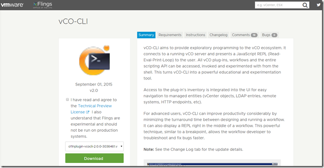
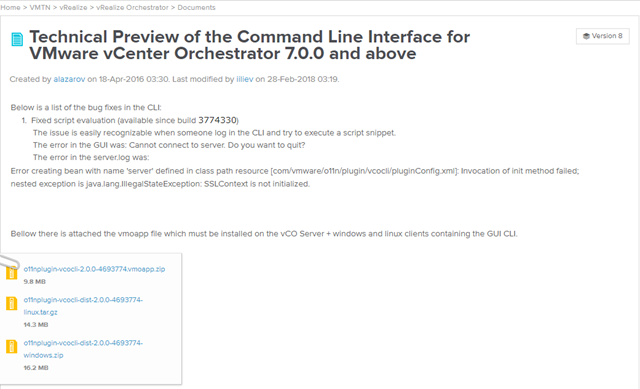
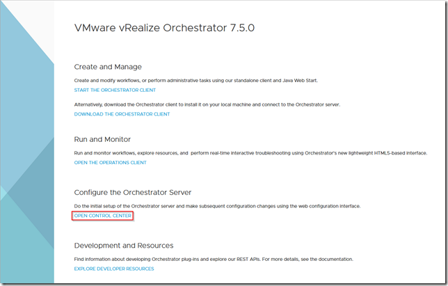
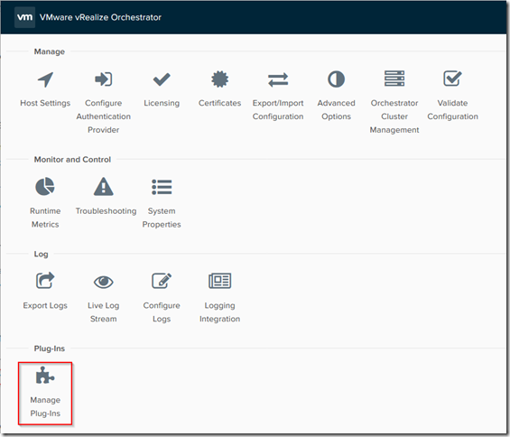
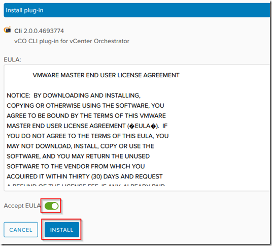
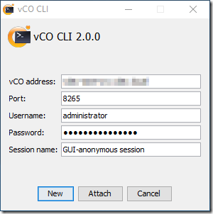
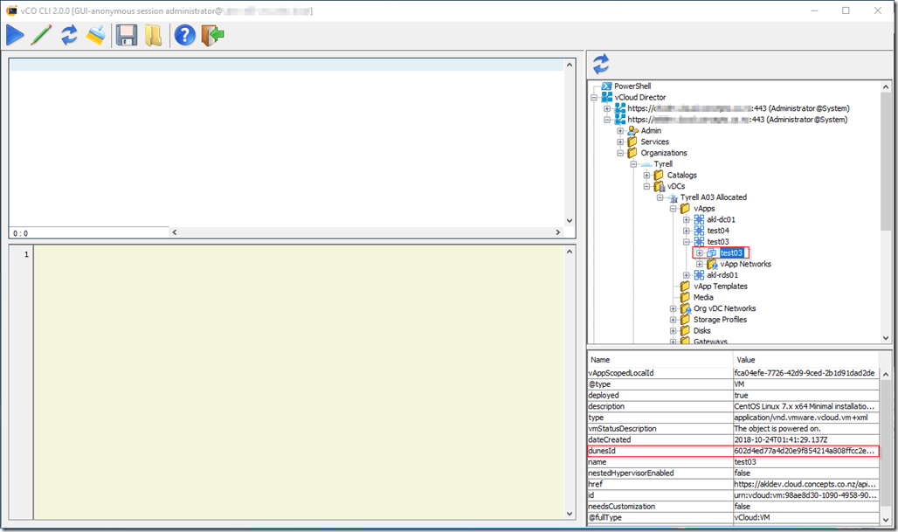
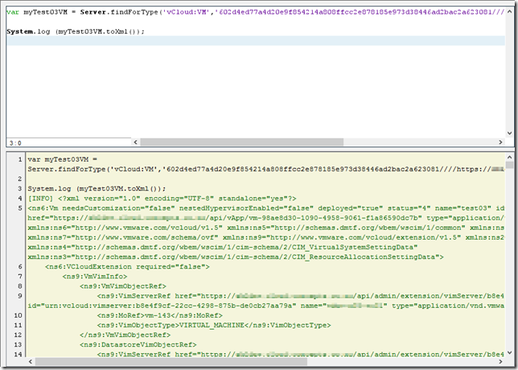

Something I was not aware of until recently was that vRealize Orchestrator (vRO) has it’s own Command Line Interface (CLI) environment. This can be an invaluable tool when developing new vRO workflows and actions as it allows you to easily test expressions and code snippets in your environment. Once developed these scripts and actions can be reused easily from vRO workflows in the vRO Workflow Designer.

## Downloading vRO-CLI

Unfortunately vRO-CLI is not particularly well publicised (originating as a VMware ‘Fling’) and does not have official support, but it can still be a valuable tool. Due to the support status though I would only recommend installing and using this in a Test/Dev environment rather than in Production.

Locating the tool is currently a bit problematic, a google search for ‘vRO CLI’ will usually take you to this page: [https://labs.vmware.com/flings/vco-cli][1]:

Unfortunately this is an old version (from September 2015) and isn’t compatible with the latest (7.x) releases of vRO. To get to the latest version you will need to visit this page in the VMware community forums: [https://communities.vmware.com/docs/DOC-31702][3] which has the build 4693774 downloads which work with the latest vRO versions:

You will need to download at least 2 of the .zip files, the vRO plugin itself (ending in .vmoapp.zip) and the client application for whichever OS you will be using on your development machine (Linux or Windows).

## Installing vRO-CLI

Installation is in 2 parts, the first installs the plugin into your vRO appliance to provide the endpoint for the vRO-CLI. The second installs the vRO-CLI client on your workstation to be able to use the service.

### 1) Installing the vRO-CLI plugin on the vRO appliance

Once you have downloaded both packages, the first step is to install the vRO-CLI plugin into your vRO instance.

Open the web page for your vRO appliance and select the ‘Open Control Center’ link:

Once signed in to the Control Center, select the ‘Manage Plug-Ins’ icon:

Unzip the file with the .vmoapp.zip extension you previously downloaded (e.g. o11nplugin-vcocli-2.0.0-4693744.vmoapp.zip) and use the Browse button to select the extracted file:

Click the ‘Upload’ button and when prompted accept the EULA agreement and click install:

You will get the following if everything has been successfully configured:

You need to let the Orchestrator service restart (just leave the configuration appliance and wait a couple of minutes) before the service will be available for client connections.

### 2) Installing the vRO-CLI Client

Since I’m using a Windows workstation for administration the following details the setup for a Windows vRO-CLI client. You will need to have Java installed and configured in your Windows OS prior to being able to run the vRO-CLI client.

Simply extract the .zip file (in this example, o11nplugin-vcocli-dist-2.0.0-4693774-windows.zip) to your machine, I used ‘C:\Program FIles\vRO-CLI-2.0.0’ as the destination directory:

You can now start the vRO-CLI client using either the GUI or command-line. To start using the GUI, start the vcocli-gui.bat script from the o11nplugin-vcocli-dist-2.0.0\bin folder, you should see the vCO CLI login dialog:

Use the hostname of your vRO appliance as the ‘vCO address’ (without any port specification) and supply valid vRO user name and password.

Note that if you have a firewall or other network security between your workstation and the vRO server you will need to permit tcp port 8265 between them to allow connection.

The ‘Session name’ can be anything you like and can be used to reconnect to sessions which have already been started and suspended. Then click ‘New’ to create a new session, if everything has gone well you should see the initial vRO-CLI screen:

Also note that the ‘Quit Session’ button will terminate your current session and you will not be able to reconnect to it, but closing the window using the close (X) icon in the top-left will keep the session running and allow re-attachment to the same session later.

To use the CLI version, you can start the vcocli.bat file from a Windows command prompt and specify the -vco and -username switches to specify the vRO server:

If you want to see what sessions already exist and can be reconnected, you can open vRO client and browse under the ‘vCO CLI / Start Session’ in the tree, each running ‘Start Session’ token will show in the ‘Variables’ tab the session name for sessions which can be reconnected (using ‘Attach’ in the GUI or the -resume switch on the command line):

## Using the vRO-CLI

Once you have the client installed and connecting successfully to your vRO server, how do you actually use it? One of the early challenges I faced was working out how to actually reference an object in the vRO object browser in my script fragments. The ‘Help’ documentation provides some useful content, but doesn’t address how to obtain object references like this.

In this example, let’s assume that we’re trying to write a script to perform an action on the ‘test03’ VM in our environment owned by the vCD tenant ‘Tyrell’ in the VDC ‘Tyrell A03 Allocated’ and in the vApp ‘test03’. We can browse down the objects to locate this VM in the vRO-CLI UI:

Now the Server.findForType function can be used when supplied with an object type and the dunesId reference for our object:

`var myTest03VM = Server.findForType('vCloud:VM','602d4ed77a4d20e9f854214a808ffcc2e878185e973d38446ad2bac2a623081////https://<my vCD server>/api/vApp/vm-98ae8d30-1090-4958-9061-f1a86590dc7b');`

You can copy the value of the object by highlighting the 'dunesId’ line in the object properties window and copy (Ctrl + C) and pasting (Ctrl + V) this into your command. (Note that this will also include the ‘dunesId’ text which will need to be removed).

This allows us to extract the output of the ‘toXml()’ method for our VM as follows:

All of the usual vRO methods and functions for the object are also available to us. If you need to initiate existing vRO workflows or actions the online help has details on how this can be initiated too.

**Note:** If you don’t highlight any text in the upper Input area, the entire script will be executed, but if you highlight a block of code or a single line, only that code will be executed when you click the ‘Execute’ icon (or press F5) which can be extremely useful to try out fragments of code and check the results are as expected.

Hopefully this will be useful to those of you developing workflows and actions in vRO and provide you with another method to write and debug your actions.

As always, comments and feedback are always welcome.

Jon.

 [1]: https://labs.vmware.com/flings/vco-cli "https://labs.vmware.com/flings/vco-cli"
 [3]: https://communities.vmware.com/docs/DOC-31702 "https://communities.vmware.com/docs/DOC-31702"
