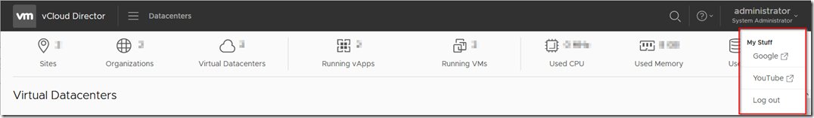
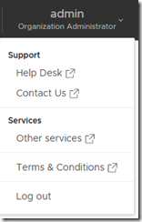
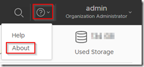

One of the nicest additions to the new VMware vCloud Director 9.7 release is the ability to more fully customize the tenant portal. This now includes the capability to define custom links (together with section groupings / separators) and also the capability to customize the portal (and links) on a per-tenant basis:



To help take advantage of this, I've updated my <a href="https://github.com/jondwaite/vcd-h5-themes" target="_blank" rel="noopener noreferrer">vcd-h5-themes</a> module on Github to understand the new capabilities in vCloud Director v9.7 (API version 32.0) to allow easier manipulation of the portal branding configuration options.

In particular the `Set-Branding` cmdlet can now take a PSObject parameter with the customization links to be overridden or added to the portal (more about what this means later), it will also now take an optional parameter to limit the scope to a single vCD tenant organization (rather than applying changes to the system-default branding).

The `Get-Branding` cmdlet has also been updated and can now retrieve either the global default branding, or the branding from a specific tenant organization.

There are actually 2 types of links that can be specified:

1) The 'Help' and the 'About' links under the circled ? icon can be redirected to other sites/pages (rather than showing the default VMware pages)
2) The menu under the current username (highlighted in red above) can be extended with any number of new sections, separators and links to other pages.

The way these are performed is slightly different, but both are placed into the customLinks object passed to Set-Branding.

Worked example

Let's say that we want to make the following changes to the portal links:

- The 'About' link under the ? icon should redirect to our company about page at https://my.company.com/about/ instead of the default VMware 'About' page.
- The Extensible menu under the username drop-down should have the following structure:

```
Support
  +- Help Desk (redirecting to https://my.company.com/helpdesk/)
  +- Contact Us (redirecting to mailto contact@my.company.com with a subject line of 'Web Support')
-- (Separator)
Services
  +- Other services (redirecting to https://my.company.com/services/)
-- (Separator)
Terms & Conditions (redirecting to https://my.company.com/tsandcs/)
```

To create these changes, we need to build a customLink object in PowerShell that reflects this arrangement, the code to do this is shown below. Running this code will create a PowerShell object variable '$mylinks' which can then be passed to the Set-Branding cmdlet:

```powershell
### Create $mylinks variable with our branding menu structure
$mylinks = [PSCustomObject]@(
    # Override the default 'about' link to redirect to https://my.company.com/about/:
    @{
        name="about";
        menuItemType="override";
        url="https://my.company.com/about/"
    },
    # Add the section name 'Support':
    @{
        name="Support";
        menuItemType="section"
    },
    # Add the 'Help Desk' link:
    @{
        name="Help Desk";
        menuItemType="link";
        url="https://my.company.com/helpdesk/"
    },
    # Add the 'Contact Us' link:
    @{
        name="Contact Us";
        menuItemType="link";
        url="mailto:contact@my.company.com?subject=Web Support"
    },
    # Add the Separator:
    @{
        menuItemType="separator"
    },
    # Add the 'Services' group:
    @{
        name="Services";
        menuItemType="section"
    },
    # Add the 'Other services' link:
    @{
        name="Other services";
        menuItemType="link";
        url="https://my.company.com/services/"
    },
    # Add the 2nd Separator:
    @{
        menuItemType="separator"
    },
    # Add the 'Terms & Conditions' link:
    @{
        name="Terms & Conditions";
        menuItemType="link";
        url="https://my.company.com/tsandcs/"
    }
)
### End of File ###
```

The syntax is a bit fiddly here - in particular make sure that you place quote marks around each value as shown above - it may be easier to copy this script and edit the values rather than creating from scratch.

To test the object has been created successfully prior to configuring the portal, you can do `ConvertTo-Json $mylinks` which should show a well-formatted JSON object if everything is correct:

```json
[
   {
     "menuItemType": "override",
     "url": "https://my.company.com/about/",
     "name": "about"
   },
   {
     "menuItemType": "section",
     "name": "Support"
   },
   {
     "menuItemType": "link",
     "url": "https://my.company.com/helpdesk/",
     "name": "Help Desk"
   },
   {
     "menuItemType": "link",
     "url": "mailto:contact@my.company.com?subject=Web Support",
     "name": "Contact Us"
   },
   {
     "menuItemType": "separator"
   },
   {
     "menuItemType": "section",
     "name": "Services"
   },
   {
     "menuItemType": "link",
     "url": "https://my.company.com/services/",
     "name": "Other services"
   },
   {
     "menuItemType": "separator"
   },
   {
     "menuItemType": "link",
     "url": "https://my.company.com/tsandcs/",
     "name": "Terms & Conditions"
   }
 ]
 ```

To set our branding (make sure you use Connect-CIServer to connect to the appropriate cloud first in the 'System' context) then:

```powershell
Set-Branding -customLinks $mylinks
Branding configuration sent successfully.
```

You can also use the '-Tenant' switch to apply the changes to a specific tenant organization only.

When we look in the vCD HTML5 portal clicking on our username in the top-right of the portal we can now see our new link structure in place:



In addition, the 'About' option under the menu obtained by clicking the circled ? will now redirect to our own site:


