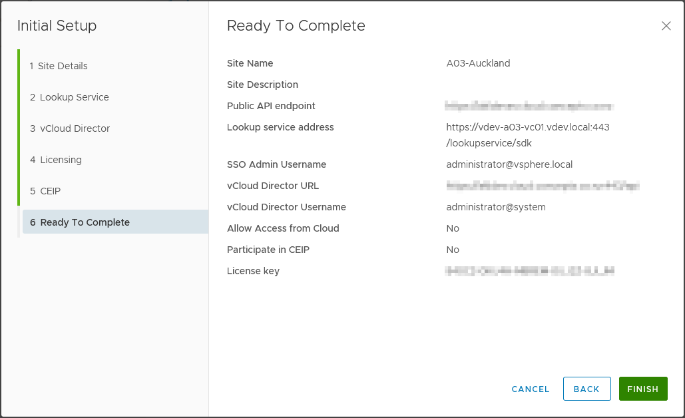

#### Deployment Configuration {.wp-block-heading}

In my lab environment I have two SP datacenter locations (Auckland and Christchurch since I'm in New Zealand) and a complete vCloud infrastructure running in each location. I have defined the appliance names and IP addresses prior to deploying vCAv and registered these in DNS prior to starting deployment as this will simplify the configuration later. My lab sites happen to have network connectivity via a VPN, but this is not important for vCAv as all network communication between the sites will be via the Tunnel appliances and the external (public) network.

{}
This was one of the first issues that I encountered when building the environment - I assumed that replication traffic would be capable of using internal networking between the replicator appliances, but this is not the case in the current release of vCAv and all communication must use the Tunnel appliances' public network.
{}

In order to deploy vCAv into a production-like configuration 3 appliances are required in each vCloud site. Since my lab configuration spans 2 sites I will need a total of 6 appliances. While the vCloud Availability documentation has good documentation on deploying appliances in the vCenter UI, I found it much easier (and reproducible when testing) to use DOS batch file to deploy the appliances using VMware OVFTool. In my lab environment I defined the following names and IP addresses for the appliances:

**Site 1 (Auckland):**

|Appliance Name|Deployment Type|IP Address|Administration URI(s)|
|---|---|---|---|
|vdev-a03-vcam|cloud|10.207.0.44|vCA Replication Manager:https://10.207.0.44:8441/ui/admin, vCA vApp Replication Manager: https://10.207.0.44/ui/admin|
|vdev-a03-vcar01|replicator|10.207.0.45|vCA Replicator: https://10.207.0.45/ui/admin|
|vdev-a03-vcat|tunnel|10.207.0.46|vCA Tunnel: https://10.207.0.46/ui/admin|

**Site 2 (Christchurch)**

|Appliance Name|Deployment Type|IP Address|Administration URI(s)|
|---|---|---|---|
|vdev-c00-vcam|cloud|10.200.0.44|vCA Replication Manager: https://10.200.0.44:8441/ui/admin vCA vApp Replication Manager: https://10.200.0.44/ui/admin|
|vdev-c00-vcar01|replicator|10.200.0.45|vCA Replicator: https://10.200.0.45/ui/admin|
|vdev-c00-vcat|tunnel|10.200.0.46|vCA Tunnel: https://10.200.0.46/ui/admin|

I then used 6 copies of the following file (saved with a .cmd extension on a Windows admin machine) to deploy the appliances, changing the variable assignments as appropriate - the example below deploys the 'cloud' appliance in the Christchurch site. Obviously if using this change the relevant parameters to suit your environment as well as the file locations of the ovftool.exe file and the vCloud Availability deployment .OVA file.

{}
The OVFTOOL syntax is extremely sensitive to syntax, so make sure you carefully check the entries provided. Also note that if any passwords contain certain special characters this can cause OVFTOOL issues (single and double quotation marks in particular) and you may need to use an alternative administrative account that does not have these characters in it's password.
{}

{}
If the appliances deploy but their consoles show that no networking is configured this most likely means that one or more of the parameters supplied are not in the correct format (in particular, don't use single-quote marks around values as shown in the example deployment for Linux in the [VMware documentation](https://docs.vmware.com/en/VMware-vCloud-Availability/3.0/com.vmware.vcav.cloud.install.config.upgrade.doc/GUID-56817ECC-FCAF-40E7-ACEF-3F4BF67F97F0.html)).
{}

The script will create a log file `<VM name>-deploy.log` in the folder it is run from showing the results of the ovftool command for troubleshooting.

```cmd
@echo off

::Appliance deployment details:
SET DEPLOYTYPE=<One of 'cloud', 'replicator' or 'tunnel' (without ' marks) depending on appliance function>
SET VMNAME=<name for the VM>
SET VMIP=<IP address for the VM>
SET ROOTPASS=<Initial root password on the appliance - will be forced to change on first login>

::File locations for vCAv and OVFTOOL.EXE:
SET VCAIMAGE="%HOMEPATH%\Downloads\VMware-vCloud-Availability-3.0.0.3736-13174385_OVF10.ova"
SET OVFTOOL="C:\Program Files\VMware\VMware OVF Tool\ovftool.exe"

::Target vCenter:
SET VIHOST=<vCenter host name>
SET VIUSER=<vCenter admin user - e.g. administrator@vsphere.local>
SET VIPASS=<vSphere Password>
SET VILOCATOR=<vCenter Locator - e.g. C00/host/DEVCLU-C00>

::Storage & Networking for Appliance:
SET VMDS=<vCenter Datastore for appliance>
SET VMNET=<vCenter Network name for appliance>
SET NTPSERV=<NTP Server IP address for appliance>
SET DNSSERV=<DNS Server(s) for appliance - comma separated>
SET DNSDOMAIN=<DNS Domain Name for appliance>
SET IPGATEWAY=<Default IP Gateway for appliance>
SET IPNETMASK=<Subnet Mask for appliance network>

%OVFTOOL% --name="%VMNAME%" --datastore="%VMDS%" --acceptAllEulas^
 --powerOn --X:enableHiddenProperties --X:injectOvfEnv --X:waitForIp^
 --ipAllocationPolicy=fixedPolicy --deploymentOption=%DEPLOYTYPE% --machineOutput^
 --noSSLVerify --overwrite --powerOffTarget "--net:VM Network=%VMNET%"^
 --diskMode=thin --X:logFile=%VMNAME%-deploy.log --X:logLevel=verbose^
 --prop:guestinfo.cis.appliance.root.password=%ROOTPASS%^
 --prop:guestinfo.cis.appliance.ssh.enabled=True^
 --prop:guestinfo.cis.appliance.net.ntp=%NTPSERV%^
 --prop:vami.DNS.VMware_vCloud_Availability=%DNSSERV%^
 --prop:vami.domain.VMware_vCloud_Availability=%DNSDOMAIN%^
 --prop:vami.gateway.VMware_vCloud_Availability=%IPGATEWAY%^
 --prop:vami.ip0.VMware_vCloud_Availability=%VMIP%^
 --prop:vami.netmask0.VMware_vCloud_Availability=%IPNETMASK%^
 --prop:vami.searchpath.VMware_vCloud_Availability=%DNSDOMAIN%^
 %VCAIMAGE%^
 "vi://%VIUSER%:%VIPASS%@%VIHOST%/%VILOCATOR%"
```

As the syntax is so fiddly, I've included a (working) example of the script used to deploy the 'cloud' appliance in the Christchurch site below unedited apart from password redaction:

```cmd
@echo off

::Appliance deployment details:
SET DEPLOYTYPE=cloud
SET VMNAME=vdev-c00-vcam
SET VMIP=10.200.0.44
SET ROOTPASS=<Redacted>

::File locations for vCAv and OVFTOOL.EXE:
SET VCAIMAGE="%HOMEPATH%\Downloads\VMware-vCloud-Availability-3.0.0.3736-13174385_OVF10.ova"
SET OVFTOOL="C:\Program Files\VMware\VMware OVF Tool\ovftool.exe"

::Target vCenter:
SET VIHOST=vdev-c00-vc01.vdev.local
SET VIUSER=administrator@vsphere.local
SET VIPASS=<Redacted>
SET VILOCATOR=C00/host/DEVCLU-C00

::Storage & Networking for Appliance:
SET VMDS=CHC-VSAN-Perf
SET VMNET=CHC-Mgmt
SET NTPSERV=10.200.0.20
SET DNSSERV=10.200.0.10,10.207.0.10
SET DNSDOMAIN=vdev.local
SET IPGATEWAY=10.200.0.1
SET IPNETMASK=255.255.255.0

%OVFTOOL% --name="%VMNAME%" --datastore="%VMDS%" --acceptAllEulas^
 --powerOn --X:enableHiddenProperties --X:injectOvfEnv --X:waitForIp^
 --ipAllocationPolicy=fixedPolicy --deploymentOption=%DEPLOYTYPE% --machineOutput^
 --noSSLVerify --overwrite --powerOffTarget "--net:VM Network=%VMNET%"^
 --diskMode=thin --X:logFile=%VMNAME%-deploy.log --X:logLevel=verbose^
 --prop:guestinfo.cis.appliance.root.password=%ROOTPASS%^
 --prop:guestinfo.cis.appliance.ssh.enabled=True^
 --prop:guestinfo.cis.appliance.net.ntp=%NTPSERV%^
 --prop:vami.DNS.VMware_vCloud_Availability=%DNSSERV%^
 --prop:vami.domain.VMware_vCloud_Availability=%DNSDOMAIN%^
 --prop:vami.gateway.VMware_vCloud_Availability=%IPGATEWAY%^
 --prop:vami.ip0.VMware_vCloud_Availability=%VMIP%^
 --prop:vami.netmask0.VMware_vCloud_Availability=%IPNETMASK%^
 --prop:vami.searchpath.VMware_vCloud_Availability=%DNSDOMAIN%^
 %VCAIMAGE%^
 "vi://%VIUSER%:%VIPASS%@%VIHOST%/%VILOCATOR%"
```

Once the appliances are deployed and started, signing into the admin URI listed in the table above first forces a password change for the root appliance user which must be completed on each appliance.

Note: The 'root' account is common between the 2 sites which run on the 'cloud' (vApp Replication Manager) appliance so only needs to be changed once here:


The VMware [documentation](https://docs.vmware.com/en/VMware-vCloud-Availability/3.0/com.vmware.vcav.cloud.install.config.upgrade.doc/GUID-84CA37CC-4653-4592-B418-6F39644A80B9.html) has very good guides for configuring the appliances once deployed, I've included screenshots below at each step showing the relevant steps. I've shown the generic (documentation) URI and the specific URI in my lab for the Auckland site for each step as it can get confusing which administrative console you should actually be using in each step. I've also linked each step to the relevant section of the VMware documentation to make it easier to follow.

[Step 1 - Configure vCloud Availability Replication Manager][3]  
Admin Link: https://<vApp-Replication-Manager-IP-address>:8441/ui/admin  
Lab Link: https://10.207.0.44:8441/ui/admin (vdev-a03-vcam)

Since my lab uses vCenter servers with embedded Platform Services Controllers (PSC), the Lookup Service address is actually on the vCenter server. You will need to confirm the Lookup Service certificate to configure this setting.


[Step 2 - Configure a vCloud Availability vApp Replication Manager][4]  
Admin Link: https://<vApp-Replication-Manager-IP-address>/ui/admin  
Lab Link: https://10.207.0.44/ui/admin (vdev-a03-vcam)


{}
The Public API endpoint in this dialog should be set to the public DNS name which will be eventually used to access vCAv from the internet by your tenants. This should be different to the URI used to access the vCloud Director portal. (e.g. 'akl.vca.cloudprovider.com:443')
{}




After completing the wizard, clicking the 'System Monitoring' tab should show a screen similar to the one shown below, at this stage the two warnings for Tunnel connectivity and Configured replicators are normal/expected as we haven't completed these steps yet.


[Step 3 - Configure vCloud Availability Replicator Appliance][5]

Admin Link: https://<vApp-Replicator-Appliance-IP-address>/ui/admin  
Lab Link: https://10.207.0.45/ui/admin (vdev-a03-vcar01)


Once configured (and the certificate accepted), you should see the Replicator appliance System Monitoring screen similar to below:


[Step 4 - Register a vCloud Availability Replicator with a vCloud Availability Replication Manager in the Same Site][6]

Admin Link: https://<vApp-Replication-Manager-IP-address>:8441/ui/admin  
Lab Link: https://10.207.0.44:8441/ui/admin (vdev-a03-vcam)


{}
Configure port 8043 on the replicator appliance - the VMware documentation shows port 8440 for this (presumably from a 'combined' appliance deployment). When you click 'Add' you will need to accept the certificate from the Replicator appliance.
{}


[Step 5 - Configure vCloud Availability Tunnel][7]

Admin Link: https://Tunnel-Appliance-IP-address>/ui/admin  
Lab Link: https://10.207.0.46/ui/admin (vdev-a03-vcat)


After configuring the Lookup Service, check that the System Monitoring tab shows connectivity:


[Step 6 - Enable vCloud Availability Tunnel][8]

Admin Link: https://<vApp-Replication-Manager-IP-address>/ui/admin  
Lab Link: https://10.207.0.44/ui/admin (vdev-a03-vcam)  


Selecting the 'Configuration' tab brings up the following screen:

{}
If you are placing the Tunnel appliance behind a NAT firewall (recommended) and using DNAT port-translation from tcp/443 (externally) to 8048 (internally on the Tunnel appliance), you should click 'Edit' on the 'Public API endpoint' and update this to reflect the external port (443) at this stage. This configuration allows tenants/users to see the vCAv portal externally on port 443 and prevents them needing to open any additional outbound firewall ports.
{}


Accept the certificate when prompted to save the tunnel configuration.

[Step 7 - Restart Services][9]

Admin Link: https://<vApp-Replication-Manager-IP-address>/ui/admin  
Lab Link: https://10.207.0.44/ui/admin (vdev-a03-vcam)  
Admin Link: https://<vApp-Replicator-Appliance-IP-address>/ui/admin  
Lab Link: https://10.207.0.45/ui/admin (vdev-a03-vcar01)

As mentioned in the VMware documentation and in the warning on the tunnel configuration dialog shown above, you must now restart all vCAv services on the local site vApp Replication Manager and Replicator appliances - simply login to each appliance and under 'System Monitoring' click the 'Restart Service' button:


When accessing vCloud Availability inside the vCloud Director portal, the SSL certificate used to render the plugin data will originate from the vCloud Availability vApp Replication Manager portal. For this reason, it is a good idea at this stage to replace the self-signed certificate generated when the appliance is deployed with a 'proper' SSL certificate which is registered to the public URI that vCAv is using.

e.g. If the Public API for vCloud Availability is 'akl.vca.cloudprovider.com' then you should reconfigure the vApp Replication Manager portal to use an SSL certificate which is valid for akl.vca.cloudprovider.com.

The process to reconfigure the SSL certificate in the vApp Replication Manager portal is described in the VMware documentation.

{}
If you are using wildcard SSL certificates (e.g. *.cloudprovider.com), you **CANNOT** use these when configuring the vApp Replication Manager portals in multiple Service Provider sites. This is because the site-pairing operation checks the SSL certificate thumbprint being used in each site and will refuse to pair sites if the same thumbprint is detected at both sites. Use dedicated SSL certificates at each site when configuring multiple vCAv cloud endpoints.
{}


The next part of this series will detail pairing the 2 deployed Service Provider instances deployed and how VM replication policies can be defined and assigned to cloud tenants to allow them to start protecting their VMs.

 
 [3]: https://docs.vmware.com/en/VMware-vCloud-Availability/3.0/com.vmware.vcav.cloud.install.config.upgrade.doc/GUID-DA33CCE4-A697-4212-831D-CFBC58BB35C0.html
 [4]: https://docs.vmware.com/en/VMware-vCloud-Availability/3.0/com.vmware.vcav.cloud.install.config.upgrade.doc/GUID-E89D32A9-3B92-40EE-ABF4-3BEB2698A893.html
 [5]: https://docs.vmware.com/en/VMware-vCloud-Availability/3.0/com.vmware.vcav.cloud.install.config.upgrade.doc/GUID-F86F2448-D4F5-4162-99E3-379E6343D42B.html
 [6]: https://docs.vmware.com/en/VMware-vCloud-Availability/3.0/com.vmware.vcav.cloud.install.config.upgrade.doc/GUID-102AC499-18DC-48A2-9F98-341DF225C10C.html
 [7]: https://docs.vmware.com/en/VMware-vCloud-Availability/3.0/com.vmware.vcav.cloud.install.config.upgrade.doc/GUID-A69CDEB6-EE5D-42C9-B389-7434B708BD32.html
 [8]: https://docs.vmware.com/en/VMware-vCloud-Availability/3.0/com.vmware.vcav.cloud.install.config.upgrade.doc/GUID-44EE9A66-4493-4C95-8E47-62263A081F6E.html
 [9]: https://docs.vmware.com/en/VMware-vCloud-Availability/3.0/com.vmware.vcav.cloud.install.config.upgrade.doc/GUID-02DE2A72-E6A4-4972-B22C-7539C69F97A9.html