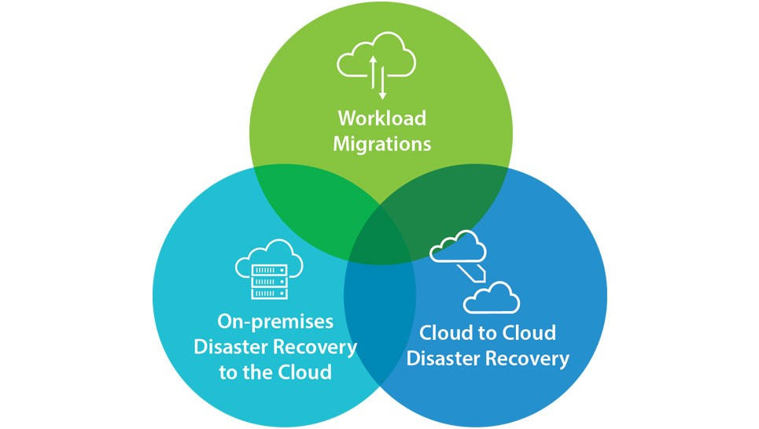
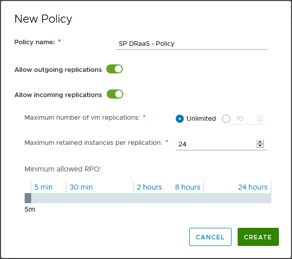
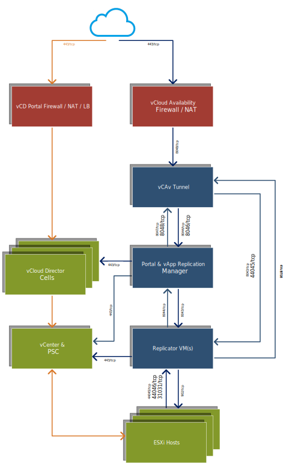

VMware has recently released version 3.0 of [vCloud Availability][1] (vCAv) ([Release Notes][2]) which allows vCloud Service Providers to offer a variety of VM protection and migration services to their tenant customers. vCAv 3.0 combines features previously available in 3 separate VMware products (vCloud Availability Cloud-to-Cloud DR, vCloud Availability for vCloud Director and vCloud Extender) and allows:

- Protect/replicate and failover VMs to/from on-premise vSphere environments to a vCloud Service Provider.
- Protect/replicate and failover VMs between 2 virtual datacenters provided by a vCloud Service Provider (these would generally be in 2 distinct geographic locations).
- Migrate VMs to/from on-premise vSphere environments and a vCloud Service Provider.

vCloud Availability 3.0 (vCAv) also supports advanced functionality usually reserved for products such as VMware Site Recovery Manager (SRM) such as allowing VM network information to be changed during failover to ensure VMs can connect to the destination network when failed-over or migrated. The tenant administrative portal is tightly integrated into VMware vCloud Director allowing full control of VM replication tasks in the same interface used by tenants to administer their virtual machines.

Service Providers can define policies and apply these on a per-tenant basis to control items such as:

- How many customer VMs can be replicated (a fixed number of VMs or 'unlimited').
- What the minimum configurable RPO interval is for VM replication (as low as 5 minutes for vSphere 6.5+ environments and up to 24 hours).
- How many snapshots of each VM can be retained (from 1 to 24).

Since the release of vCAv 3.0 I've been deploying and testing the solution components, this is the first part in a series of posts is designed to emulate a complete 'real-world' deployment consisting of 2 distinct cloud provider sites and a 'customer' on-premises infrastructure so I can detail all of the deployment, configuration and end-user usage scenarios across these.

To configure a production-realistic environment, I have deployed separate vCAv appliances for the 'cloud', 'replicator' and 'tunnel' functions, a typical service provider network diagram with the ports used by vCAv for communication is shown in the diagram below. Note that in an actual production implementation the 'tunnel' appliance would generally be deployed into a DMZ network with the 'cloud' (Replication Manager and vApp Replication Manager) and 'replicator' appliances deployed into the Service Provider management network.

<figure class="aligncenter"><figcaption>vCloud Availability 3.0 Network Architecture & Ports</figcaption></figure>

This concludes the first post in this series, in future posts I aim to cover:

- Deployment and configuration of vCAv appliances into a Cloud Service Provider
- Pairing Cloud Provider Sites, Defining VM replication policies and assigning these to tenants
- On-premise deployment and configuration into a customer vSphere cluster
- Protecting / replicating VMs from Cloud to Cloud, On-Premise to Cloud and Cloud to On-Premise (migration, failover and failback)
- Monitoring and Troubleshooting vCloud Availability services
- Conclusions, References and further reading
  
As always, corrections, comments and feedback are always appreciated.

Jon.

 [1]: https://docs.vmware.com/en/VMware-vCloud-Availability/
 [2]: https://docs.vmware.com/en/VMware-vCloud-Availability/3.0/rn/VMware-vCloud-Availability-30-Release-Notes.html