The first 2 parts of this series covered the overall vCloud Availability (vCAv) architecture and the deployment and configuration of the vCAv appliances into a Cloud Provider site. Before continuing pairing sites and configuring VM replication policies, first check that all services are online and showing as healthy.

The easiest place to do this is the 'System Monitoring' screen in the vApp Replication Manager portal (in my lab this is https://10.207.0.44/ui/admin for the Auckland site and https://10.200.0.44/ui/admin for the Christchurch site). The resulting panels look like this (the 'Local replicators' tab has been expanded in both sites):

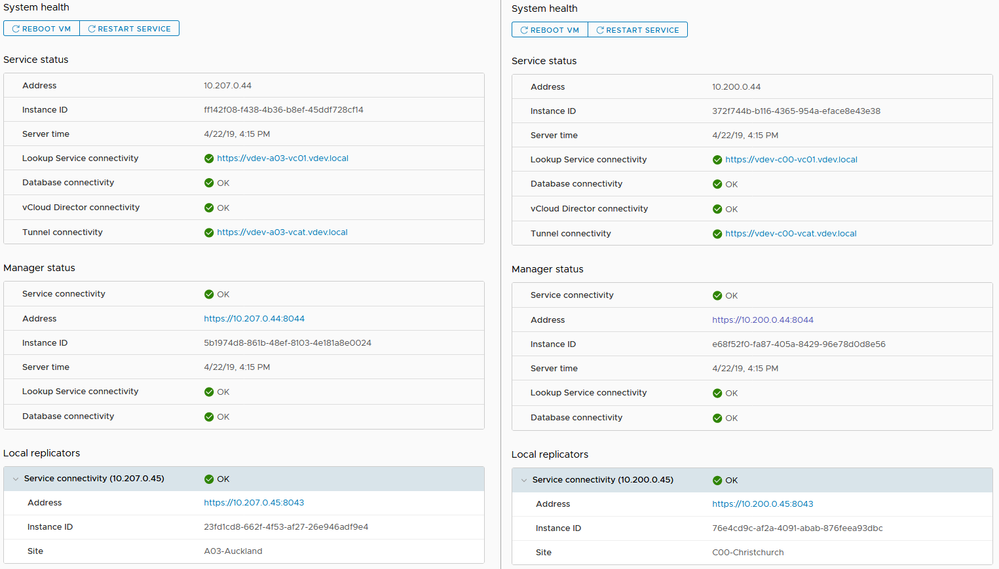 

> **Note:** If you have changed the SSL certificate for the vApp Replication Manager portal as mentioned at the end of my previous post, you may see the 'Tunnel connectivity' item showing red with a 'requires authentication' error. If so, simply access the configuration tab, click 'Edit' next to the 'Tunnel address' and provide the appliance password when prompted as shown in the screen below:

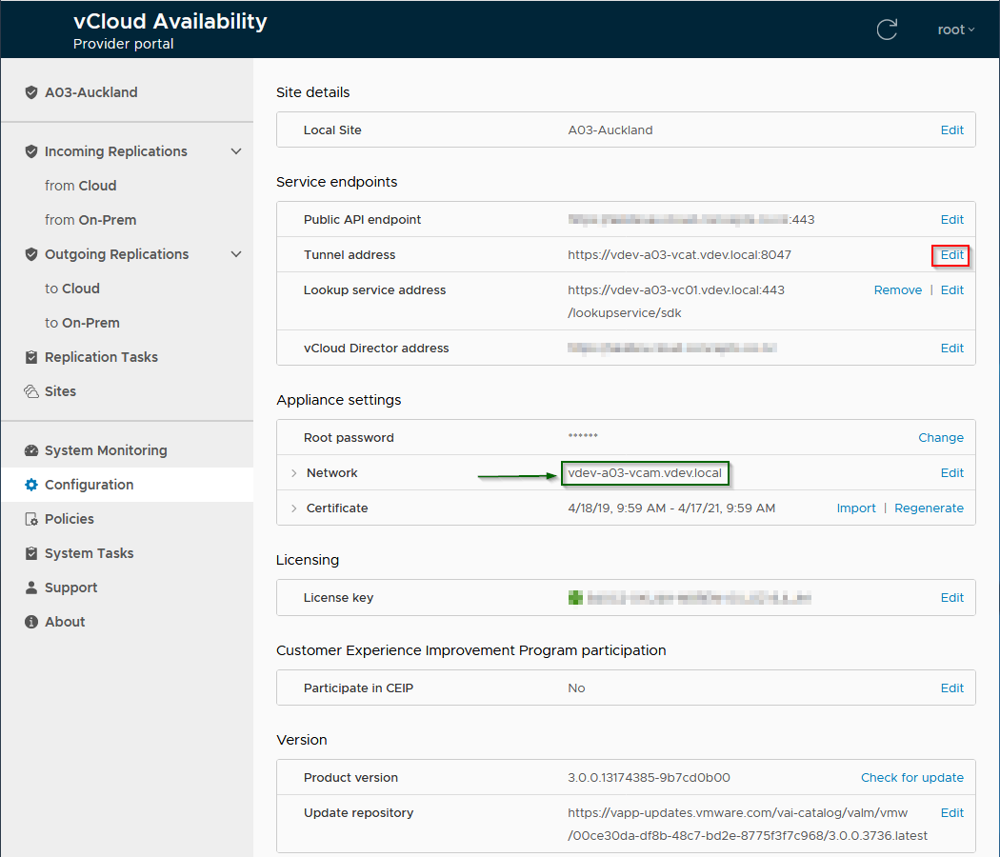 

> **Note:** I had a number of instances in my lab setup where the 'Network' entry (arrowed & boxed in green above) for the vApp Replication Manager had changed to be the public URL for vCAv. If this occurs you will not be able to pair sites as the tunnel appliance will redirect the 'management' traffic back to itself. To fix this, edit the entry and point this back to the internal name/IP of the vApp Replication Manager appliance and re-enter the appliance password.

Based on my experiences in testing, I strongly suggest at this stage that you do not continue attempting to pair vCAv cloud sites until you have resolved any issues and have all System Monitoring links showing as Green/Ok. I had a number of issues in my early lab attempts to configure vCAv which would likely have been avoided if I'd done this&#8230;

You also at this point need to make sure that your public API endpoint link is added to your firewall and NAT configuration so that internet access to your vCAv public API address is passed to port 8048 on the Tunnel appliance. Once configured properly, accessing the public vCAv API address from a browser should show the vCAv portal login screen:

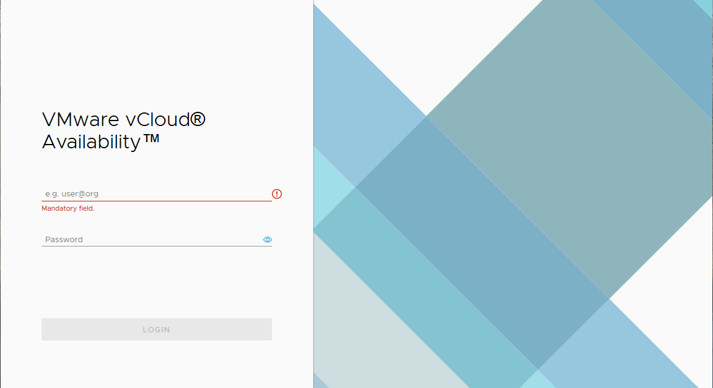 

### Pairing vCloud Availability Cloud Provider Sites {.wp-block-heading}

To pair the vCAv sites, first logout of any vCAv portals and go to the user login at https:<IP-address-of-vApp-Replication-Manager>/ui/login (as opposed to /ui/admin). The username will show 'user@org' instead of the 'root' Appliance login presented from the /admin/ui portal. Login with your vCloud Director provider credentials (e.g. 'administrator@system').

Once logged in, selecting the 'Sites' option should show a screen similar to the following:

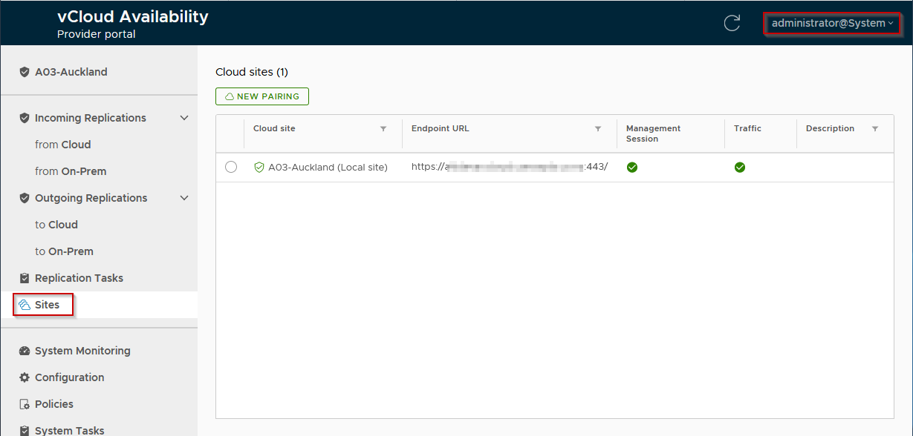 

Click 'New Pairing' and provide the details for the 2nd vCAv site (Since I'm configuring the site pair on my Auckland site I enter the details for the Christchurch site to pair):

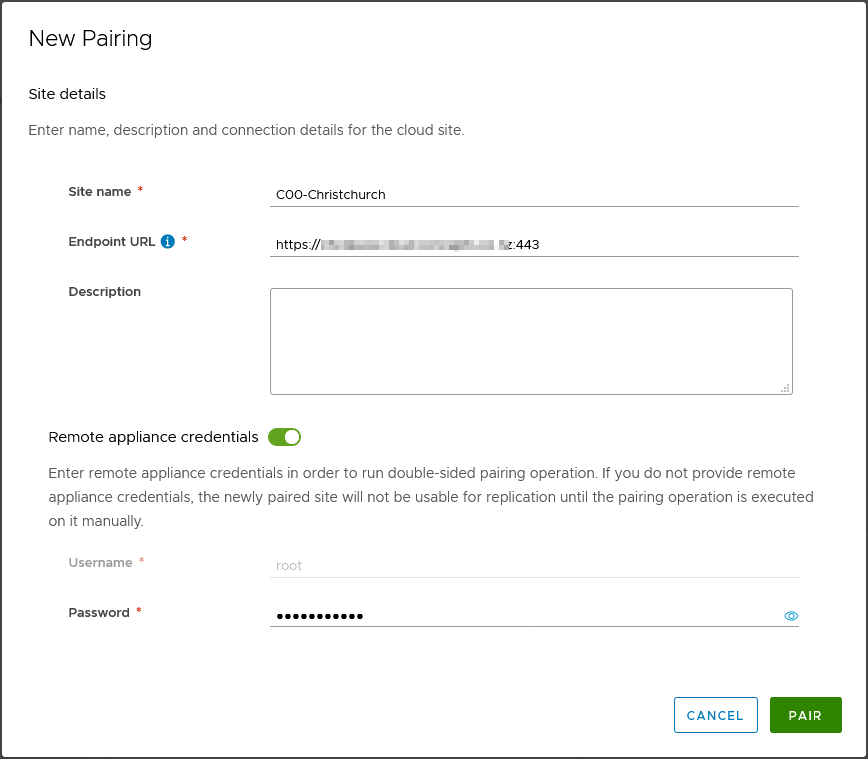 

Accept the SSL certificate from the paired site and you should be able to successfully pair the sites, the Sites window should now look like this:

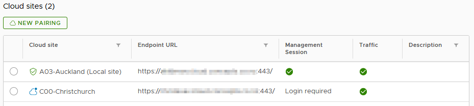 

> **Note:** It is only necessary to perform this pairing on one site providing you specify the remote appliance credentials, vCAv will automatically associate the sites in both directions.

If we select the 2nd (C00-Christchurch) site, a login button appears allowing us to authenticate as our vCloud Director provider admin user (administrator@system) to the 2nd site. After successful authentication the Sites tab will show us with a management session to both sites:

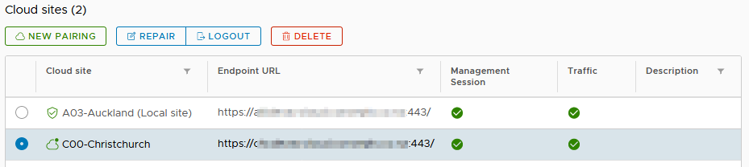

If you now check the 'System Monitoring' tab, you should see that both the local (to the site you are logged in to) and remote vCAv Replicators are shown and connected:

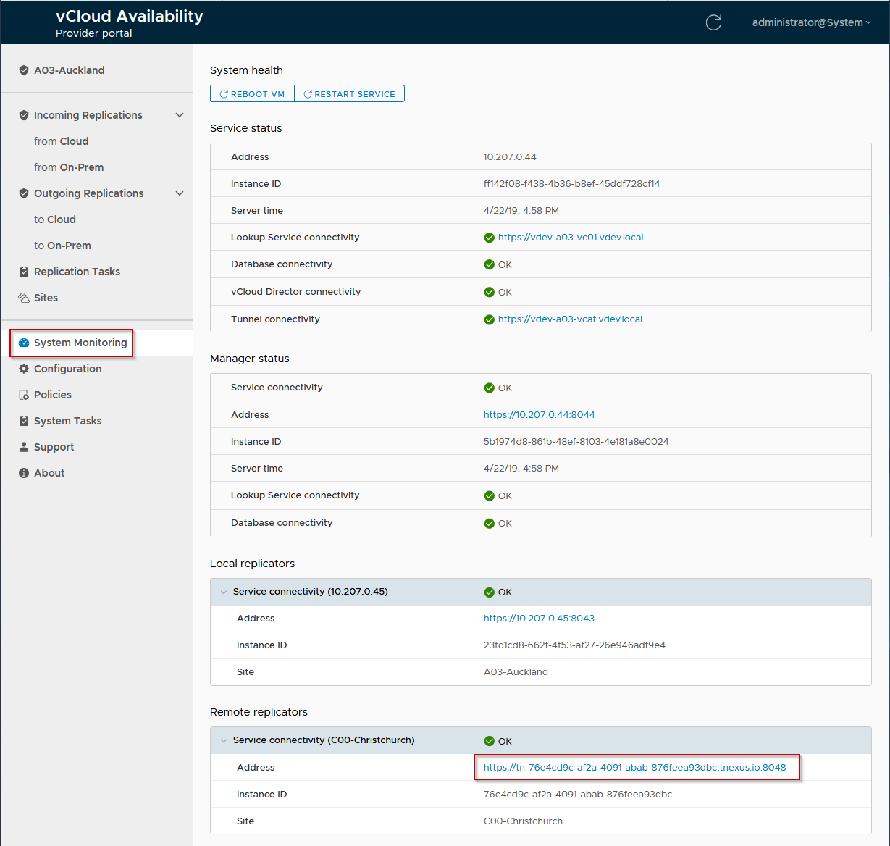 

Note: The odd 'Address' shown for the Remote replicator (boxed in red above) is correct - this is an internal address used to reach the remote replicator appliance via the vCAv Tunnel.

### vCloud Availability Policies {.wp-block-heading}

Now that we have 2 paired vCAv sites, we can configure policies and assign these to vCloud Director tenants to allow these tenants to configure protection for their VMs. 

Again working in the vApp Replication Manager portal (https://10.207.0.44/ui/login in my lab environment) and signed in as our vCloud Director provider account we can see the vCAv policies under the 'Policies' tab. The default vCAv policy assigned to all vCloud tenants by default forbids any replications:

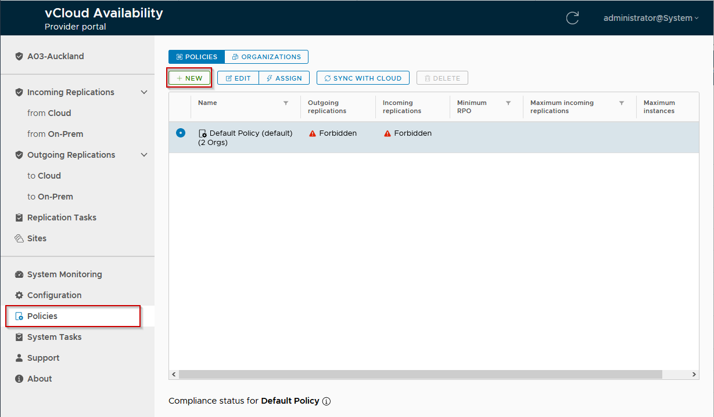 

Selecting the `New` button allows us to configure a new policy:

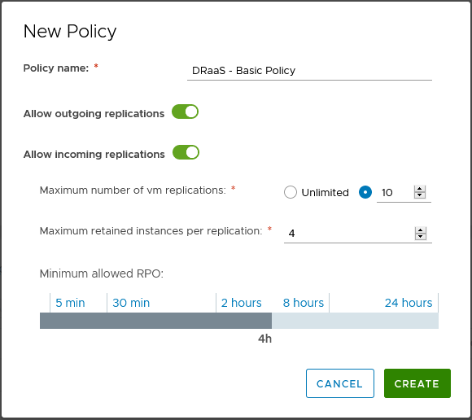 

Replication can be allowed in either direction and the maximum number of retained instances (snapshots) per VM replication can also be set between 1 and 24. The minimum allowed RPO (set to 4 hours in this example, but configurable from 5 minutes to 24 hours) prevents users of the policy configuring smaller RPOs than defined in the policy.

> **Note:** You will need to configure and assign a policy in both sites (Auckland and Christchurch in my lab environment) to permit configuration of VM replication. Policies do not automatically replicate between cloud sites, neither do assignments of policies to organizations/tenants.

With the policy just created selected, we can now select the 'assign' link to add tenant organizations to the policy as shown below:

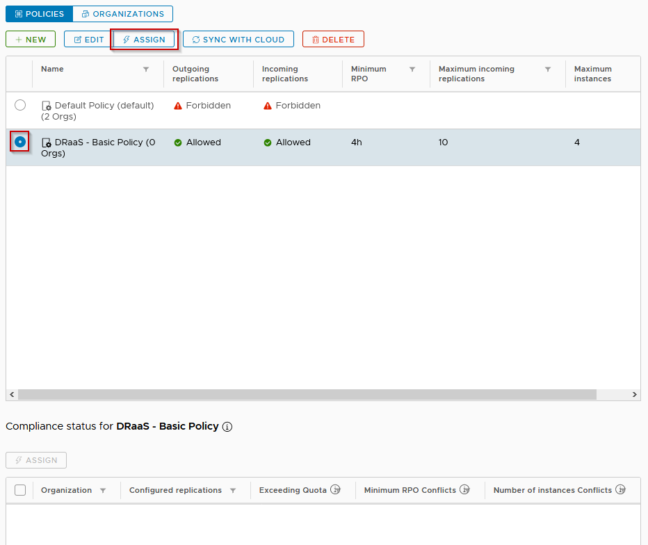 

The popup dialog that appears on clicking 'Assign' allows one (or many) vCloud tenant Organizations to be associated with the specified policy.

Note: A vCloud Organization can only ever be assigned to one vCAv policy at a time, if a tenant is assigned to a new policy any previous assignments from that tenant will be removed. In the screen below I assign the new policy to the 'Tyrell' tenant organization in vCloud Director:

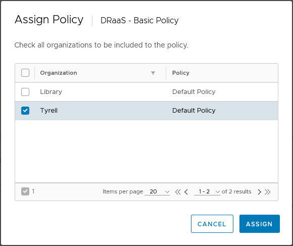

In order for the tenant to be able to configure VM replication, a policy must be defined and assigned in both sites to the organization (in order to have resources at both sites the tenant must also be defined and have virtual datacenter resources assigned to them in both sites). In my lab setup the 'Tyrell' organization has VDCs assigned in both sites and I have also configured an identical vCAv policy in the 2nd site and assigned it.

That is all that is required in order for tenants to be able to configure VM replication in their vCloud Director portal and perform migration and VM failover between sites.

In the next post in this series I will detail the configuration steps to link an on-premise vSphere environment to connect to a vCloud Service Provider site using vCAv.

