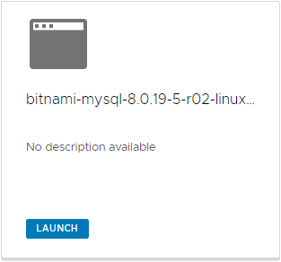
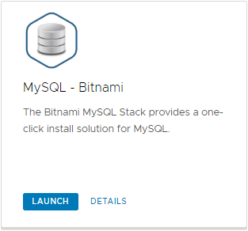
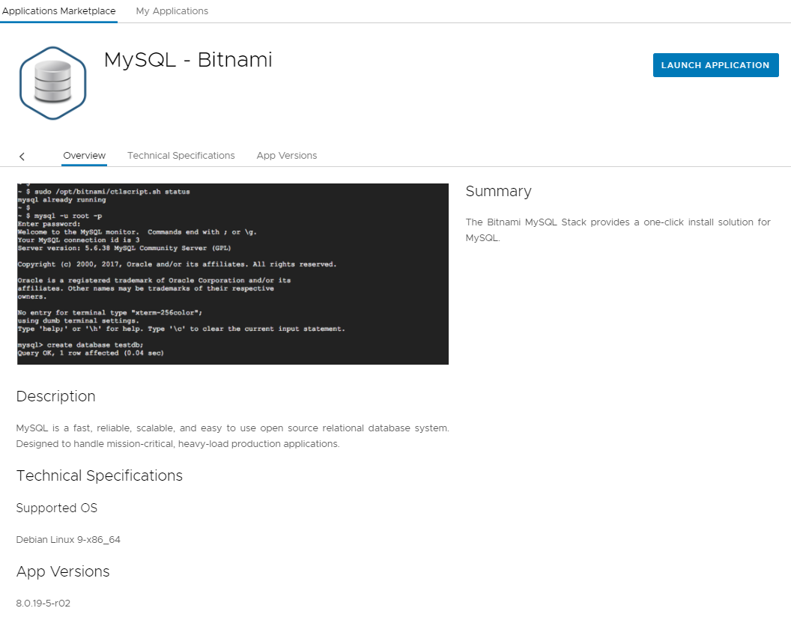

VMware App Launchpad is an addon to VMware Cloud Director (VCD) which can be used by Service Providers (SPs) to allow customers/tenants to deploy pre-created templates (known as vAppTemplates) into their environments. These templates can contain any pre-loaded/configured applications (e.g. a database server or content management platform) which can then be easily deployed into a customer environment and used extremely rapidly.

App Launchpad allows SPs to define their own templates for consumption by tenants as well as importing templates from the Bitnami catalog via VMware Cloud Marketplace. When attempting to create some initial templates to distribute in our development environment I was initially a little disappointed to see the resulting tiles in the VCD interface:


As you can see, the tile provides very little information, and is quite unfriendly.

Thinking there had to be a way to provide better information, a contact at VMware directed me to [this VMware Blog Post][2] which details using Postman (a REST API client) to manipulate the VCD metadata associated with the template. The results are much better:


Even better, we now get an additional 'Details' button which opens a page with far more details about the selected template:


Much better! But the process to create/update metadata via Postman and direct API interaction is cumbersome, complex and prone to error so I decided in my typical fashion to write a script to make this process much easier. What I ended up with was a script that takes a JSON input file defining all of the required template properties and then creates/updates all of the vAppTemplate metadata to the supplied values.

An example of the JSON format for the Bitnami MySQL template is shown in the code block below:

```json
[{
    "vAppTemplate": "bitnami-mysql-8.0.19-5-r02-linux-debian-9-x86_64-nami",
    "name": "MySQL - Bitnami",
    "summary": "The Bitnami MySQL Stack provides a one-click install solution for MySQL.",
    "description": "MySQL is a fast, reliable, scalable, and easy to use open source relational database system. Designed to handle mission-critical, heavy-load production applications.",
    "version": "8.0.19-5-r02",
    "logo": "https://dyltqmyl993wv.cloudfront.net/assets/stacks/mysql/img/mysql-stack-110x117.png",
    "screenshots": "https://bitnami.com/stack/mysql/default_screenshot",
    "os": "Debian Linux 9-x86_64"
}]
```

I've published the PowerShell script and an example JSON file containing updates for some common Bitnami application templates in a repository [on my github page here.][4]

Instructions on how to use the script are included in the repository, but basically you need a PowerShell environment with VMware PowerCLI and to be connected to your organization as a user with 'System' level permissions for it to work. Hopefully this will be of use to those of you who need to create or maintain templates for App Launchpad.

A couple of 'oddities' I've noticed when working with App Launchpad that are probably bugs that need to be fixed:

  * The 'Details' button is actually always there, even for templates which have not yet been customised, but it is in white text (on a white background) for these templates - it can still be clicked though and shows the details page (which typically will be empty) for these templates.
  * When updating the 'summary' and 'name' properties via the metadata changes will be reflected in the App Launchpad panel in VCD immediately on refresh of the browser, however changes to the properties in the 'Details' page for a template require the App Launchpad service on the ALP server to be restarted (`systemctl restart alp`) before they will be reflected in the browser session (even after a refresh).

As always, comments/feedback welcome as are pull requests and issues against the github repository for this.

Jon.

 [2]: https://blogs.vmware.com/cloudprovider/2020/04/easy-application-deployment-in-vmware-cloud-director-with-app-launchpad.html
 [4]: https://github.com/jondwaite/ALP-metadata