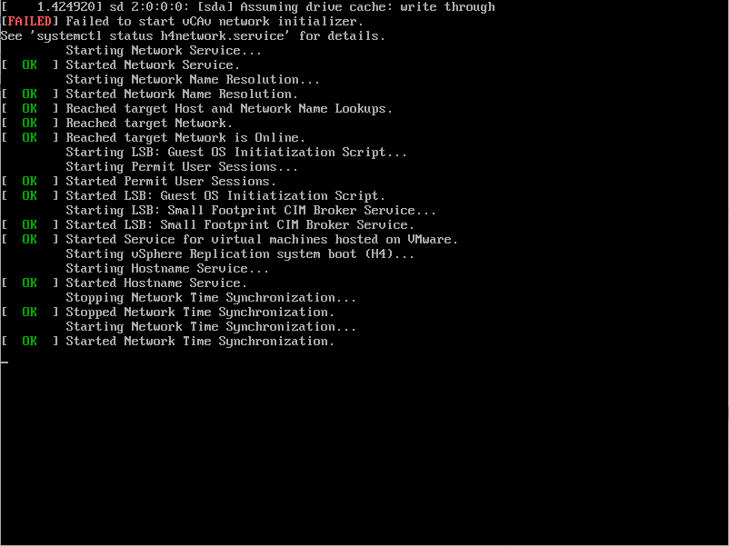
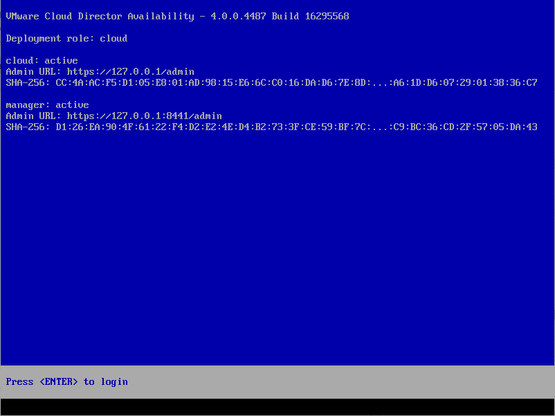
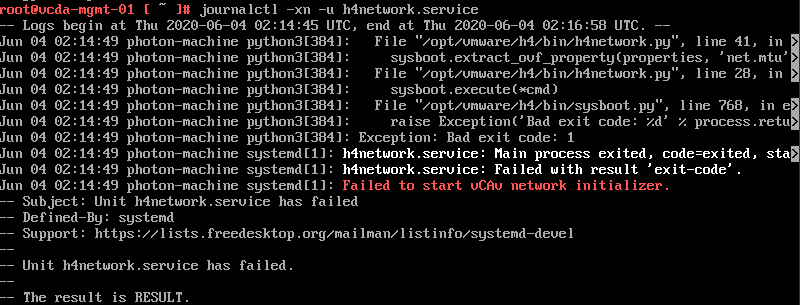

Just a quick post covering an issue I discovered when deploying new appliances for the recently released VMware Cloud Director Availability (VCDA) solution (the product formerly known as vCloud Availability).

When I deployed the first management appliance I was a bit puzzled to see this on the console during first power-up:

`Failed to start vCAv network initializer`:
 

And then when the startup had completed, the console was showing no IP address had been assigned to the appliance:

Which was odd, as I was sure I'd specified the correct IP information during appliance deployment. Logging in to the appliance and looking at the status of the `h4network.service` showed errors:

 
The errors appeared to indicate an issue with the MTU network property from the appliance ('`sysboot.extract_ovf_property(Properties, 'net.mtu'`) in the `sysboot.py` script. So I did some more digging and tried deploying again with different MTU values, none of which got me any further. I then took a step-back and looked again at the network properties I'd entered for the appliance:

Hands up if you can spot the error before scrolling down for the answer...
In my rush to deploy a shiny new VCDA instance, I hadn't properly read the information correctly against the 'Address' entry:

I'd provided a valid IP address for the appliance, but not what was being asked for - a CIDR address including the subnet mask. After changing the value shown to one appropriate for my network (192.168.0.20/24 in this case) I was able to re-deploy the appliance and the networking came up fine as expected.

Hopefully this will teach me to be a bit more careful in future reading the descriptions for vApp properties when deploying appliances and hopefully will be helpful to anyone else facing the same issue.

Jon.