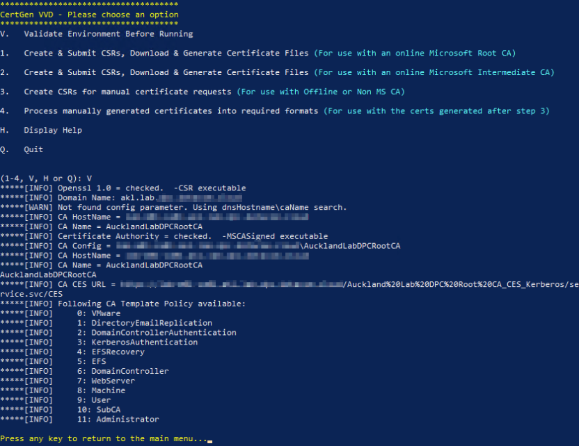
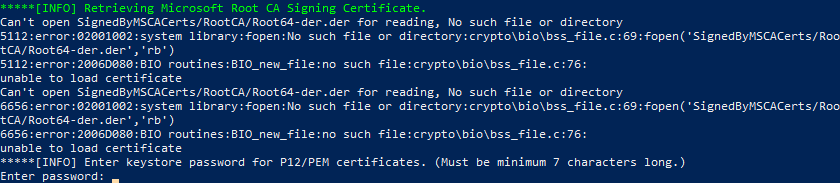
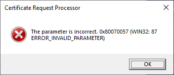

Whenever I hit an obscure issue using someone else's code, I try and write up a quick post if I manage to find the cause (and fix it). Hopefully in this case you've found this article after encountering the same issue and this will provide an easy way to resolve it.

In this case, I was working on deploying a lab environment using VMware Cloud Foundation 4.2 and using vRealize Suite Lifecycle Manager (vRSLCM) to deploy the vRealize Suite components into the VCF environment once deployed. VMware have published a utility (available from the KB page called 'Certificate Generation Utility for VMware Validated Design for Software-Defined Data Center 6.x' (yes, bit of a mouthful). This extremely useful article has a script attached which will take a comma-separated csv file generated using the VMware Validated Design (VVD) spreadsheet and automatically request all of the required PKI certificates from a Microsoft Certificate Authority and then bundle up all of the generated certificate files ready for use.

The issue I hit when I first ran this utility was that no mention is made in the pre-requisites section that the Java keytool utility is required to generate some of the certificate bundle formats. Bit of an odd omission, but easy enough to install a current JDK distribution and ensure that the keytool.exe command is included in the PATH.

The next issue I hit was a bit harder to find though, starting the utility from a PowerShell prompt and validating the configuration appeared to show everything was ok:


When I attempted to generate the CSRs and certificates though I got errors:


If I continued with the process by supplying keystore passwords, I then got error pop-ups for each key to be created:


Very odd, doing a heap of troubleshooting and PowerShell analysis, I finally found the problem - my Windows Root CA server has spaces in it's name (since I set it to be a more 'friendly' name than the default CN of the server).

The actual name of the CA is 'Auckland Lab DPC Root CA', but as you can see in the first screenshot above this has been truncated to 'AucklandLabDPCRootCA'. Once I'd worked out what the issue was, finding and fixing the code was reasonably straightforward, in the function `get-ca-name` (around line 145 in the CertGen-6.2.002.ps1 script which was the latest available at the time of writing):

```powershell
Function get-ca-name {
$val = certutil -adca
$f = ($val | Select-String -pattern 'cn = (.*)').matches[0]
$f = $f -replace " ",""
$CAName = ($f -split "=")[1]
Write-Host "*****[INFO] CA Name = $CAName"
return $CAName
}
```

Obviously the global replace in $f of all space characters will cause this issue.

Changing the function as follows allows the original CA name (including space characters) to be retained. Note the extra space character after the '=' sign in the line $CAName = ...

```powershell
Function get-ca-name {
$val = certutil -adca
$f = ($val | Select-String -pattern 'cn = (.*)').matches[0]
$CAName = ($f -split "= ")[1]
Write-Host "*****[INFO] CA Name = $CAName"
return $CAName
}
```

After making this change to the script I was able to use CertGen to generate all of the vRealize Suite component certificates successfully.

Hopefully this helps out others who hit the same issue.

Jon.
