I'm a huge fan of [VMware Photon OS][1] as a lightweight Linux distribution for running up quick demo and development environments as well as container hosts. In particular I like the small size and multiple distribution options (including VMware OVA, AWS AMI, Azure VHD and Google GCE formats as well as installation ISO and Raspberry Pi image) Earlier this year version 4.0 was released featuring a Real Time (RT) kernel option, security improvements, performance improvements and support for the latest Linux kernels and utilities.

I'm also a fan of [Microsoft Visual Studio Code (VSCode)][2] as my default development environment, the sheer number and variety of extensions available make this an extremely flexible and easy to use.

While users of Linux and Mac tend to be familiar with SSH shells and key-based authentication, this is not always the case for Windows users, but with recent functionality added to Windows 10 build 1809 (and newer), it's now reasonably straightforward to set up a complete development environment for VSCode running in Windows against a remote Linux (Photon OS) deployment target.

This post is designed to show the steps required to get such an environment set up from scratch (partly as a reference for myself, and hopefully to be useful to others).

The goals I had for this configuration were:

  * Automatic and password-less authentication from Windows 10 to a virtual Photon OS appliance
  * Use a standard Photon OS user account named 'photon' (rather than using the 'root' account)
  * The 'photon' user should also be able to use the Linux `sudo` command to run commands requiring root permissions (again, without specifying a password)
  * Allow VSCode Secure Shell (SSH) remoting from Windows to the Photon OS VM

The starting point for this configuration is a fresh minimal installation of Photon OS 4.0 (GA) from the **photon-minimal-4.0-1526e30ba.iso** media image and choosing the 'minimal' installation option. The Windows 10 installation is also a fresh installation using the October 2020 installation media.

Next I made sure that all (at the time of writing - April 2021) updates were installed in both Windows 10 and on the Photon OS VM (using `tdnf -y update` from a 'root' command prompt). On the Windows machine I then downloaded and installed the latest version of Microsoft Visual Studio Code

Windows 10 now has a built-in OpenSSH client which provides everything we need to generate SSH keys and then be able to use these to connect to remote systems, from a PowerShell prompt, first use

```
ssh-keygen -t ecdsa -b 521
```

to generate a key pair and save these in the default locations (`$HOME\.ssh\id_ecdsa` for the private key file and `$HOME\.ssh\id_ecdsa.pub` for the public key), you can optionally provide a passphrase to protect the private key - this process will work either with or without a passphrase set:
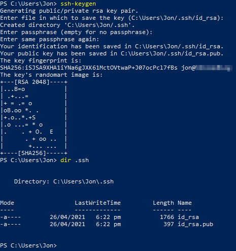

{}
There is an issue in the version of ssh-agent in Windows 10 which effects RSA key pairs - if you try to use RSA key pairs (the default generated by `ssh-keygen`, you will probably receive an error `warning agent returned different signature type ssh-rsa (expected rsa-sha2-512)` when attempting to connect to your Photon VM. This can be fixed by manually updating the `ssh-agent` in use by Windows, but in this configuration I simply use an ECDSA key pair which doesn't suffer from this issue.
{}

Next we need to add the private key to Windows 10's ssh-agent and set this service to automatically start with Windows so that we can use this to automatically authenticate using our key in future. Open an Administrator PowerShell prompt (since we are manipulating System services, we need this) and use `Set-Service ssh-agent -StartupType Automatic` then `Start-Service ssh-agent` and finally `ssh-add "C:\Users\<your user name>\.ssh\id_ecdsa"`. If you provided a passphrase for your private key you will need to enter this to add the key to `ssh-agent`:

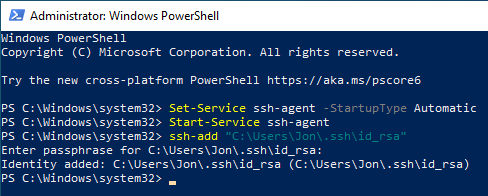

Next, login to the Photon OS VM console as `root`, and use the `ip a` command to find the IP address (if not statically assigned during installation):

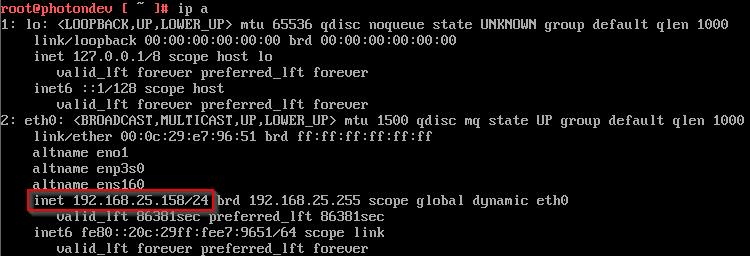

As you can see, in this example my IP address is 192.168.25.158. Next we use `useradd -m -G sudo photon` to create a new 'photon' user account, `passwd photon` to set a password on this account and then use `echo "photon ALL=NOPASSWD: ALL" >> /etc/sudoers` to add a line to the `/etc/sudoers` file to allow this user to run `sudo` commands without specifying a password:

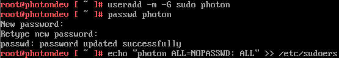

Now we can attempt to connect from our Windows 10 machine to Photon (using the password we just configured at this stage) using `ssh photon@<IP Address of Photon VM>` we'll be prompted to accept the SSH fingerprint for the host if we haven't connected previously:
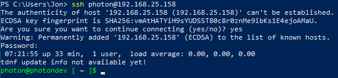

While we're here we create the `.ssh` directory for our `authorized_keys` file to be copied to in the next step using `mkdir /home/photon/.ssh`:
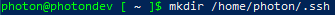

Exit from the ssh session and use `scp .ssh\id_ecdsa.pub photon@<Photon IP Address>:/home/photon/.ssh/authorized_keys` to copy the public key (id\_ecdsa.pub) to the authorized\_keys file with the public key of your Windows 10 user. Make sure you copy the .pub (public) key file:
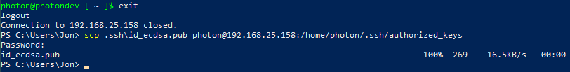

Now reconnect to the Photon VM using ssh, if everything is working successfully you should not be prompted for a password at all. You should also be able to run `sudo` commands again without being prompted for a password:
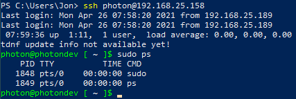

Next we need to run a couple of commands to allow VSCode to interact with the VM, the first `sudo tdnf -y install tar` provides the `tar` utility which the VSCode addon for Linux requires (and is not installed in a Photon OS minimal installation), the second `sudo sed -i "s/AllowTcpForwarding no/AllowTcpForwarding yes/g" /etc/ssh/sshd_config` allows the default Photon OS sshd process to accept TCP forwarding (another requirement for the VSCode remote connection). Finally the `sudo systemctl restart sshd` makes this change take effect:
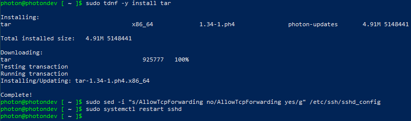

Now we have everything configured ready for VSCode, in VSCode add the Remote - SSH extension (if not already installed) by selecting the extensions option (boxes on left side of the screen), then typing 'ssh' into the search box and selecting the 'Remote - SSH' option and click 'Install':
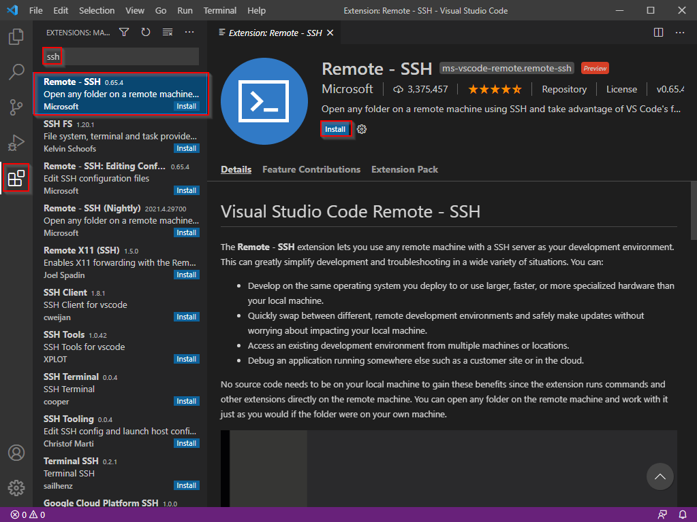

We can now bring up the VSCode command window (Ctrl + Shift + P), type 'ssh' to filter the available options and select 'Remote-SSH: Add New SSH Host&#8230;' to add our Photon VM:
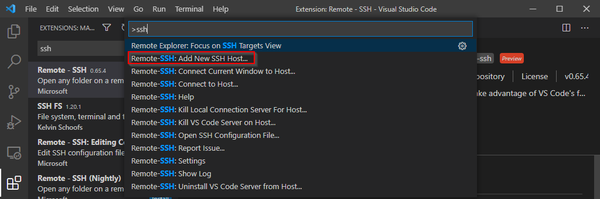

When prompted, we can enter our ssh connection string to connect to our host:
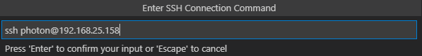

Next we can update the VSCode configuration file in our home directory to remember this host connection:
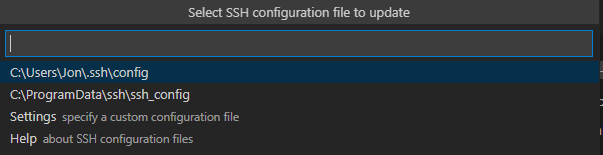

Finally we can click 'Connect' to establish the remote connection:
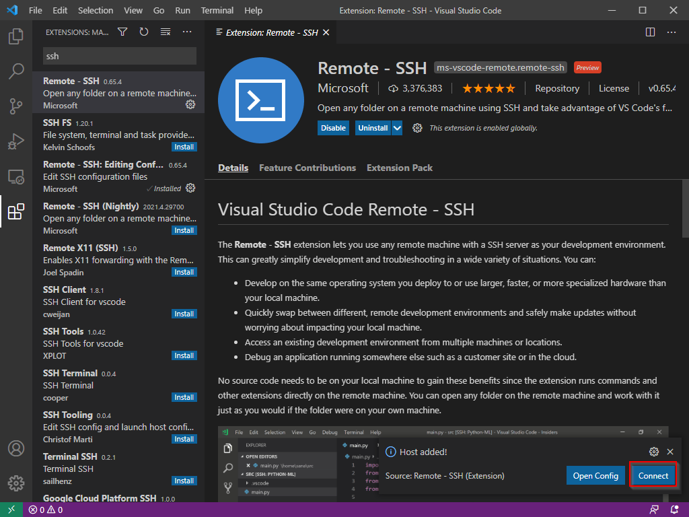

If everything has worked, we should now get a VSCode window which is connected to our remove VM ready to use (if prompted to select the Operating System of the remote connection, just select Linux from the menu):
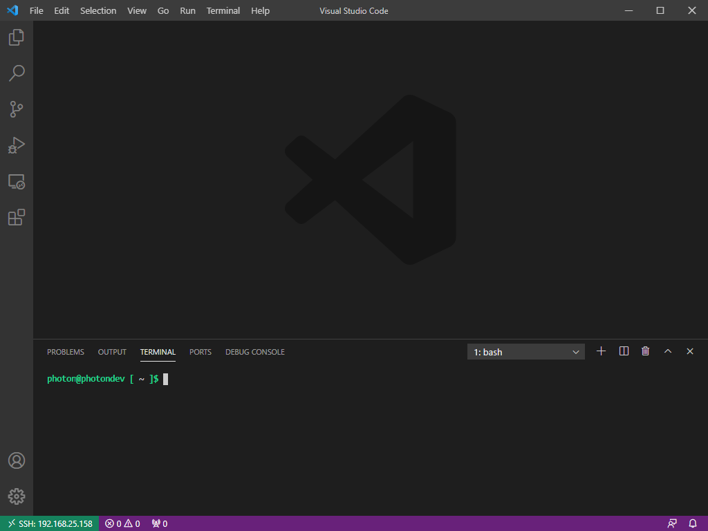

{}
Sometimes I've had to attempt connecting 2 or 3 times before successful (I'm assuming due to the time taken for the Photon VM to download, unpack and install the VSCode extension), but typically once the connection has succeeded for the first time it will continue to work in future without problems and connect first time from then on.
{}

### Troubleshooting

If you get a hang when attempting to initiate the remote connection from VSCode, this is most likely due to not setting the 'AllowTcpForwarding yes' option in /etc/ssh/sshd_config (or not restarting the sshd service after making this change) in the Photon VM. The default setting (AllowTcpForwarding no') will not work with current versions of the SSH-remote extension for VSCode.

If you get an error when first attempting to connect via SSH, check that you remembered to install the 'tar' package - this is needed to unpack the VSCode software and is not present in a default/minimal Photon OS installation.

Hopefully this will be useful to others, but I know I'll refer back to it when needing to setup a quick VSCode development environment against a Photon OS VM.

Jon.

 [1]: https://vmware.github.io/photon/
 [2]: https://code.visualstudio.com/