One of the feature requests which I've wanted for a long time is the ability to generate user API tokens in Cloud Director. Since most service providers enforce MFA/2FA authentication to the Cloud Director UI (which is a very good thing and something I definitely recommend) this can make it more difficult for automation scripts and Infrastructure as Code (e.g. Terraform) to access the environments.

In the past there were various ways this could be worked around, including:

  * Implementing a 3rd party solution in front of VCD which could intercept and handle API requests.
  * Implementing a 3rd party solution which issues and tracks it's own tokens.
  * Logging in interactively and then extracting the session token for use in a script (but this has to be refreshed whenever the session token expires)

None of these struck me as particularly elegant or useful though, and introduced additional complexity (and potentially cost) when we typically want API access that 'Just works' and is easy to enable and manage.

Thankfully, in VMware Cloud Director 10.3.1 a new feature has been released which enables the generation and use of API Tokens natively in the platform:
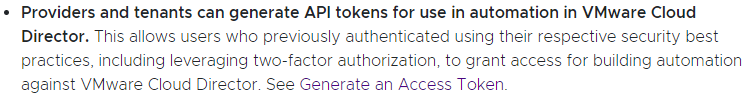

(From the VMware Cloud Director 10.3.1 release notes [here][1])

So I set about enabling and testing this functionality. After a few trials/errors I got it working, and this blog post details the changes that need to be made and the process so you can go about enabling this functionality for customers in your own environments.

## Enable and Generate API Tokens

To enable users to manage an API key, they need to have a permission assigned for this. This can be achieved either by modifying the 'Global Roles' assigned, or by using a Rights Bundle which contains the relevant permissions and publishing this to the tenant organization.

In the screen below, I'm creating a new Rights Bundle which provides the capability for a tenant user to manage their own API tokens:
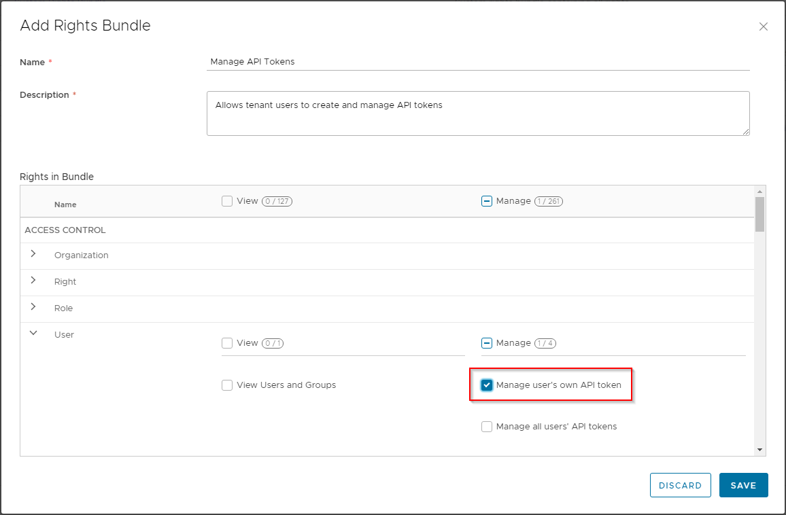

This Rights Bundle can then be published globally or to specific tenant organizations:
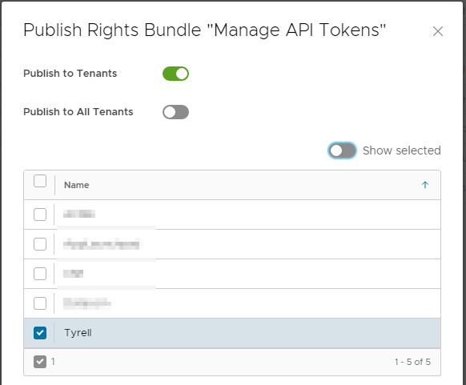

Once logged in as a tenant user that has been given the 'Manage user's own API token' right, tokens can be generated for use. The process for this is to click on the user name (top-right of screen) and select the 'User Preferences' item:
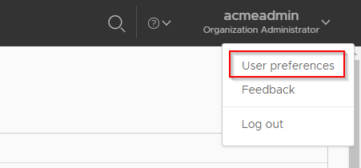

Scrolling down the user preferences screen you will see a new section (in CD 10.3.1) for Access Tokens:
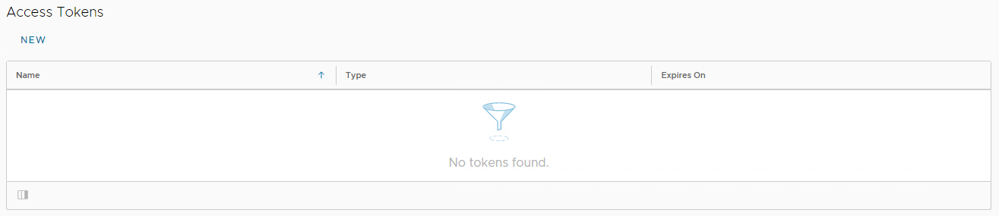

Generating a new token is straightforward - click 'New' and give the token a name:
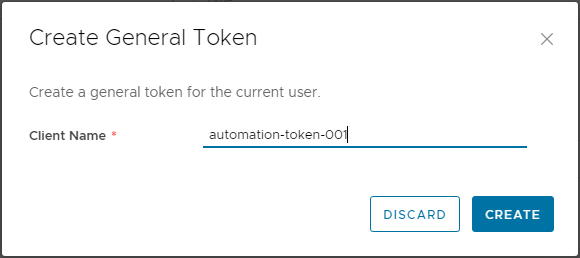

When you click create, the token detail will be shown, make sure you copy this as it will not be retrievable or available anywhere else after this screen (you will have to revoke and generate a new token if this is lost):
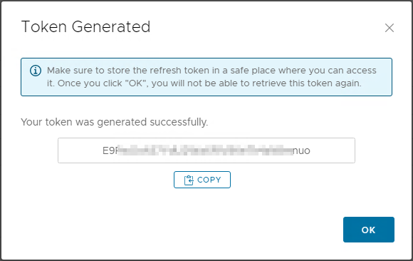

The token will now be shown, together with an option via the 3-dots button to revoke a specific token:
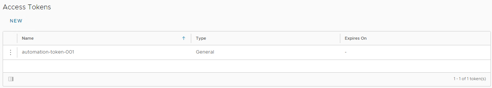

Once a token has been successfully generated, it can now be used to authenticate against the CD instance for use in a script or other automation workflow.

## Using an API Token to Authenticate

The API token itself needs to be 'refreshed' against the Cloud Director API to generate an Access token which can be used in subsequent API calls to provide authorization.

The typical call that needs to be made for this is an HTML POST request against the following URL:

https://<Cloud Director API Endpoint>/oauth/tenant/<Tenant Name>/token?grant\_type=refresh\_token&refresh_token=<API Token value>

This request needs to set an 'Accept' header of 'application/json' as the returned data is a JSON payload:
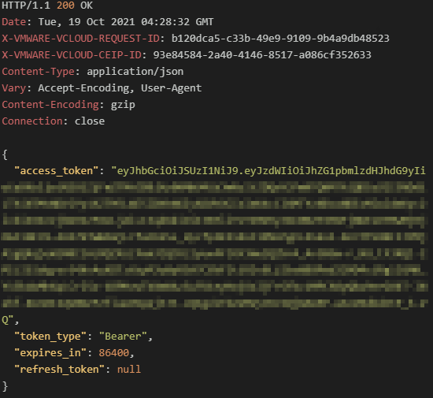

The returned &#8220;access\_token&#8221; value can now be used in subsequent API calls using the 'Authorization: Bearer <access\_token>&#8221; header.

As an example, the following PowerShell code makes a connection using an API token and then retrieves the Org details using the access_token:
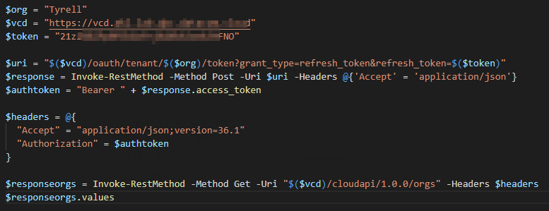

And the output ($responseorgs.values) is:
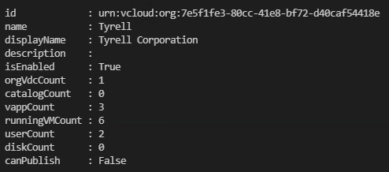

Great to see VMware adding this capability to Cloud Director, and certainly gives a new and valuable option when writing code to operate against the Cloud Director API.

Hopefully this will be of use to some of you as I found the VMware site documentation on this a bit vague and had to do a fair bit of experimentation to get this working.

Jon

 [1]: https://docs.vmware.com/en/VMware-Cloud-Director/10.3/rn/VMware-Cloud-Director-1031-Release-Notes.html
 