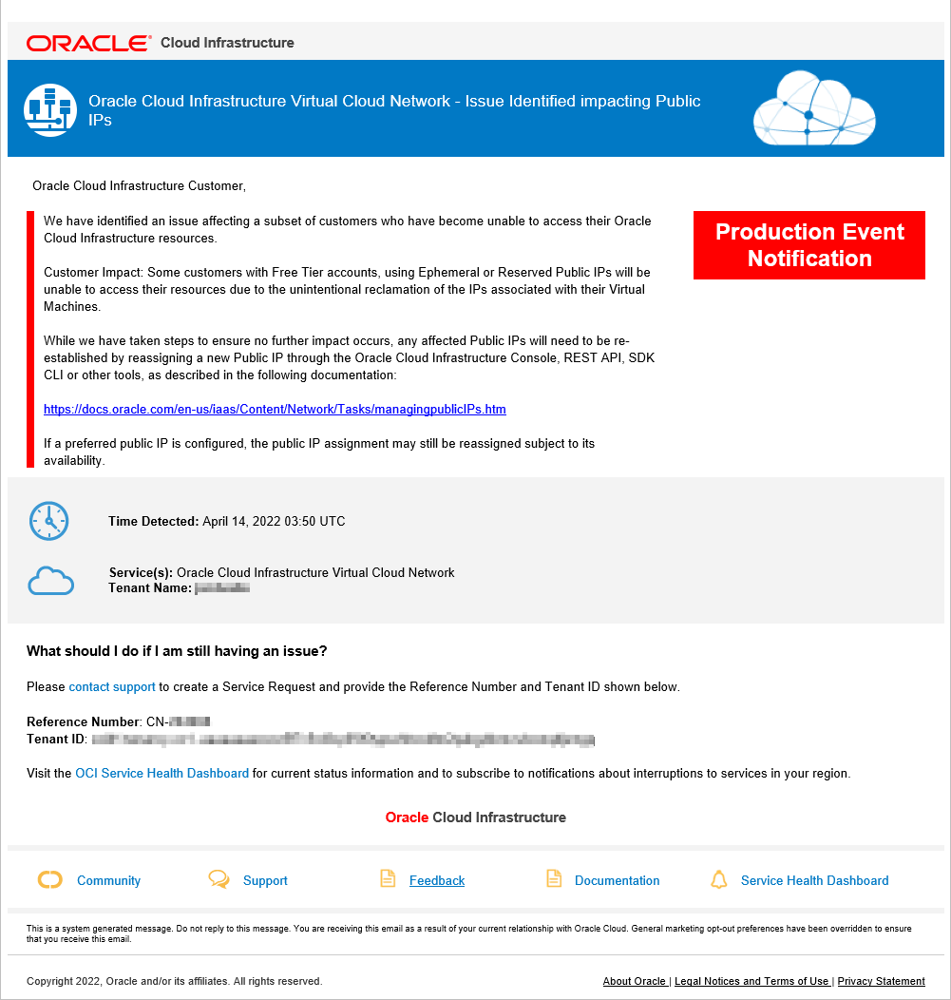

So I had an 'interesting' email from Oracle cloud (OCI) which I almost missed:

As this site (kiwicloud.ninja) is currently hosted on the 'Free Tier' of Oracle Cloud I was a bit concerned, but figured the odds of being impacted were low and I 'should be alright'.

Unfortunately - turned out it wasn't alright, OCI had 'unintentionally reclaimed' the public IP address which the site used and I had to jump into the Oracle dashboard and navigate through to assign a new reserved public IP address to the site.

Then I had to find my DNS registration logins and update those so that the domain pointed correctly to the updated public IP (unfortunately my previous public IP had already been reallocated and so was unavailable to reassign).

So everything is fixed and the site is now back on the air, but it does have me re-evaluating my choice of where the best place is for this site to live, and how I should monitor it in future to get better notifications when things go wrong.

Jon