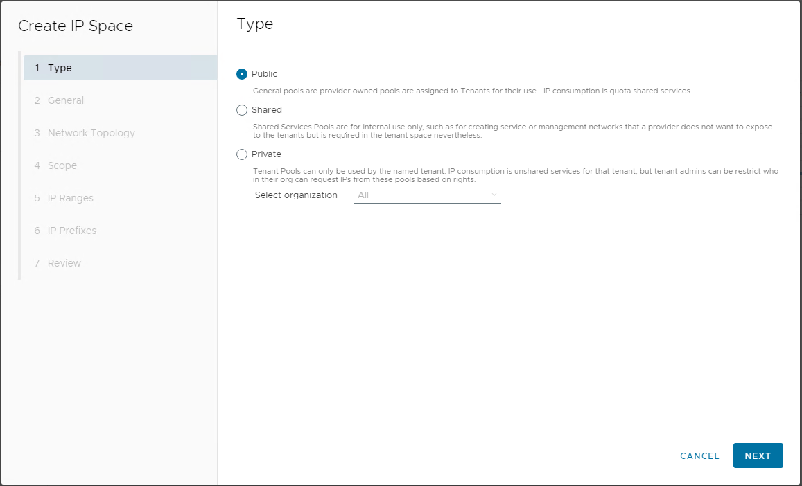

VMware recently <a rel="noreferrer noopener" href="https://docs.vmware.com/en/VMware-Cloud-Director/10.4.1/rn/vmware-cloud-director-1041-release-notes/index.html" target="_blank">released</a> version 10.4.1 of VMware Cloud Director (VCD) - VMware add a new feature known as IP Spaces. IP Spaces allow providers and tenant customers to manage IP address allocations within VCD.

What was originally meant to be a 'quick look' at IP Spaces and the capabilities they add has somehow turned into a 3-part series, so please follow the links below to the bit that interests you most.

- Part 1 - Introduction & Public IP Spaces (this post)
- [Part 2 - Private IP Spaces](/2022/12/ip-spaces-in-vmware-cloud-director-10-4-1-private-spaces/)
- [Part 3 - IP Spaces Tenant Experience, Compatibility and Summary](/2022/12/ip-spaces-in-vmware-cloud-director-10-4-1-tenant-experience/)

In this first post we'll look at the first of three possible types of IP Spaces, 'Public' IP Spaces and see how these can be configured by the Service Provider to provide extra capability and features not previously available in Cloud Director. In particular, Service Providers can now create a shared pool of IP addresses which can be 'drawn down' on by tenant organisations (within a quota limit which can be assigned both globally, and overridden for individual tenants).

This ability to have a 'floating pool' of available addressing which can be shared and reused by multiple tenants (rather than having to statically assign and manage each individual address to a specific tenant) is a welcome improvement, and in partular with the scarcity of IPv4 address space will make it much easier for Service Providers to manage and provide flexible public IP address space allocations to their customers.

IP Spaces can be found in the VCD provider UI under the Resources / Cloud Resources tabs:

To create a new public IP Space (for example to provide internet addresses), click the NEW text which opens the IP Space creation workflow:

In the next step you name your new IP Space and (optionally) provide a description:

Next you decide whether to enable route advertisement for allocations of blocks of IP addresses (referred to as 'Prefixes' in the UI), for this example we won't:

In this example, we're going to assume that our 'public' assigned internet address block is 10.10.10.0/24 (255 addresses from 10.10.10.1 through 10.10.10.255), and:

- We want to assign the block from 10.10.10.128 through 10.10.10.191 (64 addresses) to this instance of VCD for our tenants to use.
- We want to allow the first 32 addresses (10.10.10.128/27 or 10.10.10.128-10.10.10.159) to be assigned individually.
- We also would like the 2nd block of 32 addresses (10.10.10.160/27 or 10.10.10.160-10.10.10.191) to be requestable in blocks of 4 contiguous addresses by tenants.
- Finally, we only want to allow each tenant by default to assign up to 2 individual IP addresses from the first block and 1 segment from the 2nd block.

Here's how we can configure these settings in the VCD UI, first we define our Scope (including the 'superscope' from which the /26 we want is derived:

Next we add the IP Range from which tenants will be able to request individual IP addresses (in our example the /27 gives us addresses 10.10.10.128 to 10.10.10.159 inclusive):

Next we add the IP Prefix blocks that we want to be able to issue, we can use the arrow to the left side to verify that the ranges being created match the blocks that we desire. We use /30 on our range to create blocks of 4 addresses for each prefix and then specify we want to create 8 of these blocks for a total of 32 addresses:<figure class="wp-block-image size-large">

Next we can set the default quota limits which will apply to all tenant Organizations that we don't explicity set alternative limits for (or leave these as 'Unlimited'):<figure class="wp-block-image size-large">

Finally we get a summary review panel and can check and accept everything to confirm creation of the new public IP space:<figure class="wp-block-image size-large">

The IP Spaces view shows our newly created pool with a summary of how much address space is in use from it:

To make this new IP space available to tenants, we need to assign it to the Provider Gateway supporting the tenant Tier 1 gateways:

Clicking `NEW` initiates a new workflow which allows us to specify the Tenant-facing name for the pool (an extremely welcome feature), for example:

In the next page we select our newly create IP Space, note the warning that the IP Space reference cannot be altered once assigned to the Uplink

Clicking next shows a summary page from which the details can be confirmed with a Finish button to confirm the configuration choices:

And that's it! The IP Space is now fully configured and can be used by tenants to request public IP addresses (or Prefix blocks of addresses if allowed) for use in their environments. Organizational overrides can be added to limit or extend the range of addresses that can be requested by each tenant.

[Part 2](/2022/12/ip-spaces-in-vmware-cloud-director-10-4-1-private-spaces/) of this series considers using Private IP Spaces as a tenant to manage local IP address space used within VCD.

Hopefully this has given you a good feel for how the Public IP Space operates in VCD 10.4.1 and can be extremely flexibly used to provide individual (or blocks) of IP addresses to tenants.

As always, comments and feedback welcome via here or twitter ([@jondwaite][1])

Jon.

 [1]: https://twitter.com/jondwaite