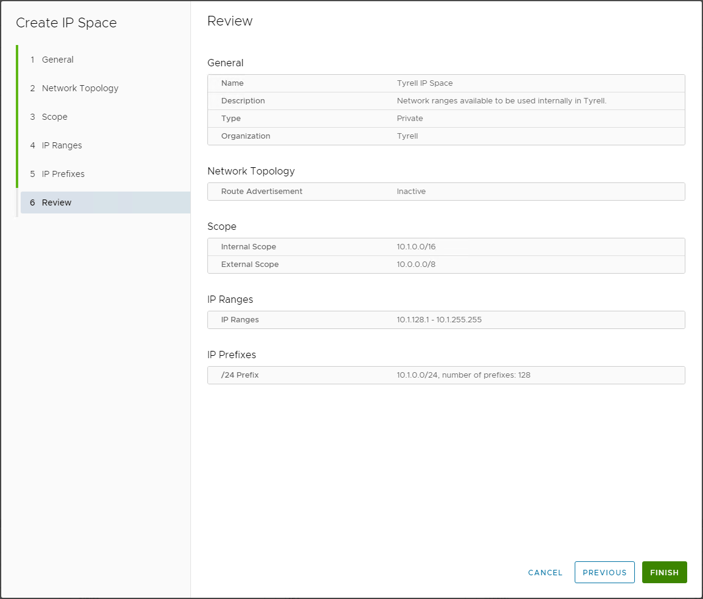

In an [earlier](/2022/12/ip-spaces-in-vmware-cloud-director-10-4-1-public-spaces/) post I wrote about the new IP Spaces feature in VMware Cloud Director (VCD) release 10.4.1 and the ability to create public IP spaces shared by multiple tenants. In this post I'll look at the ability to create private IP spaces within a tenant organization and some of the considerations for how these can be used. There is also a [part 3](/2022/12/ip-spaces-in-vmware-cloud-director-10-4-1-tenant-experience/) of this series that looks at the tenant experience, compatibility and has a summary of IP Spaces.

As a tenant administrator, IP Spaces are visible under the Networking and then IP Spaces options (if enabled by our provider):

Clicking `NEW` starts the configuration workflow, the first screen allows us to provide a name for the new IP Space and an optional description:

Clicking `NEXT` prompts us to chose whether route adverts will be globally enabled or not for this IP Space, note the warning that per-network advertisement must still be enabled for each network that requires this even if this setting is globally enabled:

Clicking `NEXT` allows us to specify the overall IP space being defined, and the subset of this space which we are adding to this VCD environment. The ADD button can be used to add multiple network definitions to the internal scope if required. In this case our example tenant organization is using 10.0.0.0/8 globally for their internal networks, and a subset of this range of 10.1.0.0/16 will be used within the VCD environment:

Next we can assign a pool of IP addresses which can be allocated individually (e.g. for Load Balancer IP addresses used in the NSX Advanced Load Balancer). In this example I've reserved the upper half of the 10.1.0.0/16 address space for use in this way:

Now we can assign the lower part of the pool which can be allocated as contiguous blocks (e.g. for OrgVDC networks within our tenancy), we specify the block size and the number of blocks to be created - in this example we chose a /24 block size and 128 total blocks, the down arrow allows us to preview the sequence of blocks that will be created for us:

Finally we get to review our choices and make sure that all the assignments look correct:

That completes the configuration of a new private IP space for our tenant organization, this can now be used when creating IP assignments within VCD, in the [final part of this series](/2022/12/ip-spaces-in-vmware-cloud-director-10-4-1-tenant-experience/) I show how a tenant can easily consume from (from either public or private IP Spaces) and use these for their networking requirements.

As always, comments and feedback welcome via here or twitter ([@jondwaite][1])

Jon.

 [1]: https://twitter.com/jondwaite