In [part 1](/2022/12/ip-spaces-in-vmware-cloud-director-10-4-1-public-spaces/) of this series I looked at the process for a Service Provider to allocate a public block of IP addresses to be consumable by VMware Cloud Director (VCD) tenant organizations.

In [part 2](/2022/12/ip-spaces-in-vmware-cloud-director-10-4-1-private-spaces/) of this series I showed the process by which a Service Provider or tenant organization can allocate IP Spaces for consumption within their environment.

This 3rd part will show how this all appears from the tenant perspective within VCD and how they can request and assign addressing from IP Spaces in their environment.

I'll be using a single VCD tenant 'Tyrell Corporation' in this example who has previously had both a public IP space assigned to them and a private IP space created. I'll cover the following in this post:

- Requesting and using a new 'floating' public IP address
- Requesting and using a new 'floating' private IP address
- Requesting and using a new 'prefix' private IP address range
- Notes on IP Spaces Compatibility (as of December 2022)
- Summary and final thoughts

### Requesting and using a new 'floating' public IP Address

Logged in to VCD as our tenant administrator and going to Networking / IP Spaces, we can see that two IP Spaces are available to us - a 'Public IP Pool' and 'Tyrell Internal' private pool:

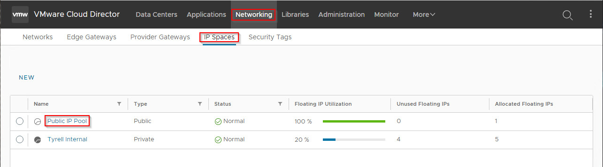

Selecting the 'Public IP Pool' we get a summary that shows we already have 1 Floating IP allocated which is in use (in this case this is the 'outside' address used on our Orgs Edge Gateway):

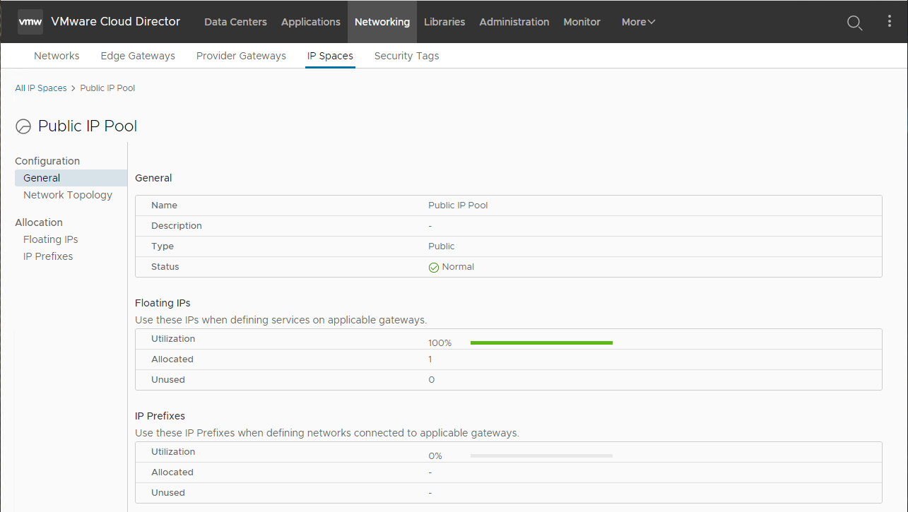

To allocate an additional Floating 'Public' IP address we go to 'Floating IPs' and click the `REQUEST` button:

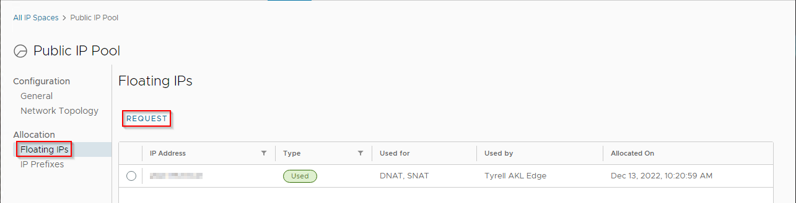

The pop-up dialog asks how many floating IPs we want to request (up to 5 can be requested at a time):

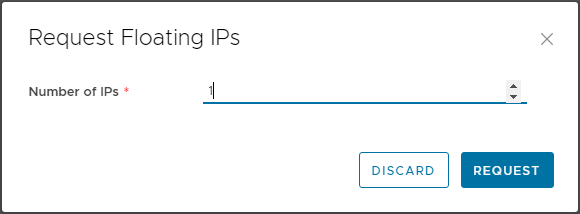

Once the request is made, we may be told we have reached our quota and that no more addresses are available to us (in which case the Service Provider will need to allocate additional addresses by either changing the global quota or adding an override quota for our Org). In this case, we have available quota and the additional Public IP address is assigned to our Org and is ready for assignment:

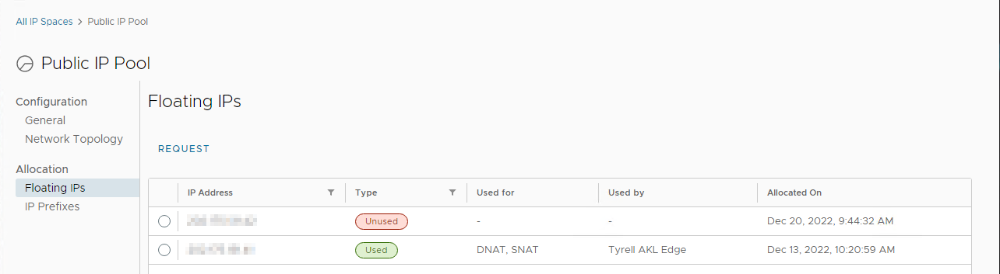

Selecting the newly allocated address allows us to flag the address as 'Manual' if we wish to use it for something outside of what our VCD environment is aware of, as well as release the IP back to the provider if we no longer need it:

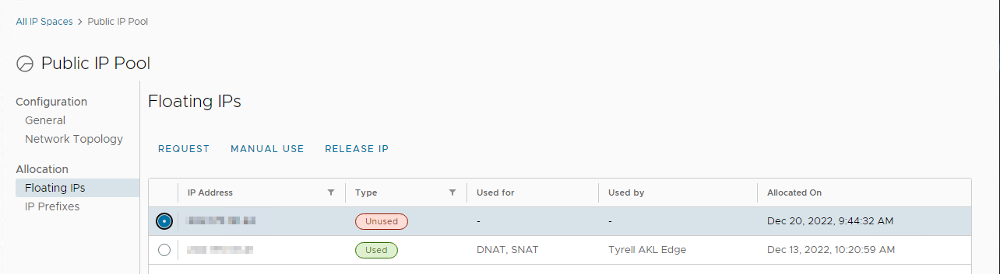

Once we have the IP allocated, we can assign it to services on our Edge Gateway (for example, as a new DNAT external address for a service we wish to publish to the Internet), or assign to a NSX Advanced Load Balancer as the Load Balancer address.

Note that VCD won't let IP addresses flagged as 'Used' be released back to the provider pool so the services referencing an address must be reconfigured first.

### Requesting and using a new 'floating' private IP Address

The process to request a new private floating IP address is similar to the process for a public IP address, although typically there won't be any quota on available private addresses. We first select our private IP space and can see the summary for this:

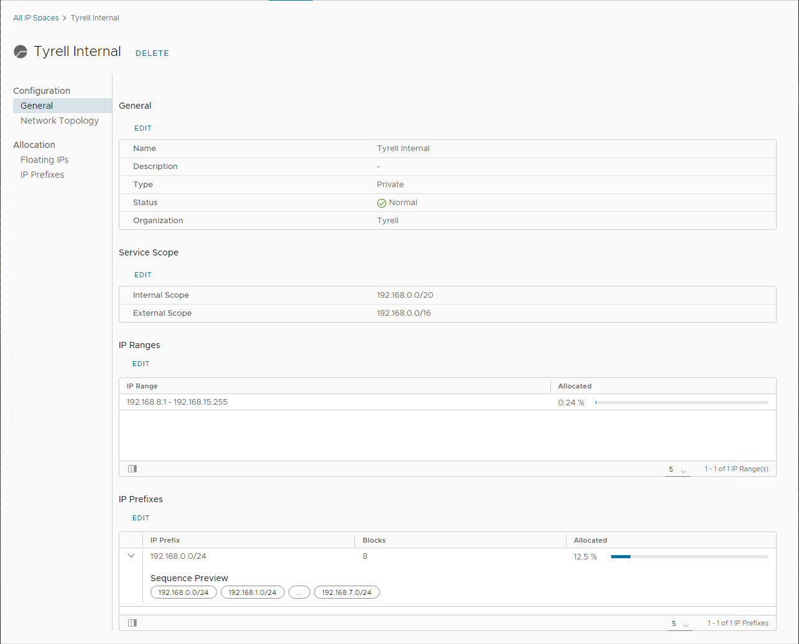

In this case we've defined our range as 192.168.0.0/16 from which 192.168.0.0/20 will be used within our VCD environment. We've then further subdivided 192.168.0.0/20 into a lower block of 8 prefix ranges (192.168.0.0/24, 192.168.1.0/24 etc.) and a pool of floating addresses from 192.168.8.1 to 192.168.15.22.

To request a new Floating IP address we select the Floating IPs item from the left panel:

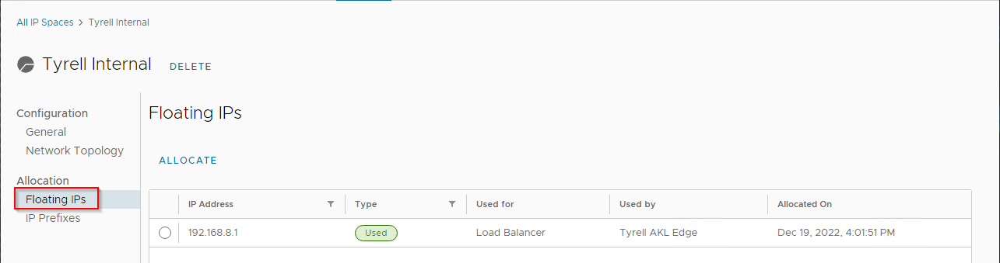

We can see that a single IP address has already been allocated and is in use by a Load Balancer instance, to allocate additional floating IPs we select `ALLOCATE` and provide the number of addresses required between 1 and 5:

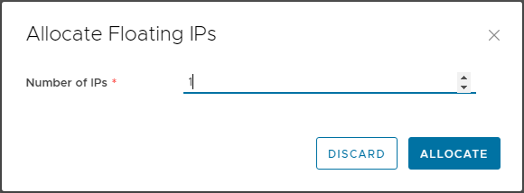

Our new Floating IP address is allocated and shown to us with a type of 'Unused', as with public addresses we have the option to flag this address as being 'Manual Use' (outside of VCDs awareness):

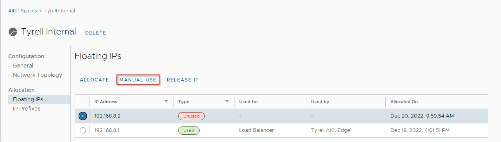

We also have the option to release the IP address back to the pool if no longer required (and not currently in use). Once obtained we can now use the floating IP that has been allocated to us - typically this would be assigned to an NSX Advanced Load Balancer for use to internally load balance a service which our internal users consume (as can be seen for the existing 192.168.8.1 IP address).

### Requesting and using a new 'prefix' private IP Address Range

When requesting a new 'prefix' IP address block, this can be done either by first allocating the block in IP Spaces and then assigning this to a new network, or directly at the time the new network is created. We'll look at the 2nd option here as the first behaves very similarly to requesting a floating private IP address.

From the tenant Networking / Networks tab, select `NEW` to create a new network for the OrgVDC:

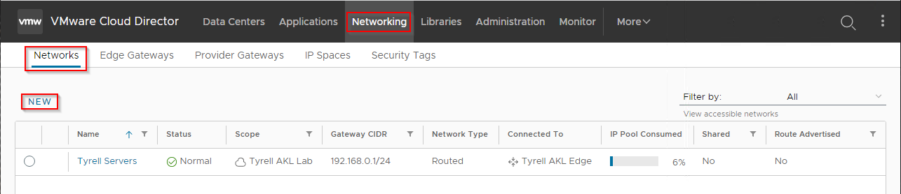

This opens the New Organization VDC Network workflow, where we select our VDC and click Next:

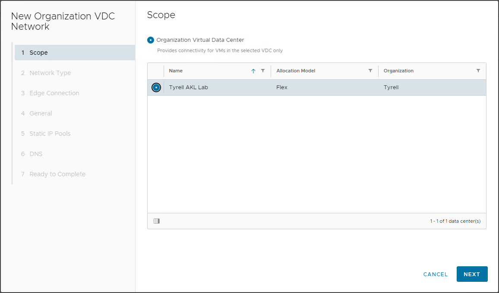

We can chose whether this new network will be Routed via our Edge gateway or Isolated, in this example I'll just create an Isolated network:

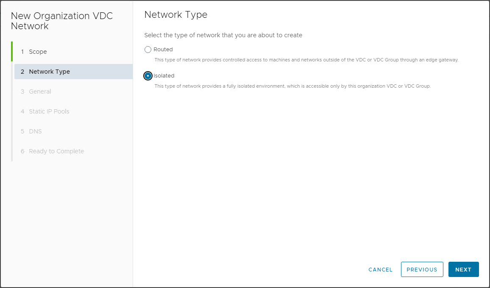

In the General step, we give the network a name and network details - if we select the dropdown arrow next to the Gateway CIDR field we see any accessible private networks available to us and can then chose a pre-allocated prefix network (if available), or ask to request a new one if not:

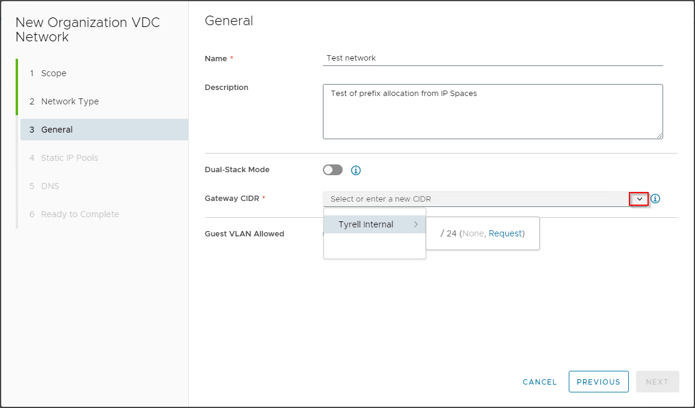

As we have no pre-allocated range available ('None') in this example, we'll use 'request', after a short request phase, we get assigned a new prefix network from our IP Spaces definition and are told what this will be:

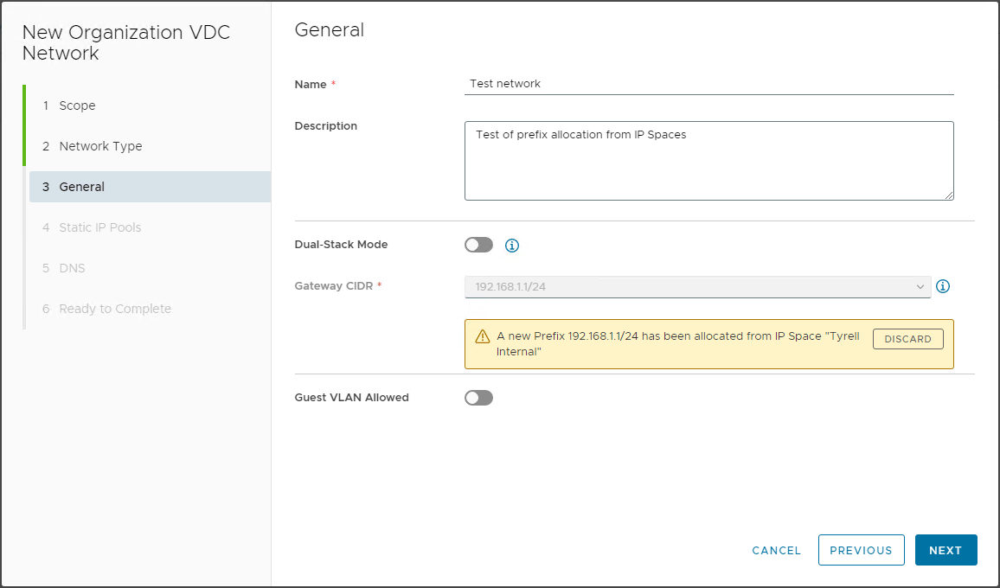

The rest of the network creation workflow functions as previously using the 'legacy' network model so there is no need to go through the rest of these steps.

Note that IP Spaces will not permit the same network allocation (IP addresses or prefixes) to be used more than once within an OrgVDC. This can potentially break some use-cases.

For example, as a tenant I may want to allocate a network to do DR testing which shares the same IP address space as my Production server network (although being disconnected from it - possibly in an isolated network). IP Spaces will not currently allow me to define a network for DR which conflicts/overlaps with my production address space. I'm not sure what VMware are intending to be used in this situation, but since VCD 10.4.1 is the first release of this capability I'm sure we will see consideration of these types of requirements in future revisions.

### IP Spaces Compatibility (as at Dec 2022)

While testing out IP Spaces I also noticed incompatibilities with VMware Container Services Extension (CSE) 4.0 for Cloud Director. The core of the issue appears to be that CSE doesn't know how to request IP address allocations from IP Spaces. Annoyingly right now this means that any CSE cluster deployment will fail in an IP Spaces environment unless:

- An IP address has been requested (but not allocated) from an accessible IP Space (private or public)
- The obtained IP address is manually specified in the 'Control Plane IP (Optional)' field when deploying a cluster:

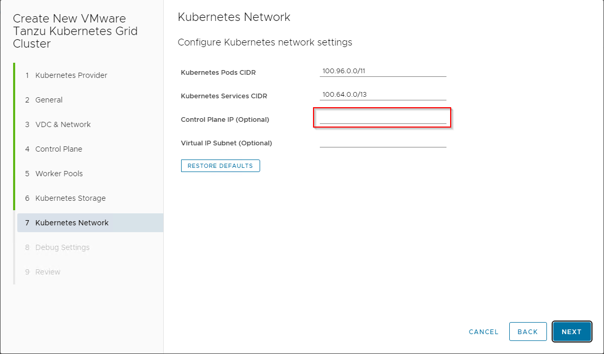

This will allow the CSE cluster to deploy successfully, but attempts to provision new Kubernetes resources that use the LoadBalancer ingress type into the cluster will fail as CSE's Cloud Director integration doesn't understand how to request additional service IP addresses from IP Spaces.

This can probably be worked around by manually specifying ingress addresses for each deployed service, but is not really a graceful tenant experience. I'm sure that the VMware teams involved with CSE and VCD will come up with a way to fix this in subsequent versions.

### Summary

When I started this post I had no idea it would turn into a 3-part series, or of some of the issues I would experience while testing IP Spaces. I have to say the move towards pooled address management for public addressing is a potentially huge benefit for Service Providers who are increasingly having to juggle the limited resource of available public IP addresses.

I also like the move to provide tenants with more capability over requesting (and releasing) their consumption of public IP addresses along with managing the use of IP address spaces within their environments.

If the wrinkles around how overlapping ranges can be handled more gracefully, and the interactions for other services such as Container Service Extension improved then I can see IP Spaces as being useful for most Service Providers in future.

One other question remains about how VMware will help Service Providers migrate existing environments using the 'legacy' IP allocation methods to and from IP Spaces as this is a significant task to perform manually and automation could really help to make this easier.

In short - IP Spaces looks really promising and has a lot of capability in its first release with VCD 10.4.1, if VMware can keep developing it and iron out the wrinkles that current exist it will become a very welcome enhacement to VCD capabilities for both Service Providers and tenants.

As always, I hope you've found this series of posts useful and comments/feedback welcome in here or [@jondwaite][1] on Twitter.

Jon.

 [1]: https://twitter.com/jondwaite