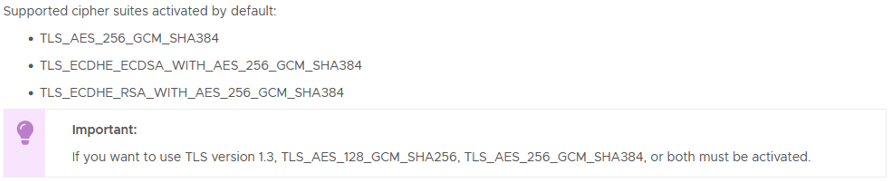
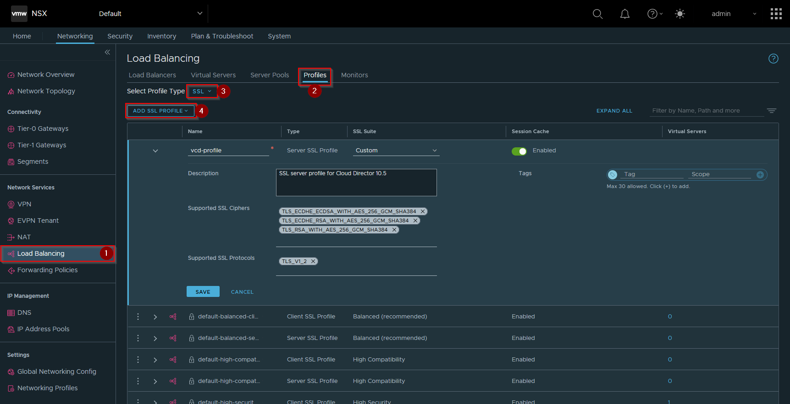
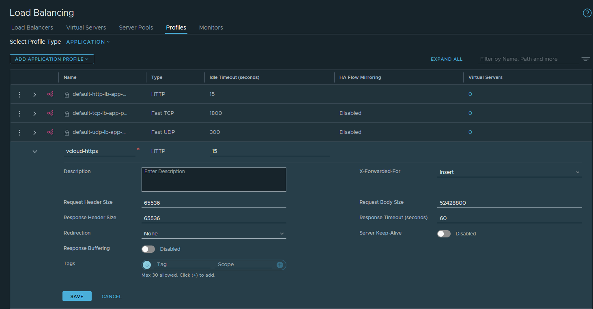
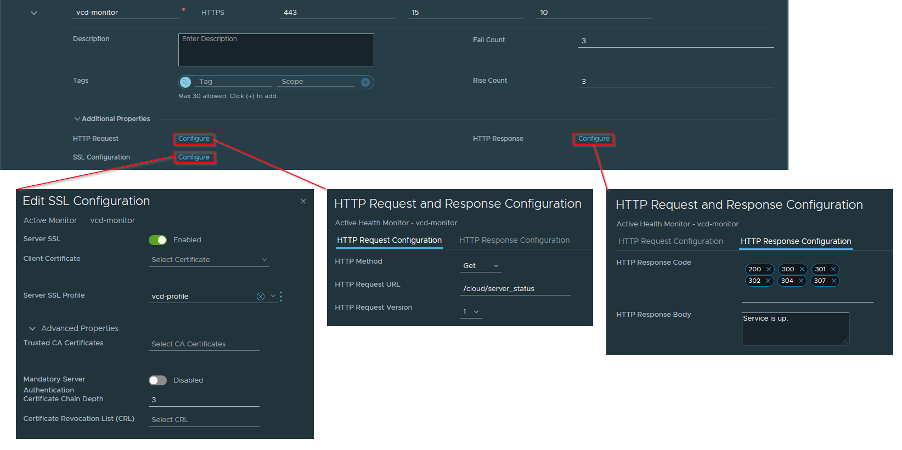
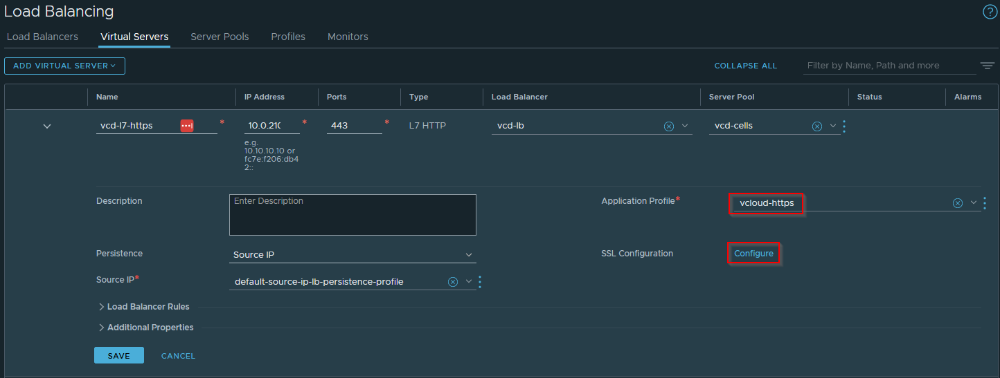
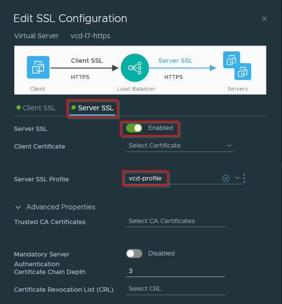

Back in 2019, Tom Fojta wrote an <a rel="noreferrer noopener" href="https://fojta.wordpress.com/2019/06/28/load-balancing-vcloud-director-with-nsx-t/" target="_blank">excellent guide</a> on configuring NSX Load Balancer in front of a VMware Cloud Director (VCD) cluster. As I was in the process of rebuilding my home lab environment I wanted to try this out - eventually I'll probably use the NSX Advanced Load Balancer (formerly known as AVI), but I don't have that deployed yet, and 'plain' NSX itself is more than capable of performing the task.

What I hadn't considered was that the updates to supported cipher suites in the more recent releases of VCD mean that some extra configuration is now required to enable the load balancing and service monitoring work correctly.

The lab environment I'm currently rebuilding is a nested installation of VMware Cloud Foundation (VCF) 5 which includes vCenter 8, ESXi 8 and NSX 4.1 so these are the versions used here.

If we check the <a rel="noreferrer noopener" href="https://docs.vmware.com/en/VMware-Cloud-Director/10.5/rn/vmware-cloud-director-105-release-notes/" target="_blank">VCD 10.5 release notes</a> we see that only a reasonably small subset of security protocols and cipher suites are now supported 'out of the box' by default:

One option would be to follow the <a href="https://kb.vmware.com/s/article/88929" target="_blank" rel="noreferrer noopener">guidance in KB88929</a> as linked in the release notes to enable other combinations of protocol and ciphers, but I wanted to keep the VCD environment as unmodified as possible so I opted instead to allow for these in the configuration of the load balancer.

My goals for the configuration were:
- Terminate client SSL sessions on the Load Balancer so I didn't have to worry about maintaining valid public certificates on each VCD cell server individually
- Service monitoring of the vCD cells so that a cell being down was correctly handled and the cell server removed from the pool until available again
- Support large request/response headers and body sizes as required by VCD
- Provide a platform against which I can automate the refresh/renewal of VCD public certificates via API calls to NSX and VCD rather than scripting of cell-management-tool (which I'm aiming to detail in a future post once complete)

I'm not going to go over the creation of a Load Balancer inside NSX in this article, as there are plenty of guides out there on how to configure this. Once I had a Tier-1 Gateway deployed to act as the host for my load balancer I first created a new SSL server profile - in NSX manager go to **Networking > Load Balancing > Profiles > Select Profile Type: SSL** and **Add SSL Profile**. I've shown the options I selected for supported protocols and ciphers in the screenshot below, I called this **vcd-profile**, you need to set the **SSL Suite** drop-down to **Custom** to get the individual cipher and protocol options to activate:

Once we've created an appropriate SSL profile, we also need to create an application profile to configure the required larger request and response headers and body sizes needed, I called my application profile **vcloud-https**. Note that we don't need the API call from Tom's original post any more as we can directly edit both request and response header size limits in the NSX UI, I've also set request body size to 50MB to allow ISO/OVA transfers:

Once the two profiles are created it's reasonably straightforward to configure the load balancer as normal, first define the monitor, ensuring that you use the new **vcd-profile** for the **Server SSL Profile**, we can then use the **/cloud/server_status** monitoring endpoint and check for the cell server response **Service is up.**

Now we can define our server pool in the normal way and add our VCD cell server IPs to the pool. Next when creating our virtual server we create as L7 HTTP, specify our pool and make sure that our application profile is selected

Finally we can configure the server SSL Configuration from our virtual server definition and make sure that we enable SSL and use our **vcd-profile** when connecting via SSL to our backend cell servers:

If everything's been configured correctly you should now be able to select the appropriate client SSL certificate in the virtual server **Client SSL** section and successfully be able to connect to a load balanced VCD environment.

As always, comments and feedback welcome, hope this is helpful to someone else.

Jon.