Over the last few years <a href="https://www.proxmox.com/en/proxmox-virtual-environment/overview" target="_blank" rel="noopener" title="">Proxmox Virtual Environment</a> (PVE) has been gaining a lot of interest as a way of easily managing virtual machines and container images using Open Source software and the <a href="https://linux-kvm.org/page/Main_Page" target="_blank" rel="noopener" title="">Linux KVM</a> hypervisor.

In my home lab I was keen to try out the latest (v8.1.3) PVE environment including advanced networking and storage inside by ESXi-based physical hosts. As I hit a few issues along the way, this post is designed to help anyone else attempting to get PVE running as a nested environment on VMware.

The steps detailed here are obviously in-part specific to my home setup, but should be applicable to most types of VMware environment, whether on a single host or cluster of hosts and whether using existing shared storage (NFS, iSCSI, FC etc.) or local storage in a single host or multiple hosts.

In this series of posts I detail the steps I took to build a PVE cluster of 3 nodes running with shared Ceph storage, a Ceph Filesystem for shared media and live migration of VM workloads functioning between the 3 virtual PVE nodes. I certainly don't claim to be an expert on PVE (a large part of my desire to build this environment is to learn more about it), but this process worked for me.

# 1 Pre-requisites

Before configuring the PVE VMs, I found it was useful to ensure some pre-requisites were in place as shown in the list below.

- Media - you'll need a copy of the latest installation ISO for PVE available on the Proxmox site <a href="https://www.proxmox.com/en/downloads/proxmox-virtual-environment" target="_blank" rel="noopener" title="">here</a> and will need to make this accessible so it can be attached to the PVE VMs to build them. In this guide I'll be using the 8.1-1 release of PVE from November 2023.
- Platform - To build a virtual PVE cluster you'll need a suitable host or host cluster, either as physical hardware or running a hypervisor which supports nested environments.
  
  In this article I'll assume you are doing as I did and building the PVE nodes as vSphere VMs. My homelab currently has 2 ESXi 7.0U3 hosts managed by a vCenter instance connected to a DVS switch, but the process described should work for single hosts as well as clustered environments.
- DNS - while not a mandatory requirement (you can use IP addresses for most things), I'd recommend configuring DNS entries for the PVE host servers and allocating IP addressing for these prior to deploying the VMs.
- VM Networking - This is the most important one! In order for VMs running inside the PVE hosts to connect to the 'real' network you'll need a PortGroup defined (either in vCenter or directly on a vSwitch if just using ESXi) configured with both 'MAC Learning' and 'Forged Transmits' enabled.

  This is necessary so that the virtual MAC addresses assigned by PVE to VMs and containers are allowed to transit the PortGroup. These settings should also work if configured as an NSX security profile, but I've only tested against a vSphere DVS portgroup.

  If these settings are not configured deployed PVE VMs and containers will have no network connectivity outside of their immediate host PVE VM.
- Storage - PVE can use exsisting network storage, but if you want to configure Ceph clustered storage within the PVE environment the easiest way to do this is to add an additional 'local' disk to each PVE VM which can then be used to form a cluster across the PVE VMs deployed. Having shared storage for PVE allows fast live-migration of VMs between the virtual PVE hosts.

# 2 Creating the PVE VMs

In my environment, I chose to deploy 3 x PVE VMs with 32GB vRAM and 8 CPU cores each as detailed in the table. Note that the 'Cluster' and 'Storage' networks are entirely optional - I chose to create them in my home lab as I already have VLANs defined for these and wanted to keep cluster traffic and storage traffic separated from the management and guest VM traffic, but they are not required.

|VM|VMNIC #1 Management Network|VMNIC #2 Cluster Network|VMNIC #3 Storage Network|VMNIC #4 VM Networking|Boot Disk|Data Disk|
|---|---|---|---|---|---|---|
|Network|VLAN 10 10.0.10.0/24 GW 10.0.10.1|VLAN 20 10.0.20.0/24|VLAN 30 10.0.30.0/24|VLAN Trunk| | |
|pve01|10.0.10.101|10.0.20.101|10.0.30.101|No IP|20GB|250GB|
|pve02|10.0.10.102|10.0.20.102|10.0.30.102|No IP|20GB|250GB|
|pve03|10.0.10.103|10.0.20.103|10.0.30.103|No IP|20GB|250GB|

When creating the PVE VMs select Linux / Debian 11 64-bit as the guest OS

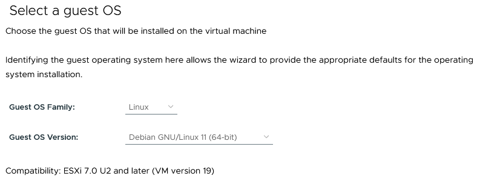

Configure the CPU option to support hardware assisted virtualization for the guest

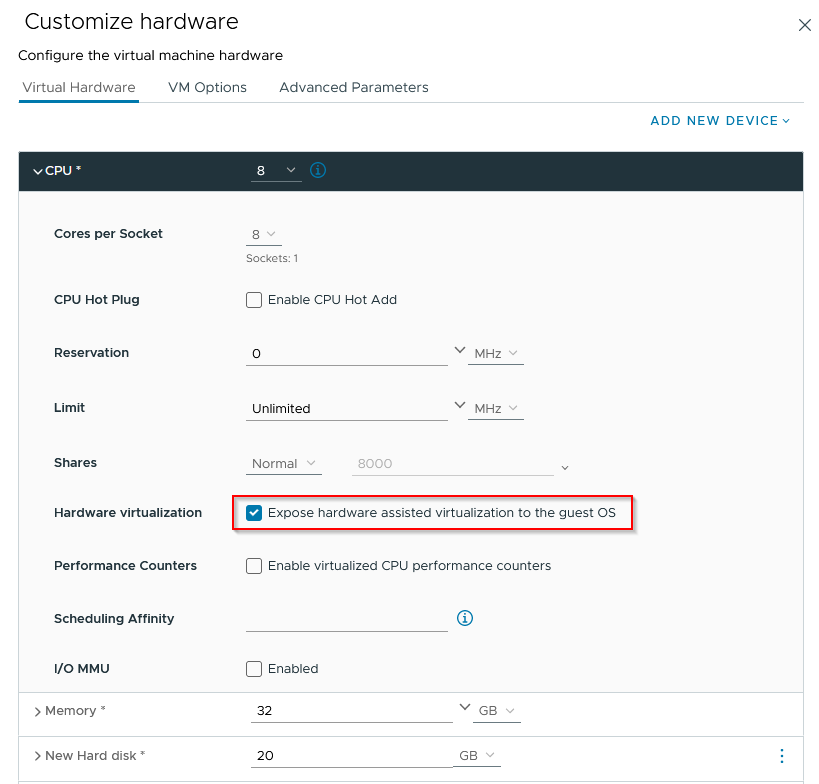

The customized hardware for my lab configuration looks as follows (the `proxmox` port group in my home lab is the one described earlier to be used for PVE guests with forged transmits and MAC learning enabled). The other portgroups do not require any special security changes.

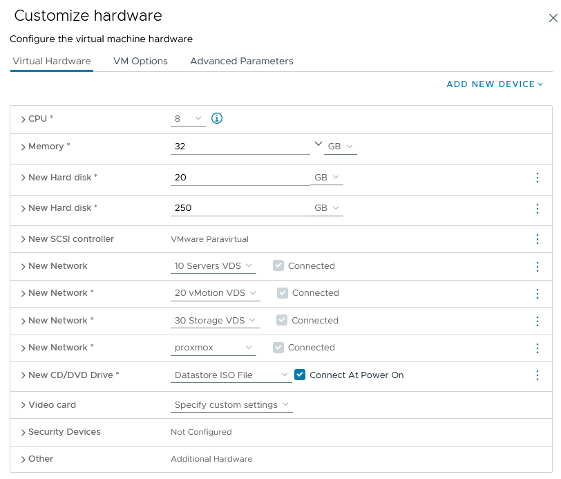

Once the first VM is created, it can be cloned to deploy the other PVE nodes (do this prior to powering-on and installing PVE itself).

The network card ordering/numbering within PVE can be a bit 'odd' in a VMware environment, so at this stage I would strongly advise going into the VM hardware properties and noting down the last byte of the virtual MAC address for each VM network adapter - this will allow us to match the MAC addresses to the NICs within PVE later.

In every case I've deployed so far I've ended up with the following mapping of VM NICs to PVE network names, but I don't know if this will always be the case - noting the MAC address last byte allows us to check this<figure class="wp-block-table">

|VM Network Interface|Function|PVE Interface|
|:---|:---|:--|
|Network Adapter 1|Management|ens192|
|Network Adapter 2|Clustering|ens224|
|Network Adapter 3|Storage|ens256|
|Network Adapter 4|Guest VM Networking|ens161|

If building a cluster of PVE servers as in this guide, now is a good time to clone the initial server VM you have created for as many nodes as are required - this is best done prior to installation and configuration of PVE itself to ensure each node gets a unique identity.

You can now connect the PVE ISO file from an accessible location (Datastore or Content Library) and boot each node VM to start the Proxmox VE Installer. When the VM boots select the 'graphical installation' option and accept the license agreement. The screens below show the remainder of the installation selections used

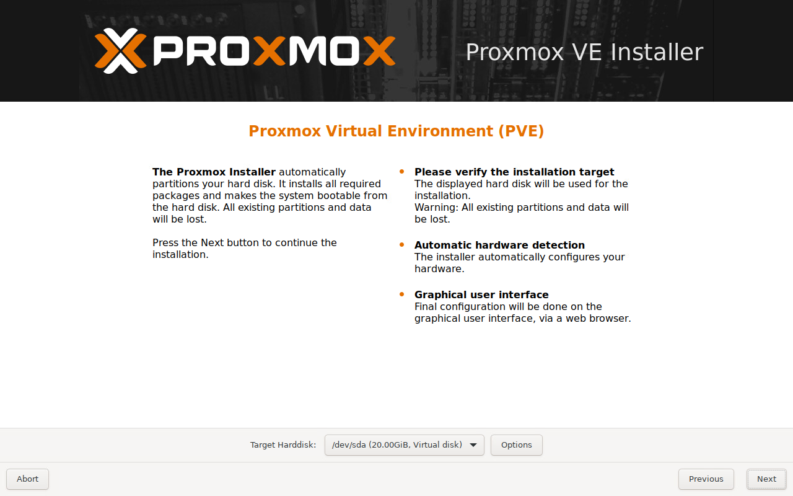

Check the correct disk is listed then select 'Next':

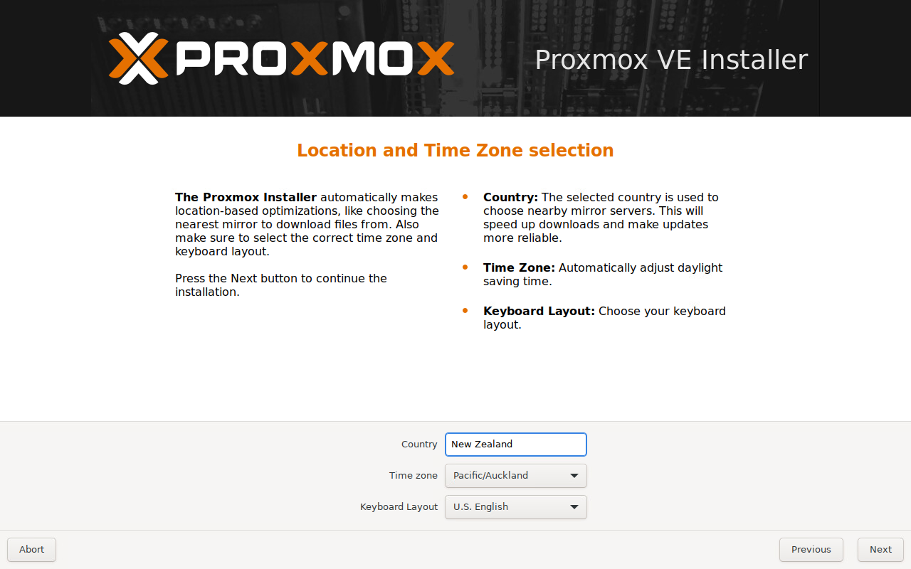

Specify a suitable timezone and keyboard layout then 'Next'

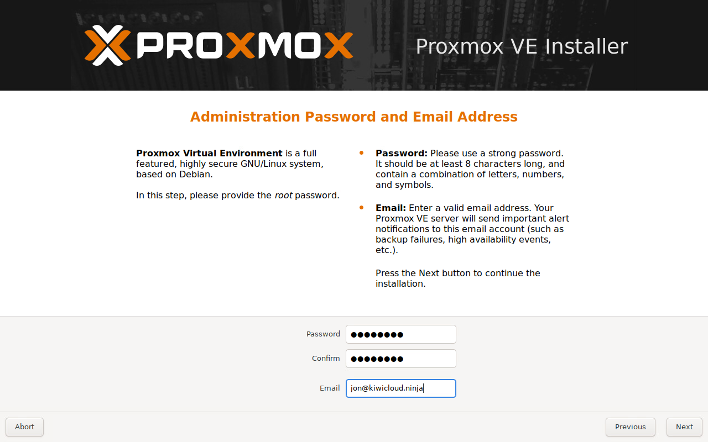

Create a new password for the PVE 'root' account and enter an email address

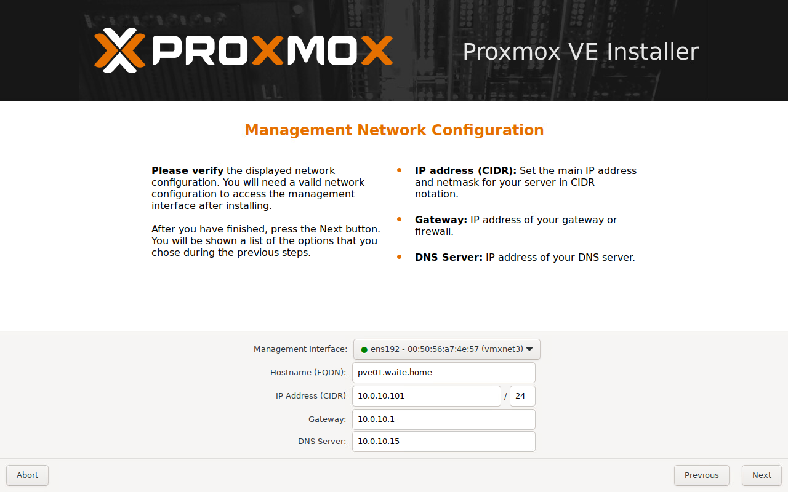

Configure the 'Management' network interface for this server - pay particular attention to the 'Management interface' dropdown and make sure the MAC address corresponds to the correct VM network card. If configuring a VM with 4 NICs, PVE will select ens161 by default which is actually VM Network Interface 4 in my case.

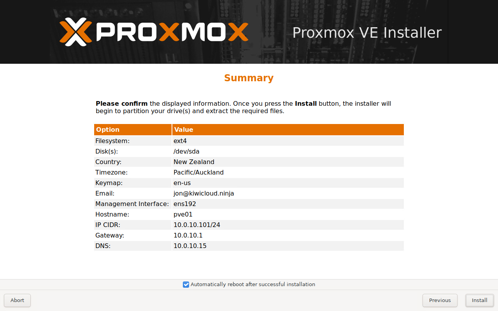

Finally, on the summary screen you can check everything looks ok and leave the 'Automatically reboot after successful installation' selected and click Install.

# 3 Initial Configuration

Once the VMs are installed and restarted, each VM should be accessible on port 8006 at `https://<management IP of VM>:8006`, after logging in I make the following changes (on each node)

## 3.1 Repository Configuration & Update

I'm assuming here that (like me) you don't have an enterprise subscription to Proxmox so first we configure the repository sources to use the 'No-Subscription' options which allows everything to be updated without requiring an subscription key. You will see warnings about not being suitable for production use when doing this which is fine.

First, select the server node from the left panel, then Updates / Repositories and click Add:

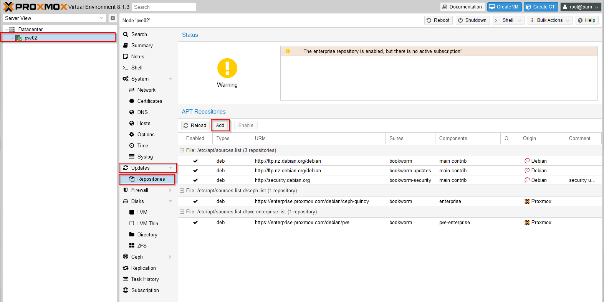

Select the 'No-Subscription' repository and click Add again. To configure the Ceph repository, click Add and select the 'Ceph Reef No-Subscription' repository and click Add. Next select the enterprise entries for 'ceph-quincy' and pve-enterprise and click 'Disable' (since these will block any updates without an appropriate subscription), the repository list should now appear like this (note the disabled enterprise repository entries):

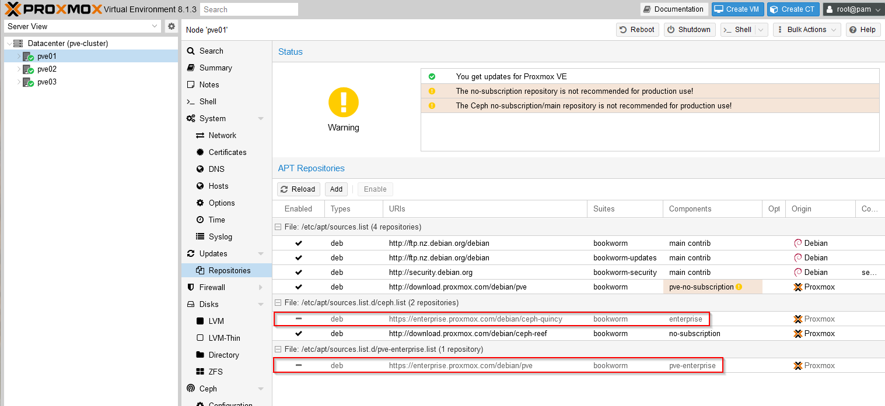

Now click 'Reload' and click back on the 'Updates' entry and 'Refresh' which should successfully request all available updates for your system:

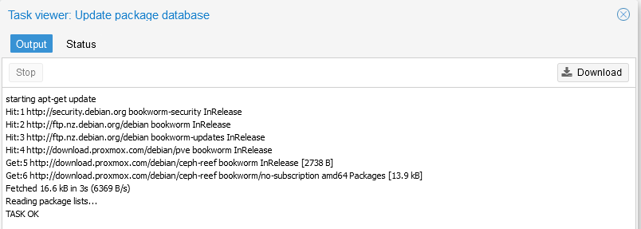

You can now close this window and select the `>_ Upgrade` option from the top of the screen to download and install available updates, progress will be shown in a separate console window and you'll need to confirm with a `Y` to continue and install the updates.

When the updates are finished processing you should see a message similar to:

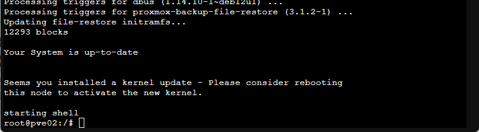

As recommended, type `reboot` at the prompt to restart the VM with all the updates installed. You should close any browser windows to the host and after the reboot is completed log back in to the console on port 8006. Once logged back in, click the server node and `Updates` to check and confirm that there are no further updates available - if there are you can repeat the steps above to download and install these.

## 3.2 Local Storage

Similarly to how ESXi will use additional disk capacity on a configured boot device above a threshold size as a 'local' datastore, PVE will similarly make extra storage on the VM boot disk available as VM storage capacity (as an LVM-Thin volume named 'data'). I've found that this results in a very small PVE boot disk which can cause issues (for example, when attempting to upload large ISO files via the PVE web interface which we'll need to do later to install VMs from).

Since I'm intending to configure shared storage across the cluster, this local storage volume is not required and so I use the following commands from a shell session to remove the local VM storage and extend the PVE boot disk to use the freed capacity:

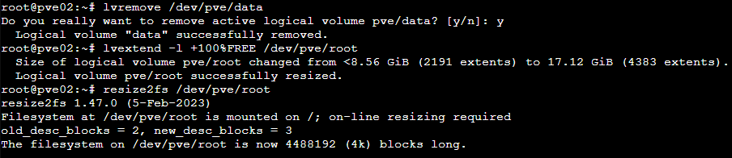

These commands are below for ease of copy/paste - remember that you'll need to do this step on each VM host:

```bash
lvremove /dev/pve/data
lvextend -l +100%FREE /dev/pve/root
resize2fs /dev/pve/root
```

If (like me) you've configured a 20GB VM boot disk, this will extend the `root` filesystem for PVE to include almost all of this storage which should be plenty for our example configuration. (Note that the issue with uploading large ISO files via the root volume can be avoided by copying these directly to `file` storage using scp or similar command-line utilities, but I found it annoying to not be able to also do this via the web interface hence this change). The web interface only uses the `local` storage as a temporary upload destination and moves files uploaded in this way out to shared file storage itself provided there is sufficient space to hold the entire uploaded file.

## 3.3 Network Configuration {.wp-block-heading}

Networking in PVE is primarily based on the Linux network stack and uses bridging to attach multiple VMs and containers to a physical network interface (in a similar way to a local vSwitch on ESXi). In this example, I only want one of the network interfaces to support VM workloads and the other 3 are already 'tagged' to appropriate VLANs in the ESXi configuration so I need to change the network configuration.

While this can be achieved in the web interface (which has an awesome way of staging and then applying networking changes), I found it easier (and less error prone) to directly edit the main network configuration file stored at /etc/network/interfaces on each node.

The initial file from my 'pve02' node looks as follows:

```text
auto lo
iface lo inet loopback

iface ens161 inet manual

auto vmbr0
iface vmbr0 inet static
        address 10.0.10.102/24
        gateway 10.0.10.1
        bridge-ports ens192
        bridge-stp off
        bridge-fd 0

iface ens192 inet manual

iface ens224 inet manual

iface ens256 inet manual

source /etc/network/interfaces.d/*
```

I changed this to the following (after confirming the mapping of MAC addresses to VM network interfaces as mentioned above - use the 'ip a' command from a shell prompt to see within PVE the MAC addresses assigned to each interface. The new network configuration is now:

```text
auto lo iface lo inet loopback

auto ens192
iface ens192 inet static
        address 10.0.10.102/24
        gateway 10.0.10.1
#Management

auto ens224
iface ens224 inet static
        address 10.0.20.102/24
        mtu 9000
#Cluster

iface ens161 inet manual
        mtu 9000

auto ens256
iface ens256 inet static
        address 10.0.30.102/24
        mtu 9000
#Storage

auto vmbr0
iface vmbr0 inet manual
        bridge-ports ens161
        bridge-stp off
        bridge-fd 0
        bridge-vlan-aware yes
        bridge-vids 2-4094
        mtu 9000
#VM Networking

source /etc/network/interfaces.d/*
```

Once edited to match your network configuration, use the 'ifreload -a' command to cause PVE to reread the network configuration and apply changes. If everything has gone correctly, looking at the System/Network configuration in the web UI after applying changes should show native interfaces for Management, Cluster and Storage and a bridged/trunk interface for VM traffic:

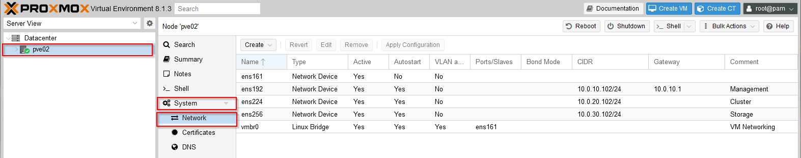

The MTU changes are not necessary, I've simply updated them to match my homelab VLAN configured MTU sizes. Also note that the #comment following each block is used in the web UI to help identify each interface and is quite useful to include.

I originally intended this article to be a single post, but it seems to got pretty large already so I'm going to continue the configuration - including creating a Ceph storage cluster and creating and running the first workloads in a part 2, I'll be sure to link here when this is available.

As always, comments and feedback appreciated, I'm definitely having fun learning about Proxmox PVE and nesting this on my VMware homelab is a pretty easy way to play around with it, hope this post is useful to some of you wanting to try this out too.

Jon.
