In [part 1](/2024/01/building-a-nested-proxmox-pve-cluster-on-esxi-part-1/) of this series I looked at creating the VMs, installing and updating Proxmox VE (PVE) on them and configuring local storage and networking for each VM to form a fully functional PVE cluster running as VMs running on a VMware vSphere ESXi platform.

In this second part of the series I'll continue to configure the PVE cluster and get to a point where we can run nested VMs from shared storage (presented via Ceph to the cluster). This will also allow live-migration of VMs between the virtual cluster nodes. The section numbering below continues from part 1.

# 4 Create PVE Cluster

Until now all configuration has been to the individual node VMs (in this example, pve01, pve02 and pve03). Now that these nodes are updated and have networking configured we can join them together to form a cluster.

PVE doesn't use a 'central' control plane (for example, like vCenter in a typical VMware environment) but uses Proxmox Cluster File System (pmxcfs) to provide a distributed database file system which is replicated using corosync to maintain a consistent configuration across all cluster nodes.

To configure the cluster, on the first node (pve01 in my case) we select the Datacenter / Cluster / Create Cluster option from the web UI:

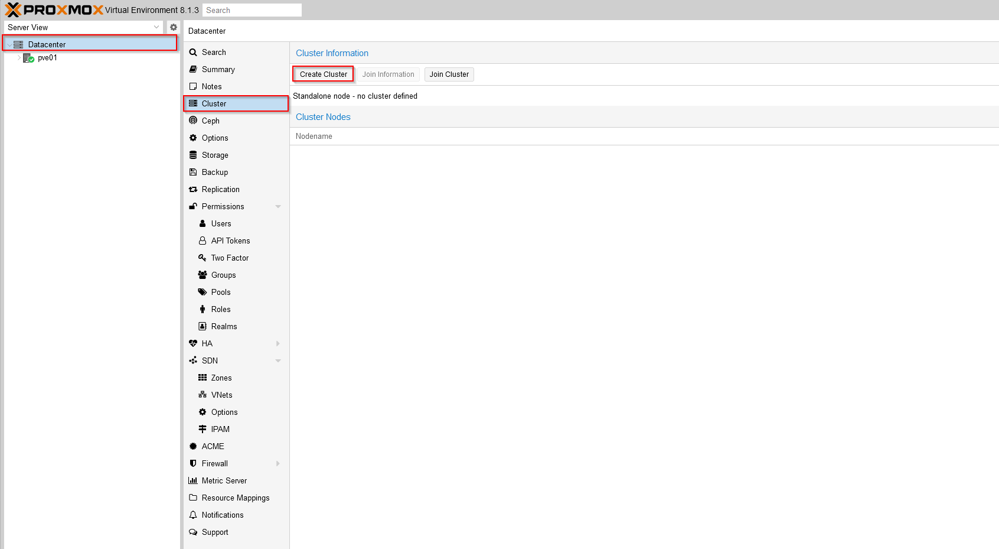

Next we get to name the cluster (pve-cluster here) and (optionally) select which network interfaces will be used for cluster communication. Since I've defined these when building the VMs I can simply select the 'Cluster' interface from the drop-down list. I could also add other interfaces at lower priority to be used as fallback options if needed:

Once the Create Cluster task is completed, we can click 'Join Information' in the Cluster page to get the details needed to add the remaining nodes (pve02 and pve03) to the cluster:

Use the 'Copy Information' button to copy this to clipboard which is then used on the remaining nodes to join the cluster - you'll also need to select the correct Cluster Network interface and the password for the cluster node you're 'joining' (this is on my pve02 node):

Repeat this process for any remaining cluster nodes - I've found that you need to refresh the web UI (refresh or close browser window and log back in) to get cluster details to properly show following joining a node:

# 5 Install Ceph

In order to provide shared storage (similar to VMware vSAN and vSAN file service) across our newly formed cluster we can install and configure Ceph on each cluster node.

PVE does not mandate shared storage and will copy complete VMs between 'local' filesystems to migrate between nodes if needed - this obviously makes VM migrations between nodes copy large amounts of data and take significantly longer.

To install the required packages for Ceph, we select each node then Ceph and click the `Install Ceph` option:

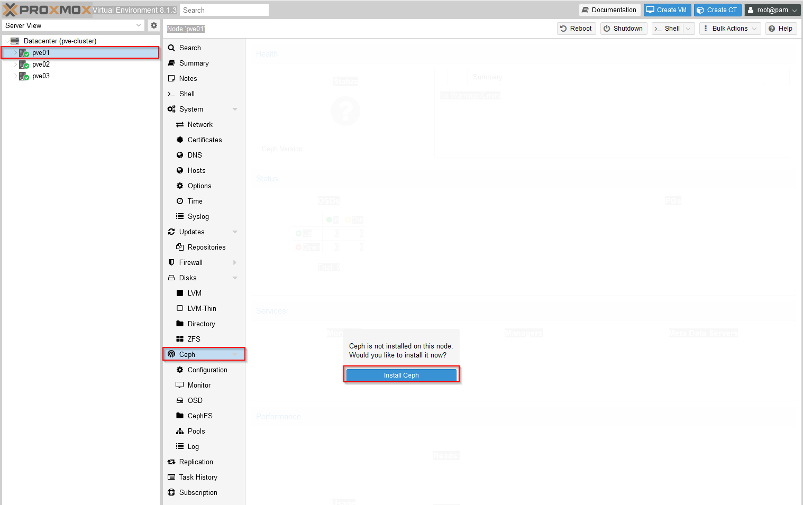

Change the dropdown for `Repository` to `No-Subscription` and click `Start reef installation`:

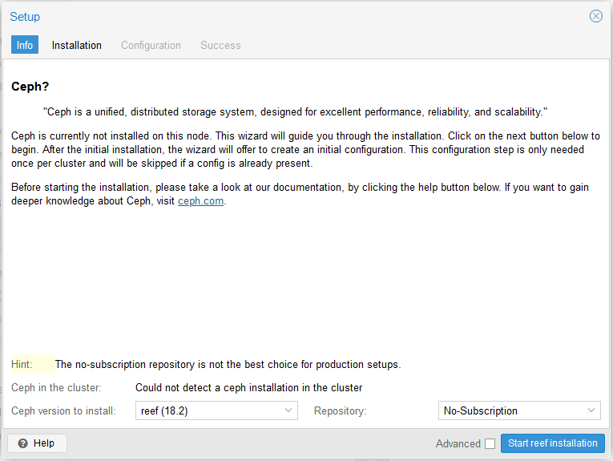

In the terminal window shown next, answer `Y` to begin the installation of Ceph and it's required support packages, when completed click `Next`.

Here I'm selecting my `Storage` network as the cluster network for Ceph and the `Management` network as the `Public` network address for the ceph cluster:

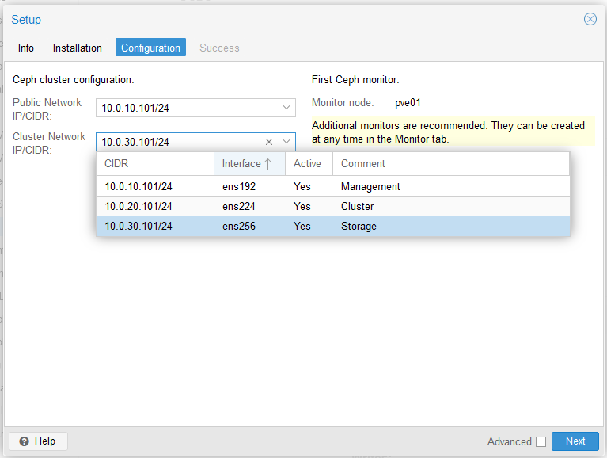

If everything has worked, the last page of the dialog should show successful Ceph installation:

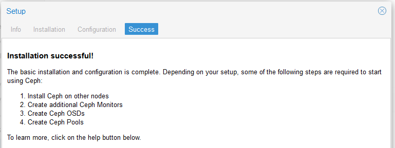

We now repeat this process to install Ceph on the remaining cluster nodes (note that on subsequent nodes the 'Configuration' step above will be skipped as this has already been configured for the cluster when the first node installed).

# 6 Configure Ceph

Best practice with Ceph is for at least 3 nodes to be configured as `monitor` nodes, our first node (pve01) has been automatically configured as a monitor node when Ceph was installed and configured, but we now add this to the remaining 2 nodes, to add these we can go to node / Ceph / Monitor and click the `Create` button in the Monitor section:

Ceph also advises that a minimum of 3 managers are maintained, which we can add by clicking the `Create` button under the `Manager` section (below the `Monitor` section) on the remaining 2 nodes (since as with Ceph Monitor, the first node is installed as a manager automatically).

Once these steps are completed for the remaining 2 nodes this shows all nodes running the Ceph monitor:

And Ceph manager:

Next we add our 250GB disk (see the VM configuration from [part 1](/2024/01/building-a-nested-proxmox-pve-cluster-on-esxi-part-1/) as an Object Storage Device (OSD) on each of the 3 Ceph nodes:

We simply select our VM's second disk (`/dev/sdb`) here and click `Create` which shows the new OSD on the node:

Once we have this completed on all 3 nodes, we should see the global Ceph status page showing as follows:

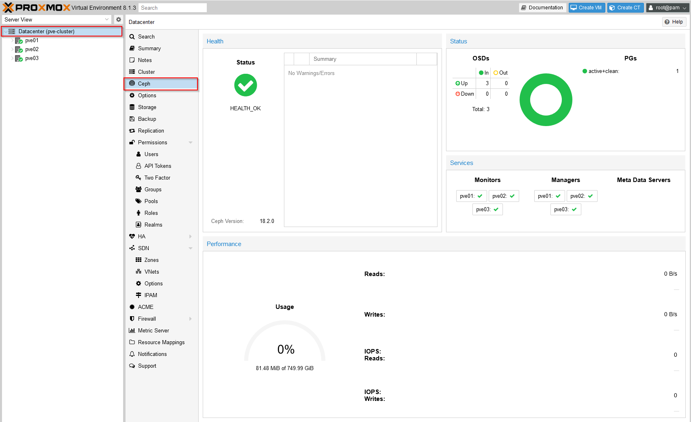

Next we create a Ceph pool from the Ceph menu within one of our nodes:

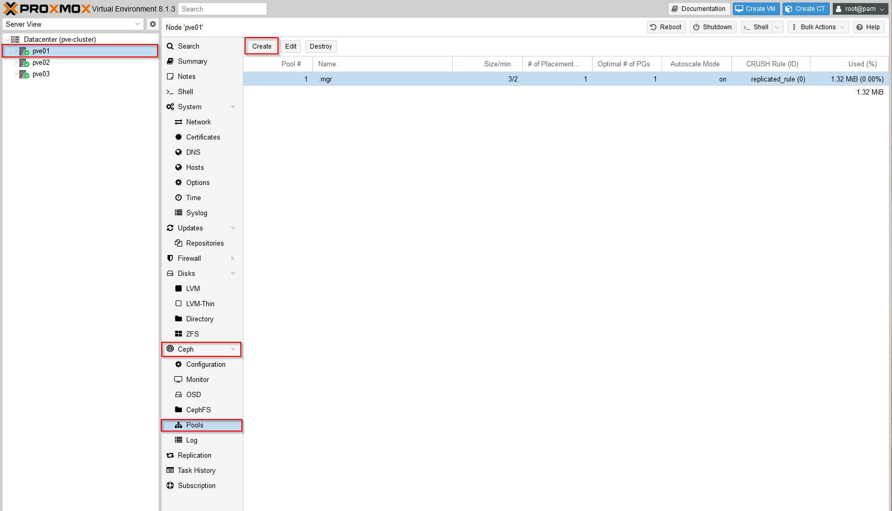

The dialog is a little confusing, but the 'size' here refers to the number of Ceph replicas that will make up our pool (so we leave set to 3 in this example) and leave the 'Add as Storage' box checked:

# 7 Create Storage for ISO images

Unlike vSphere Datastores which can store both VM disks and ISO files from which VMs can be installed, PVE with Ceph uses CephFS (Ceph Filesystem) to hold 'file' data and treats this distinctly from VM disks.

Once we have a Ceph pool created, we can add the Ceph filesystem in order to have storage for our installation ISO images, to do this we first need to create a metadata server by selecting CephFS and then 'Create', in the dialog that appears just chose a server node (I've used pve01 in this example):

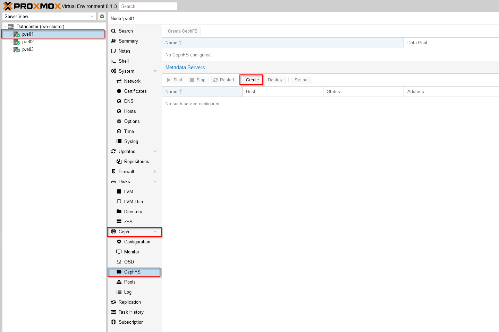

Now we can create CephFS using the 'Create CephFS' button, if you've used similar disk sizing to my example change the Placement Groups (PG) number from the default of 128 to 32 (I'm not going to get into a discussion of Ceph PG sizing here, but this will prevent exhausting the default number of PGs):

If everything has worked correctly you should now see the cephfs storage listed for your cluster and available for ISO image use:

Now we can upload an ISO image to be used to build our first VM, to do this go to the cephfs node under one of the servers and select `ISO Images` then `Upload`:

In this example I've uploaded a PhotonOS 5 minimal ISO image:

Finally we have everything ready to be able to install our first VM.

# 8 Creating the first VM

Once the environment is configured from the previous steps, creating a new VM is relatively straightforward - especially for those familiar with vCenter/ESXi, simply click the `Create VM` icon at the top of the screen and complete the forms changing defaults where necessary. The following screenshots show the configuration steps creating a new Photon OS 5 VM. I've highlighted where non-default values are used:

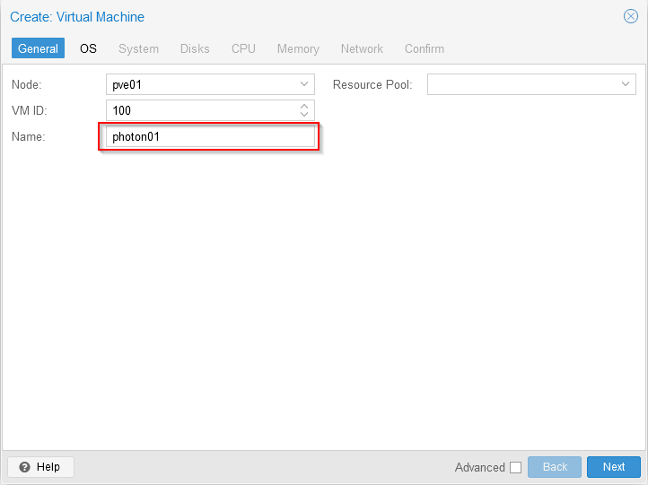

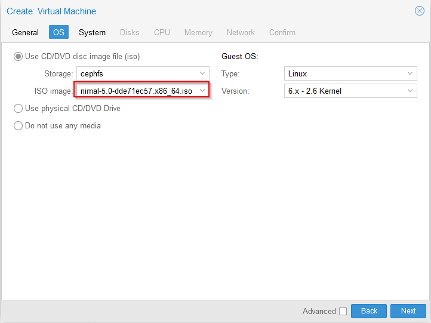

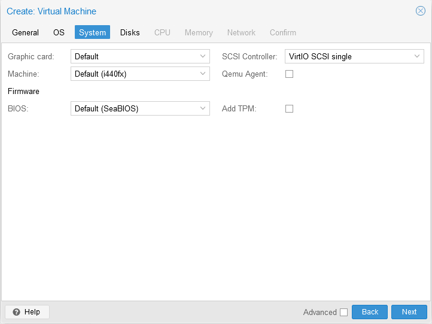

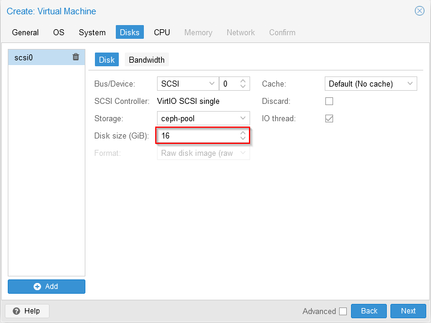

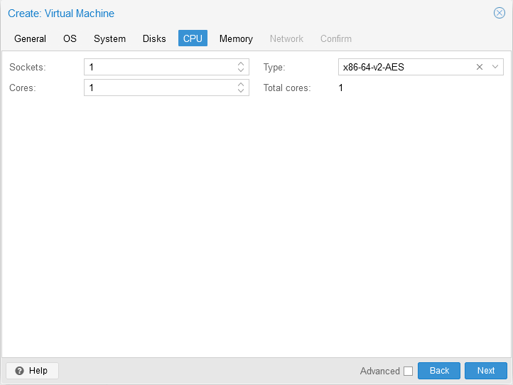

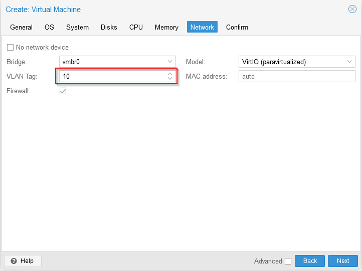

I've chosen VLAN 10 here as appropriate for my network using the trunked network bridge we created in part 1.

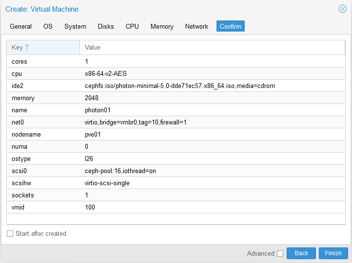

> Note that for Photon OS 5 (specifically), installation will fail when attempting to install from an IDE CD-ROM image, so remove the ide CD-ROM device and replace with a SATA CD-ROM device with the same file selected so you don't hit this problem.

Once configured it's simply a matter of clicking `Start` on the VM and then the `Console` button to see the new VM running:

We can also live-migrate (vMotion equivalent) running VMs between nodes in the cluster (right-click a VM, select `migrate` and chose a destination node). Note that at this stage we don't have any HA configuration so loss of a cluster node will result in VMs on that node becoming unavailable, but this is reasonably easy to add in PVE.

Hopefully that all makes sense and shows how to configure a nested PVE cluster running on ESXi with clustered storage and networking so that PVE VMs can talk to the outside world. If there is interest I'll follow up this post with a part 3 which goes into more detail on how more advanced configuration options like HA, replication etc. can be configured.

As always, comments & feedback welcome,

Jon.