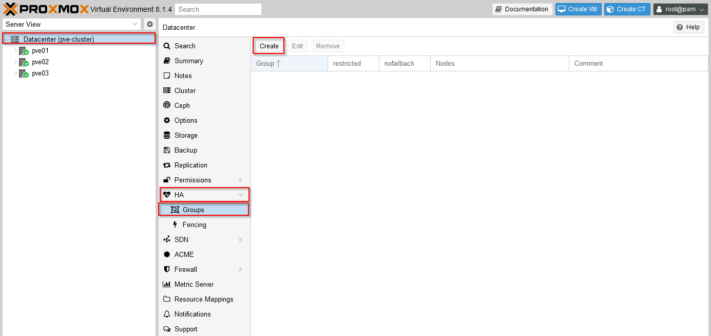
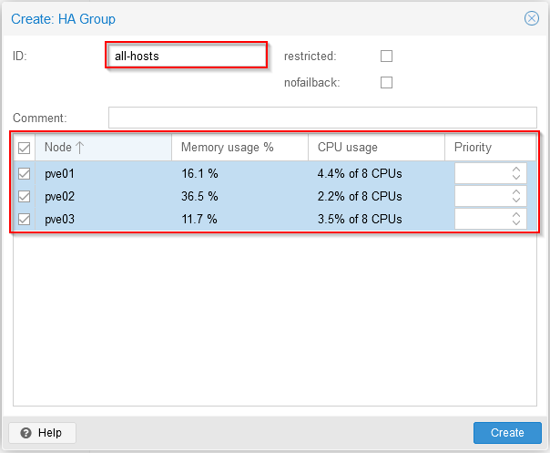
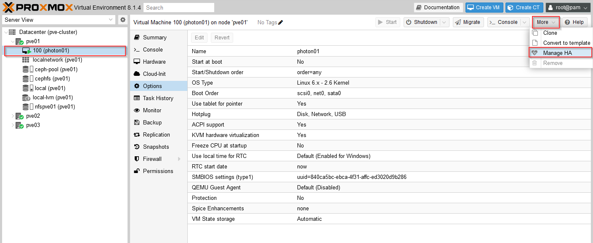
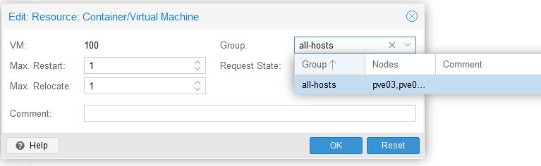
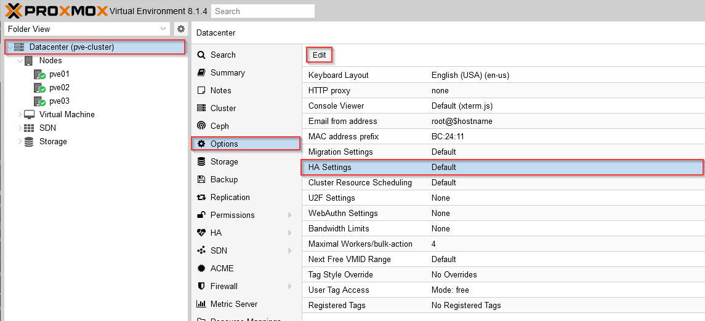

As someone familiar with VMware and vCenter, but coming reasonably fresh to Proxmox Virtual Edition (PVE) there are a number of important differences when configuring High Availability (HA) compared with a VMware environment.

In particular, I was surprised to find in a cluster configuration was the default behaviour of restarting a PVE host is to shutdown any VMs running on that host and restart them once the host reboot is completed rather than migrating them to other available nodes.

This post follows on from my previous posts:

- [Building a nested Proxmox VE (PVE) cluster on ESXi – Part 1](/2024/01/building-a-nested-proxmox-pve-cluster-on-esxi-part-1/)
- [Building a nested Proxmox VE (PVE) cluster on ESXi – Part 2](/2024/01/building-a-nested-proxmox-ve-cluster-on-esxi-part-2/)

However, it should be applicable to any PVE environment whether built as VMs or on bare metal servers.

Note that everything described in this article applies to the current at the time of writing (8.1.4) release of PVE and may be different in other versions.

In order to change the default behavious, we first need to create an HA group and reconfigure our VMs to use the group. This is reasonably straightforward in the PVE UI by going to Datacenter view, HA, Groups and then Create:



In the dialog that pops up we can simply enter a name for our HA group and select the hosts which should be considered part of this group (in this example, I've selected all 3 hosts in my homelab cluster):



The **restricted** check box allows you to specify that VMs can only run on a node in this group when assigned (which can be desirable if they rely on hardware or connectivity only available on a subset of nodes for example).

The **nofailback** check box prevents VMs moving back to a node with a higher priority if it comes back online (we're not assigning any priorities in this example, but could do to favor some nodes over others). Both options are well described in the PVE documentation if needed.

Now our HA group is defined, we need to configure our VMs to use it (newly created VMs won't have any HA group assignment unless this is done explicitly at creation time).

The easiest way I've found in the UI to configure this is under the top More / Manage HA option on the VM: 



In the dialog that pops up we can set our previously created group as the HA group for this VM, we should also set the 'Request State' to 'started' to flag that this VM should usually be running in this group. 



{}
if you shutdown the VM, and don't change this setting then the VM will be automatically restarted - which may or may not be what you want, if you want a VM which you've shutdown to stay powered off you'll need to change this setting under the Manage HA option.
{}

We should also change our datacenter settings to 'migrate' VMs when a host is placed in maintenance mode (rather than the default which will shutdown and restart the VMs on an alternative host when in an HA group).

Select Datacenter then Options / HA Settings and Edit and change this to 'migrate'. The help link has useful details on the other settings available here:



Now if we power-off the host this VM is running on (pve01 in this example), the following sequence will occur:

- Our VM (photon01) will be shutdown on pve01
- The host pve01 will be shutdown
- The VM (photon01) will be started on an alternative host due to HA

Alternatively, we can manually live-migrate VMs to other hosts in our cluster prior to shutting down or restarting a host. While this is an improvement from the default behaviour (of waiting until the original host is available once again and then restarting the VM on that host), there is still room for improvement here - Ideally I'd like something similar to HA in vCenter where VMs automatically live-migrate to other nodes in the cluster prior to the host being shutdown.

With the above settings configured, we can use the PVE host maintenance mode now which live-migrates all running workloads to other nodes in the cluster first. The 'catch' here is that unfortunately there doesn't appear to be any way to place a host in maintenance mode in the PVE UI, but it can be done from the CLI using the command (where pve01 is the host we want to put into maintenance mode):

```bash
ha-manager crm-command node-maintenance enable pve01
```

Once our maintenance is completed and the server available again, we can allow VM placement back on the host using

```bash
ha-manager crm-command node-maintenance disable pve01
```

Unfortunately there does not appear to be any way of telling in the PVE UI whether a host is in maintenance mode or not, so if VMs won't migrate to a particular host check that the host isn't still in maintenance mode.

It's also worth mentioning here that if you have VMs with attached media from the CephFS we configured in our cluster in part 2 of this series, you should make sure you have additional standby CephFS metadata servers configured if you need to shutdown or restart the host which provides this service.

I've also found it best to connect to the PVE UI on a different host to the one that is being worked on when performing these types of operations (e.g. if you need to restart pve01 to apply patches, then access the PVE UI from pve02 or pve03) - this can prevent issues with not being able to see activity until the host is available again. This makes sense, bit is again a little unfamiliar to those of us used to administering a cluster via a single vCenter which remains accessible throughout these types of operations.

Hopefully this helps others as they explore the options within PVE, and as always comments and feedback always welcome. In particular - since I'm very much still learning about PVE, if there are better or easier ways to achieve the same outcomes I'd love to know.

Jon