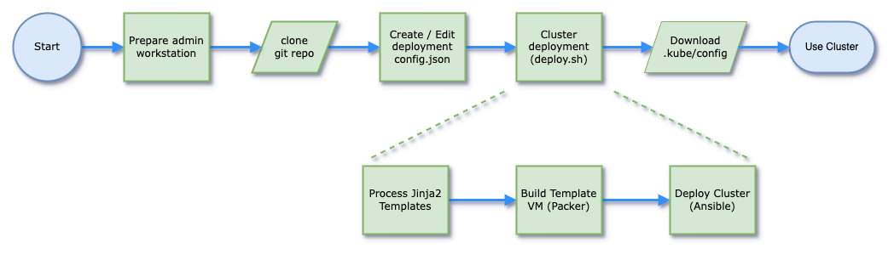

# Introduction

As I find myself using Kubernetes (k8s) and container technologies more and more frequently I wanted a way to easily deploy clusters in my homelab environment so I could try out new features and capabilities (as well as get a better understanding of Kubernetes generally). In particular I wanted to make the deployed clusters as 'production-like' as possible - including minimal single points of failure and redundancy as would typically be used when running Kubernetes environments to support critical applications.

My 'ideal' solution would allow me to:

- Deploy complete Kubernetes environments driven from a simple configuration file which specified how the cluster was to be built and configured
- Be based on a slimline/minimal Linux distribution which had small system requirements and package overheads
- Be as automated as possible to deploy and configure clusters in a reproducable manner
- Capable of deploying the latest versions of components without being restricted by packaged versions available from the distribution's package maintainers
- Have automated persistent storage (PVC/PVs) for deployed clusters to support applications requiring this
- Able to deploy to my homelab vSphere cluster
- Not require excessive system resources in the deployed clusters since I'd often want to have multiple clusters deployed simultaneously
- Have the base OS to be fully patched/updated on deployment to remove known vulnerabilities

This is all very much still a 'work in progress', but I have got to a stage now where I've been able to achieve the vast majority of these goals and am now working on further enhancing the capabilities and functionality of the automation I've created so I've written this post as a 'snapshot' of where things currently stand.

## Components Used

The choices I made for the software components for the build and automation are:

|Element|Description|
|---|---|
|Hashicorp Packer|To build the initial VM template image containing all the required components|
|Red Hat Ansible|To deploy multiple instances of the Packer template VM and then create the Kubernetes cluster and configure the environment|
|Jinja2/Python3|To take a single configuration file and generate the packer and ansible configurations|
|VMware Photon OS 5|Photon OS has a clean minimal installation which I used as the base operating system|
|Kubernetes|Latest Kubernetes version v1.31.0 / Containerd v1.7.20 / runc v1.1.13 components (at time of writing)|
|kube-vip|High Availability of the Kubernetes cluster control-plane using a Virtual IP|
|kube-vip-cloud-controller|LoadBalancer for deployed container applications leveraging kube-vip|
|calico|CNI Networking between containers in the cluster|
|csi-driver-nfs|To allow use of NFS shares for persistent cluster storage|
|helm|To support deployment of application 'charts' to the deployed clusters|
|Portainer|For visiblity and management of deployed clusters|
|Traefik|As an Ingress controller for deployed clusters|

## Deployment Workflow

The diagram below shows the workflow to deploy a Kubernetes cluster using the code I've written:

1. First an admin workstation is prepared (either as a new VM deployed to serve as the admin workstation, or by installing the required components on an existing physical or virtual machine). You will also need to download an appropriate ISO file for Photon OS v5.0 (minimal installation) and upload this to a vSphere Datastore to be used by the build process.
2. Next the github repo is cloned to the admin workstation from [this link](https://github.com/jondwaite/k8s-photon)
3. The config.json.example file in the root of the repo is copied and updated with parameters for this deployment (including details of the vCenter environment being used as the deployment target)
4. Next the `deploy.sh` script can be run to build and deploy the cluster, consisting of 3 parts:
    - A python script uses the Jinja2 templating engine to process the `config.json` configuration file and create the necessary artifacts for Packer and Ansible to use later. The template definition files can be seen in the `./templates/` folder of the repository
    - Packer is then called to build a new VM template configured as specified in the `config.json` and save this in vCenter as a VM Template. The Packer build runs from the `./packer/` folder in the repository using the `config.auto.pkrvars.hcl` file generated by Jinja2
    - Ansible is then called to deploy and configure the cluster based again on values from `config.json`. Ansible runs from the `./ansible/` folder in the repository using YAML files generated by Jinja2
5. If everything has worked correctly, you will now have a fully configured/functional Kubernetes cluster running as a series of VMs in vSphere and can download the KUBECONFIG file in order to be able to access the cluster and deploy any required applications

## Documentation Links

I've tried to make the configuration parameters in `config.json` as straightforward as possible, and added documentation into the [github repository](https://github.com/jondwaite/k8s-photon) including some additional documents to help using the code:

|Link|Description|
|---|---|
|[Github Link](https://github.com/jondwaite/k8s-photon)|Link to the main Github repository|
|[README.md](https://github.com/jondwaite/k8s-photon/blob/main/README.md)|Overview documentation including component versions|
|[admin-workstation.md](https://github.com/jondwaite/k8s-photon/blob/main/admin-workstation.md)|Details of how to build a suitable administration VM to run the scripts including required dependencies|
|[config-options.md](https://github.com/jondwaite/k8s-photon/blob/main/config-options.md)|Details on the parameters available in the `config.json` configuration file together with some notes on things to watch out for|

## Next Steps

I originally started out writing this post as a 'howto' to manually install and configure a Kubernetes environment on Photon OS using the latest released versions of Kubernetes components. It quickly became obvious when doing this that the manual configuration was extremely 'fiddly' and prone to errors and that automation was a much better approach.

In the course of automating the deployment I learnt a lot about Kubernetes itself, but also Hashicorp Packer, Red Hat Ansible and the Jinja2 templating engine.

I'd love people to try this project out in their own environments and let me know how it goes for them and any bugs/issues encountered and suggestions for improvements. I'm intending to keep adding functionality and capabilities to the repository over time and will link any updated documentation here when changes are made. One change I've already made is the ability (configured as always in the `config.json` file) to automatically download a copy of the KUBECONFIG file to the admin workstation when the cluster build is complete so that `kubectl` can be used without needing to do this manually, I've also written code that creates a 'hosts-entries' file within the `./ansible/` folder in the cloned repository which can be copied/pasted into the admin machine `/etc/hosts` file to give access to cluster nodes/resources by hostname rather than IP address.

The best way to give feedback is to raise an 'issue' against the [github repository](https://github.com/jondwaite/k8s-photon).

I'm also considering several enhancements to this project and will add them based on available time and feedback/demand including (in no particular order):

- Ability to deploy to other virtualization environments (Proxmox, VirtualBox, ESXi hosts directly, VMware Workstation/Fusion etc.)
- Ability to configure additional/alternative persistent cluster storage options (Longhorn, Ceph, etc.)
- Ability to configure alternative Ingress solutions (nginx)
- Ability to configure highly available certificate handling with public or private CA (cert-manager & traefik integration)
- Ability to deploy clusters to non-Intel CPU architectures (e.g. ARM)
- Ability to chose/use Kubernetes GatewayAPI instead of Ingress

As always, comments and feedback welcome and I'd love to hear from you if this project is in any way useful to you.

Jon.
